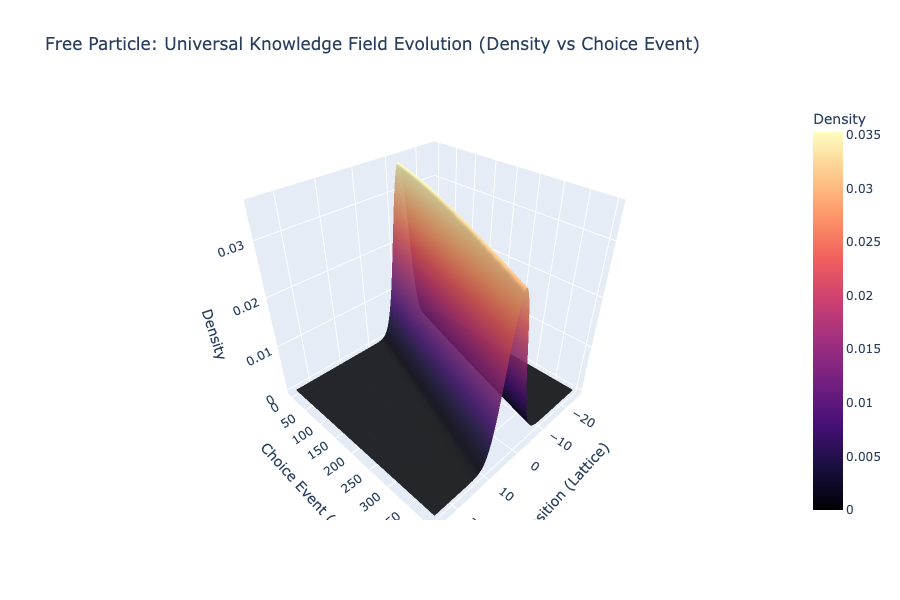
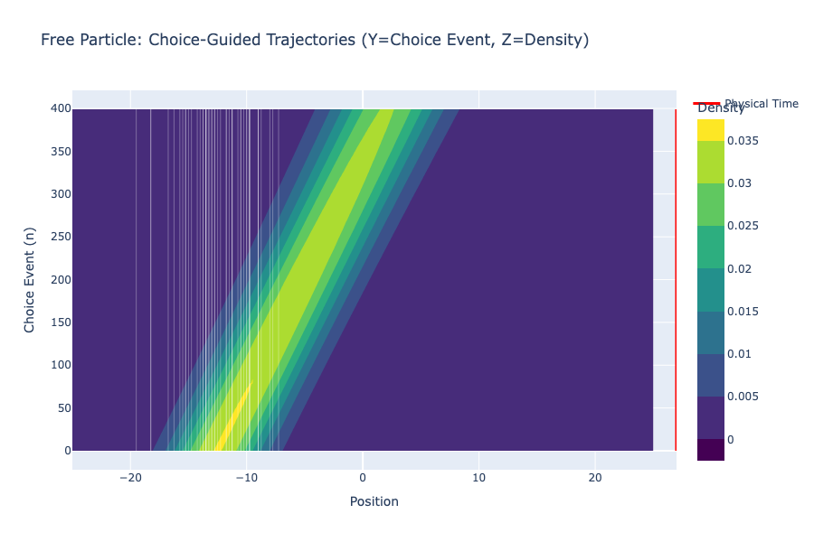
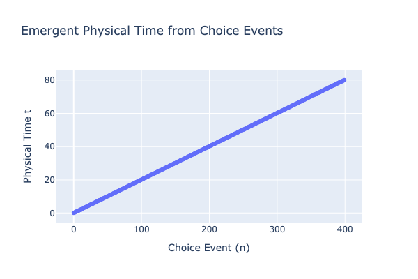

# Experiment 01: Free Particle Baseline

## Objective
To establish a baseline for the Choice-Guided Bohmian Mechanics simulator by reproducing the standard spreading of a Gaussian wave packet in free space. This confirms that:
1.  The discrete time propagator works correctly.
2.  The "Zero-Entropic" ($\alpha=0$) choice minimization recovers standard Bohmian drift.

## Setup
*   **Initial State**: Gaussian packet centered at $x = -L/4$ with rightward momentum.
*   **Potential**: $V(x) = 0$ (Free space).
*   **Parameters**:
    *   $\alpha$ (Entropic Gravity): **0.0** (Standard QM) or Low.
    *   $dt$: Dynamic, but roughly constant in free space.

## Results Analysis

### Figure 1: The Knowledge Landscape
The density $|\psi|^2$ spreads over time (Choice Events). In free space, this dispersion is Gaussian.

### Figure 2: Trajectories
The particle trajectories (white lines) follow the spreading wave packet. They do not cross in configuration space, consistent with Bohmian mechanics.

### Figure 3: Emergent Time
In a free particle system with smooth density changes, the relationship between "Choice Event" ($n$) and "Physical Time" ($t$) is approximately linear.

