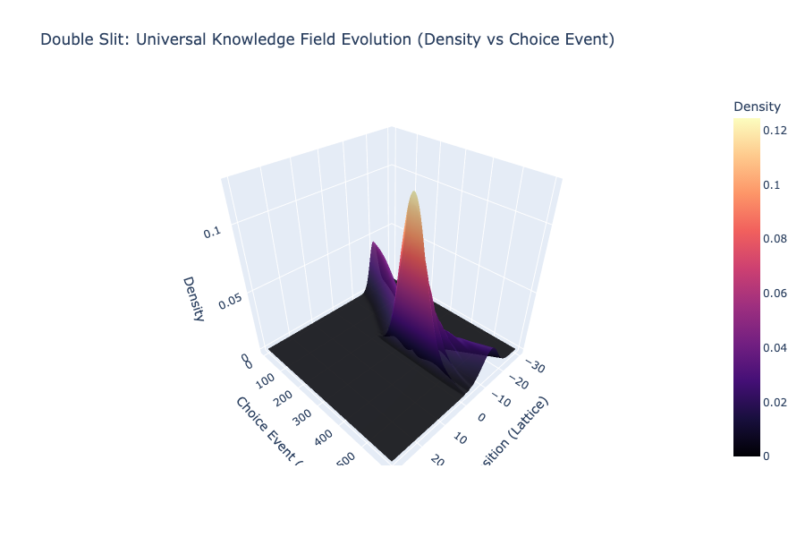
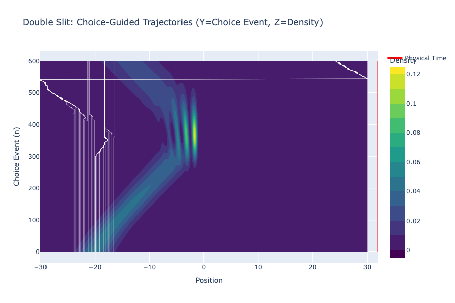
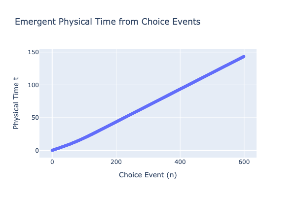

# Experiment 02: Double Slit Interference

## Objective
To detect **"Choice Branching"** geometries and **Time Dilation** effects in a classic quantum interference setup. This experiment tests the core UKFT hypothesis: *particles "process" information at complex junctions (slits), slowing down physical time relative to choice events.*

## Setup
*   **Potential**: Infinite wall with two narrow slits ($V=20.0$ barrier).
*   **Initial State**: Gaussian packet moving towards the barrier.
*   **Key Physics**: The wavefunction diffracts through the slits, creating interference fringes on the far side.

## Results Analysis

### Figure 1: Interference Pattern
The probability density shows the characteristic diffraction pattern emerging after the slits.

### Figure 2: Choice Branching
Observe how the trajectories "decide" which slit to enter. In the interference region, trajectories bunch into the "bright" fringes and avoid the "dark" nodes.

### Figure 3: Time Dilation (The "Thinking" Particle)
Note the slope of the curve.
*   **Steep Slope**: Fast physical time (low action density).
*   **Flat Slope**: Slow physical time (high action/knowledge density).

**Update (Local Time Dilation)**: The simulation now calculates proper time *locally* for each particle based on the knowledge density $\rho(x)$ it experiences ($dt \propto 1/\rho$).
You may observe a "kink" or flattening as the packet hits the complex slit region, representing the increased "computational cost" (in choice steps) to navigate the superposition.

