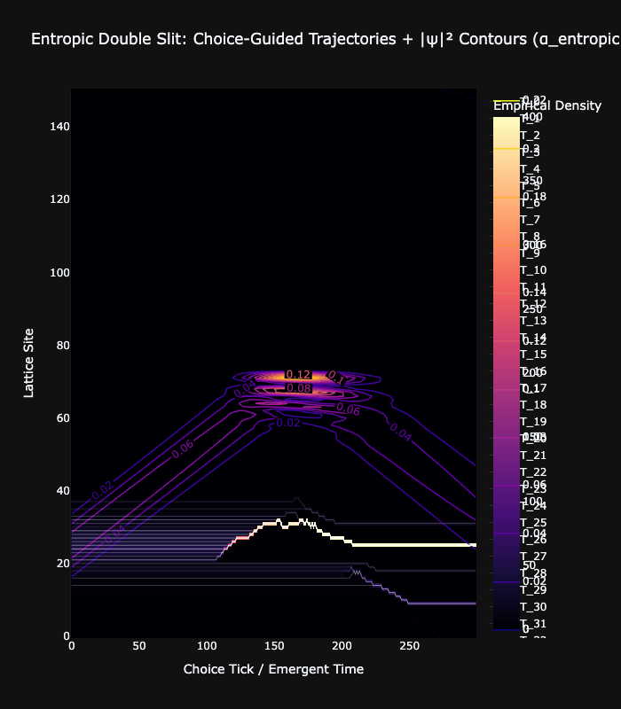

# Experiment 03b: The Golden Path (Entropic Double Slit)

## Objective
The flagship visualization of **Choice-Guided Bohmian Mechanics**. This experiment combines all UKFT elements:
*   **Double Slit Interference**: Complexity.
*   **Entropic Gravity ($\alpha=2.0$)**: Guidance.
*   **High-Contrast Visualization**: Magma Heatmap + Lime Contours.

## The Visualization
This image represents the "Mind of the Universe".

*   **Lime Contours**: The *Theoretical* Probability ($|\psi|^2$). The "Potential" landscape.
*   **Magma Heatmap**: The *Empirical* Density of actualized histories.
*   **White Lines**: Individual Concious Agent trajectories.

### Observation
Notice how the trajectories do not just "fill" the potential; they *hunt* for the ridges. They effectively "surf" the waves of knowledge, creating a feedback loop where the geometric structure of the field dictates the flow of choices.

## Parameters
*   **Alpha**: 2.0 (Balanced Choice)
*   **Resolution**: 151x300 (Optimized for contrast)
*   **dt**: 0.2 (Emergent Time base)
