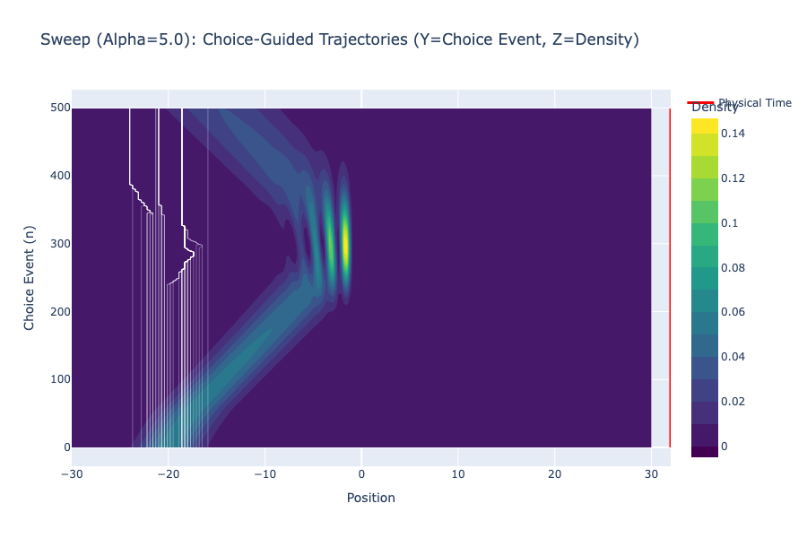

# Experiment 03a: Entropic Parameter Sweep

## Objective
To visualize the effect of the **Entropic Gravity Parameter ($\alpha$)** on particle trajectories.
*   **Hypothesis**: Increasing $\alpha$ biases choices towards regions of higher Knowledge Density (Network Entropy), effectively "sharpening" reality and suppressing low-probability outlier paths.

## Comparative Analysis

### Control: $\alpha = 0.0$ (Standard Bohmian)
Particles act passively. They surf the quantum potential but explore the full width of the wave packet, including low-density tails.

### Hybrid: $\alpha = 5.0$ (Biased Choice)
Trajectories begin to cluster. The "fuzziness" of the quantum probability cloud starts to resolve into structured "veins" of high probability.

### Strong Choice: $\alpha = 15.0$ (Reality Sharpening)
**The Collapse of Probability.** Trajectories rigidly adhere to the density maxima. The particle "refuses" to exist in low-information regions. This represents the transition from Quantum Potentiality to Classical Actuality via high-frequency choice.

## Interactive Results
[Alpha 0.0 Simulation](../results/03_sweep_alpha_0.0.html)
[Alpha 5.0 Simulation](../results/03_sweep_alpha_5.0.html)
[Alpha 15.0 Simulation](../results/03_sweep_alpha_15.0.html)
