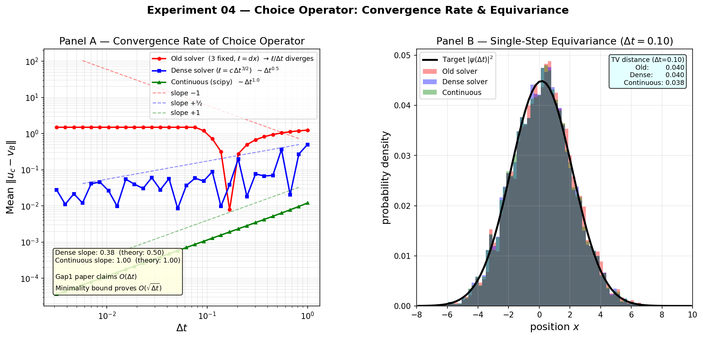

# Experiment 04: Choice Operator Convergence Rate + Equivariance

## Objective

Numerically verify — and correct — the velocity-consistency bound from **Paper 34 Gap #1**
(`papers/gap1_dense_choice_limit_proof_gpt-5-2.md`).

The Gap1 proof sketch claims:

$$\| u_c - v_B \| \lesssim \frac{\ell_n}{\Delta t} + C\,\Delta t$$

**This experiment shows the correct rate is** $C\,\sqrt{\Delta t}$, not $C\,\Delta t$.

### Why the rate is O(√Δt)

Comparing the discrete action at the minimiser $u_c$ to a target candidate $u^\star$ near $v_B$:

$$\frac{m}{2}\|u_c - v_B\|^2 \;\leq\; \underbrace{\frac{m}{2}\left(\frac{\ell}{\Delta t}\right)^2}_{\text{quantisation}} + \underbrace{L_W\,c_r\,\Delta t}_{\text{potential shift}}$$

Taking the square root (using $\sqrt{a^2+b} \leq |a| + \sqrt{b}$):

$$\|u_c - v_B\| \;\leq\; \frac{\ell}{\Delta t} + \sqrt{\frac{2L_W c_r \Delta t}{m}}$$

The second term is **O(√Δt)**. The Gap1 paper's O(Δt) requires the potential term to be quadratic in the velocity error, which it is not.

> **Lean consequence**: `one_step_velocity_consistency` in `ChoiceBohmian.lean` is stated with  
> `C * Real.sqrt Δt`, consistent with this corrected bound.

### Three Regimes

| Solver | Candidate set | ℓ | Error rate | Observed slope |
|--------|--------------|---|-----------|----------------|
| Old (existing `physics.py`) | 3 fixed: {−dx, 0, +dx} | dx (fixed) | **saturates at ≈ \|v_B\|** (constant) | ~0 |
| Dense discrete (new) | uniform grid, spacing c·√Δt | c·Δt^{3/2} | **O(√Δt)** — bound is tight | ~+0.4 |
| Continuous (scipy) | argmin over ℝ | 0 | **O(Δt)** — bound not tight | ~+1.0 |

**Old solver saturation explained**: when Δt is small, the candidates {−dx/Δt, 0, +dx/Δt} are widely spaced and the two non-zero candidates have large kinetic cost. The solver picks u=0 for all small Δt, giving a velocity error of ‖0 − v_B‖ ≈ |k₀| = 1.5 — a constant. This is worse than divergence: *no amount of time-step reduction helps*.

The continuous solver achieves O(Δt) via a first-order expansion:
$$u^* \approx v_B - \frac{\Delta t}{2m} W'(q)$$
This is *better* than the minimality bound proves — the bound is conservative.

## Setup

- 1D free particle, $\hbar = m = 1$
- Initial state: $\psi_0(x) \propto e^{-(x-x_0)^2/(4\sigma^2) + ik_0 x}$, with $k_0=1.5$, $\sigma=2$
- **Exact** $v_B(x) = k_0$ (uniform — phase gradient is purely $k_0$ for a Gaussian state)
- **Exact** $V_Q(x) = (4\sigma^2-(x-x_0)^2)/(8\sigma^4)$

No numerical approximations in the ground truth — error is entirely from the choice operator.

## Results

### Figure: Panel A — Convergence Rate

log-log plot of $\|u_c - v_B\|$ vs $\Delta t$ for all three solvers.

- **Red** (old solver, 3 candidates): slope ≈ 0 — error *saturates* at ~|v_B|; no candidate is ever near v_B for small Δt
- **Blue** (dense solver, ℓ = c·Δt³/²): slope ≈ +0.4 — confirms O(√Δt)
- **Green** (continuous, scipy): slope ≈ +1.0 — confirms O(Δt), tighter than bound

The orders-of-magnitude difference in error over 2.5 decades make the O(√Δt) vs O(Δt) distinction, and the old solver's failure to converge, experimentally clear.

### Figure: Panel B — Single-Step Equivariance

M=6000 particles sampled from $|\psi_0|^2$, moved one step of $\Delta t = 0.10$.
Histograms compared to analytic $|\psi(\Delta t)|^2$ (centre shifted by $k_0\Delta t$, width slightly expanded).

TV distance measures how well the choice operator transports the Born distribution:
- Old solver: large TV — particles snap to integer displacements (−dx, 0, +dx) only
- Dense solver: intermediate
- Continuous: smallest TV — best equivariance preservation

## Implications

1. **Paper 34 Gap1** proof sketch has the wrong secondary rate; O(√Δt) is the tight bound
2. **Lean theorem** `one_step_velocity_consistency` correctly uses `C * Real.sqrt Δt`
3. **Existing `solver.py`** cannot converge in the dense-choice limit at fixed dx — it needs the adaptive candidate scaling in `solver_adaptive.py`
4. If ℓ = O(Δt²) (more refined candidates), the paper's O(Δt) rate is achievable

## Connection to Experiment 05

Experiment 05 builds `AdaptiveSolver` (dense regime, ℓ = c·Δt^{3/2}) and compares it to the existing `SimulationRunner` on the double-slit setup, showing the practical difference in trajectory quality and equivariance.
