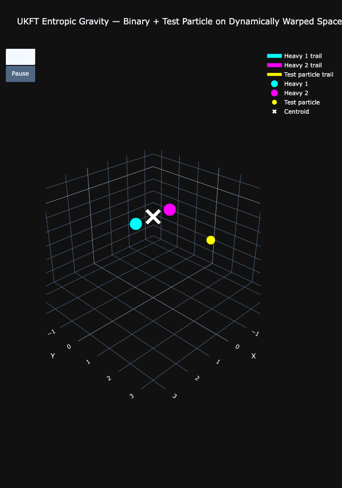

# Experiment 06: UKFT Entropic Gravity - 3D Dynamic Sheet

## Objective
To visualize **Entropic Gravity** in a full 3D simulation with a dynamically warping "Space-Time" sheet.
This demonstration moves beyond the 1D lattice to a continuous 2D plane (visualized in 3D), showing how Mass/Knowledge Centers create "wells" of coherence that attract other particles.

## Setup
*   **System**: Binary Heavy System + Light Test Particle.
*   **Physics**: Pure Entropic Attraction ($\vec{a} \propto \nabla \rho$). No Newtonian Gravity.
*   **Visualization**: A "Rubber Sheet" ($Z$-axis) that represents the Entropic Curvature (negative Knowledge Density).

## Key Features
1.  **Mutual Attraction**: The two heavy particles orbit each other solely due to the desire to maximize local knowledge density ($\rho$).
2.  **Test Particle Capture**: A light particle behaves like a probe, spiraling into the deep coherence wells of the binary system.
3.  **Dynamic Geometry**: The grid itself warps in real-time, illustrating how "Mass" (Knowledge Density) dictates the geometry of "Space-Time" (Choice Space).

## Results
The visualization shows the test particle (yellow) getting captured by the binary system (cyan/magenta), tracing a chaotic path before settling into the attractor basin. The "sheet" continuously deforms to guide the trajectories.

