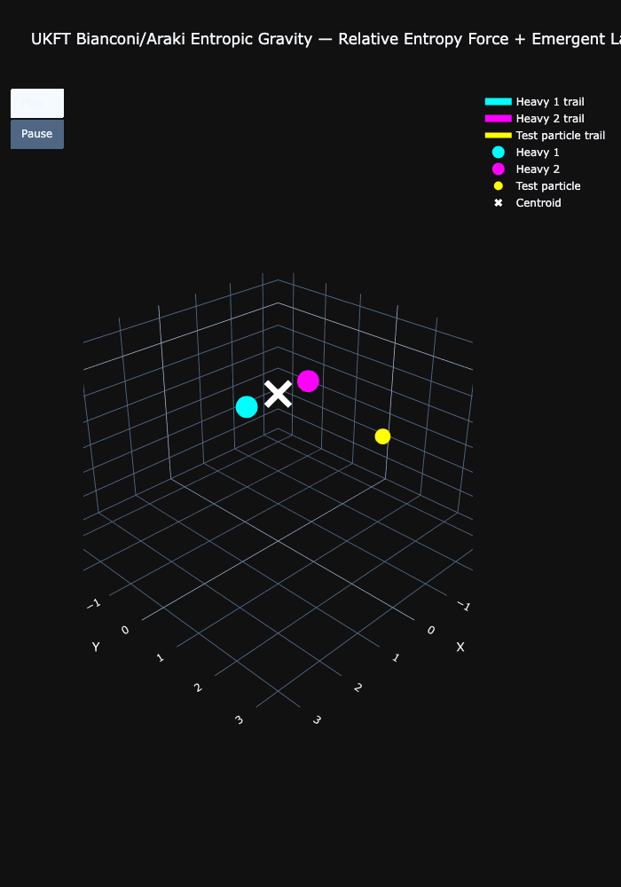

# Experiment 07: Bianconi/Araki Entropic Gravity

## Objective
To implement the **Relative Entropy Force** law inspired by Ginestra Bianconi's "Gravity from Entropy" (arXiv 2408.14391 / Phys. Rev. D 111).
This experiment modifies the entropic bias from a simple density gradient ($\nabla \rho$) to a logarithmic relative entropy minimization ($\nabla \ln \rho$).

## Physics Patch
*   **Force Law**: $\vec{F} \propto \nabla (\ln \rho) \approx \frac{1}{\rho} \nabla \rho$.
    *   This term mimics the "informational cost" of separation.
    *   Unlike the linear gradient, the logarithmic gradient is **amplified** in low-density regions (inverse $\rho$), creating a stronger "long-range" coherence pull.
*   **Expansion (Toy G-Field)**: A small repulsive term ($\Lambda r$) is added to model the "Emergent Cosmological Constant" predicted by Bianconi's theory.

## Results
The behavior differs significantly from the standard UKFT entropic gravity:
1.  **Stiffer Orbits**: The $1/\rho$ scaling creates a "stiffer" restoring force at distance.
2.  **Harmonic Wells**: In Gaussian density fields, $\nabla \ln(e^{-r^2}) \propto -r$, leading to harmonic oscillator-like confinement (Hooke's Law) rather than $1/r$ potentials.
3.  **Expansion**: The `lambda_cosmo` term eventually wins at very large distances, mirroring the expanding universe.

## Interactive Results
[View Bianconi Entropic Gravity Simulation](../results/07_ukft_bianconi_entropic_gravity.html)
[View Quantum Swarm Simulation](../results/07_quantum_swarm.html)
