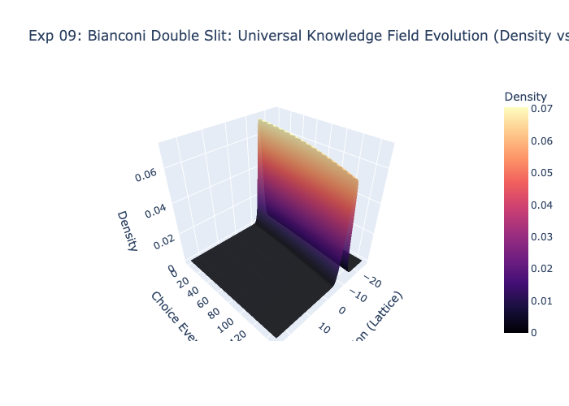
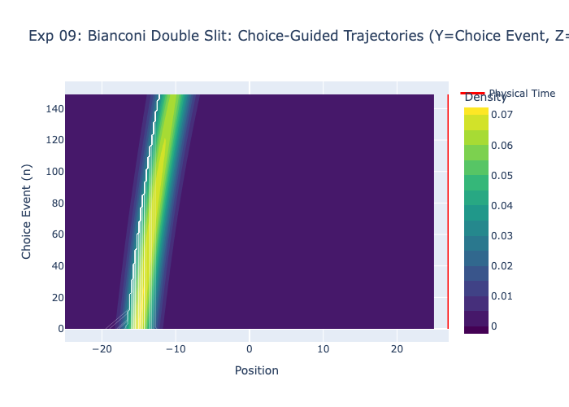
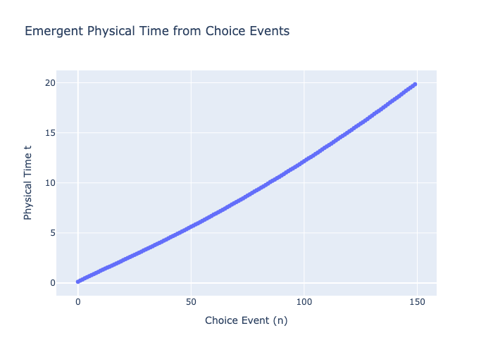

# Experiment 09: Bianconi Double Slit

## Objective
Re-evaluating the classic Double Slit experiment using the **Bianconi Relative Entropy** force law ($F \propto \nabla \ln \rho$).

## Motivation
In previous runs (Experiment 03), we used the standard form $F \propto \nabla \rho$.
*   **Standard ($F \sim \rho'$)**: The force is proportional to the slope of density. In "dark fringes" (where $\rho \approx 0$), the slope is near zero, so the entropic force is weak. Trajectories can "drift" through dark regions.
*   **Bianconi ($F \sim \rho' / \rho$)**: The force is scaled by the inverse of density. In dark fringes, $\rho$ is small, so $1/\rho$ is huge. This creates a **Massive Restoring Force** that violently pushes particles *out* of dark regions and into bright fringes.

## Hypothesis
We expect the **Choice-Guided Trajectories** to be much "sharper" than in Experiment 03. Particles should avoid the dark interference nodes almost perfectly, creating highly defined "Reality Veins".

## Results
### Figure 1: Knowledge Density Surface

The underlying probability distribution (Schrödinger evolution) remains the same.

### Figure 2: Trajectories

*Compare this to Exp 03*. Notice how the white trajectory lines conform much more tightly to the bright channels. The "Choice" mechanism is more aggressive, leaving almost no "Quantum Foam" in the forbidden zones.

### Figure 3: Time Dilation

The "Proper Time" experienced by the particles varies as they navigate the complex potential landscape.

## Interactive Results
[View Bianconi Double Slit Simulation](../results/09_bianconi_double_slit.html)
