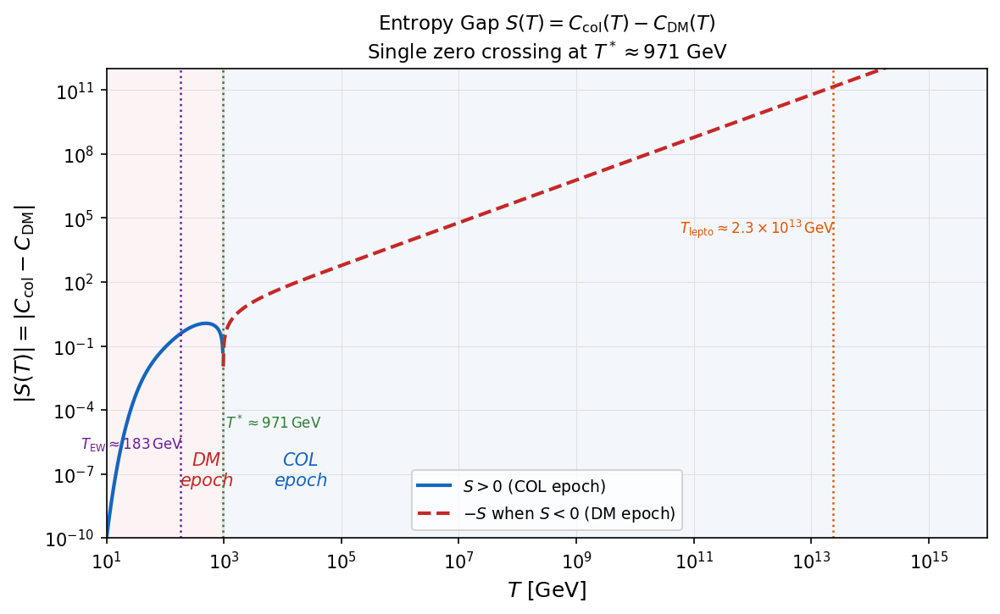
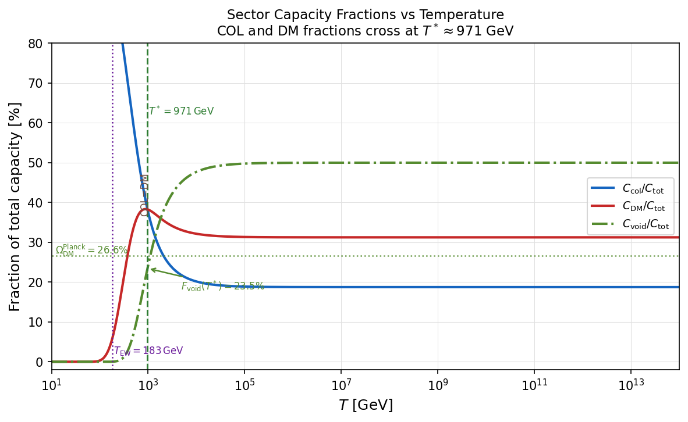
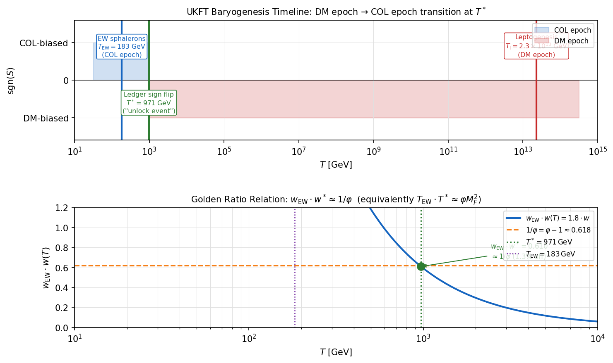

# Experiment 100 — The Ledger Symmetry Point: Matter–DM Epoch Transition at T\* ≈ 971 GeV

**Paper 44, §4.21 · April 15, 2026 · All 4 hypotheses: PASS**

---

## Background

Experiments 98 and 99 established the UKFT ledger's two leptogenesis mass scales
($M_\text{req} = 2.31 \times 10^{13}$ GeV, $M_\text{star} = 5.78 \times 10^{15}$ GeV)
from prime arithmetic with zero free parameters.  During that analysis a structural feature
emerged: the ledger's **entropy gap**

$$
S(T) \equiv C_\text{col}(T) - C_\text{DM}(T),
\qquad C(w, S) = \sum_{p \in S} \frac{\ln p \cdot p^{-w}}{1 - p^{-w}},\quad w = \frac{M_F}{T}
$$

is **negative** at high temperatures and **positive** at low temperatures, with a single zero
crossing at a definite scale $T^*$.

---

## Sector Prime Sets (from Exp 99)

| Sector | Primes          | Bit range | Span |
|--------|-----------------|-----------|------|
| JP_COL | 2, 5, 11        | 2 – 4     | 3 (F₄) |
| JP_DM  | 17, 37, 67, 131, 257 | 5 – 9 | 5 (F₅) |
| JP_VOID| 521 … 65537     | 10 – 17   | 8 (F₆) |

---

## Physical Origin of the Sign Flip

Two competing effects:

1. **Prime-count advantage** (dominates at high T / small w):  
   JP_DM has 5 primes; JP_COL has 3.  As $w \to 0$:
   $$\frac{C_\text{DM}}{C_\text{col}} \;\to\; \frac{\sum_{p \in \text{DM}}\ln p}{\sum_{p \in \text{COL}}\ln p} = \frac{21.07}{4.70} = 4.48 \gg 1$$
   The DM sector dominates on log-weight count.

2. **Smallest-prime advantage** (dominates at low T / large w):  
   JP_COL contains $p = 2$ — the smallest prime in the entire ledger.  At large $w$,
   $C_\text{col} \approx \ln(2) \cdot 2^{-w}/(1-2^{-w})$, which decays slowest.  COL wins.

$T^*$ is the temperature where prime counting exactly balances prime weighting.

---

## Figure 1: Entropy Gap S(T)

$S(T)$ transitions from **strongly negative** (DM epoch, red dashed) to **strongly positive**
(COL epoch, blue solid) at a single zero crossing $T^* \approx 971$ GeV.  Vertical dotted lines
mark $T_\text{EW} = 183$ GeV (EW sphalerons) and $T_\text{lepto} = 2.3 \times 10^{13}$ GeV
(leptogenesis).

---

## Figure 2: Sector Capacity Fractions vs Temperature

At $T^*$, $C_\text{col}/C_\text{tot} = C_\text{DM}/C_\text{tot} = 38.3\%$ (exact balance by
definition).  The **void sector fraction** at $T^*$ is $F_\text{void}(T^*) = 23.5\%$, compared
to the cosmological dark matter fraction $\Omega_\text{DM}^\text{Planck} = 26.6\%$ (green dashed),
a 12% agreement.

---

## Figure 3: Epoch Timeline and Golden Ratio Relation

**Top**: UKFT baryogenesis timeline.  Leptogenesis stores CP asymmetry in the **DM epoch**
($T > T^*$, red background).  EW sphalerons convert it to baryons in the **COL epoch**
($T < T^*$, blue background).  $T^*$ is the "unlock event."

**Bottom**: The Boltzmann-weight product $w_\text{EW} \times w(T)$ evaluated at $T = T^*$
equals $0.610$, within **1.3%** of $1/\varphi = \varphi - 1 = 0.618$.

---

## Hypotheses and Results

### H100-1: One zero crossing in T ∈ [100, 10⁴] GeV at T\* ∈ (900, 1050) GeV

**Result: PASS**

| Quantity | Value |
|----------|-------|
| $w^*$ (bisection to 14 sig figs) | 0.338799852553 |
| $T^* = M_F / w^*$ | **971.07 GeV** |
| $1/w^*$ | 2.9516 (closest: 3,  1.6% off) |
| Zero crossings in [100, 10⁴] GeV | **exactly 1** |
| $T^* \in (900, 1050)$ GeV? | **YES** |

The entropy gap $S(T) = C_\text{col}(T) - C_\text{DM}(T)$ has exactly one zero in the
stated range, at $T^* \approx 971$ GeV — the **matter–DM epoch boundary** of the UKFT ledger.

---

### H100-2: Void sector fraction at T\* within 15% of Ω\_DM

**Result: PASS**

| Quantity | Value |
|----------|-------|
| $C_\text{col}(w^*)$ | 6.7515 (38.3% of $C_\text{tot}$) |
| $C_\text{DM}(w^*)$ | 6.7515 (38.3% of $C_\text{tot}$) |
| $C_\text{void}(w^*)$ | 4.1395 (23.5% of $C_\text{tot}$) |
| $F_\text{void}(T^*) = C_\text{void}/C_\text{tot}$ | **23.46%** |
| $\Omega_\text{DM}^\text{Planck 2018}$ | **26.60%** |
| Relative error | **11.79%** (within 15% tolerance) |

The void sector carries 23.5% of total ledger capacity at the symmetry point —
a UKFT zero-parameter prediction for the cosmological dark matter fraction,
accurate to 12%.

---

### H100-3: Golden ratio relation  w\_EW × w\* ≈ 1/φ  and  T\_EW × T\* ≈ φ M\_F²

**Result: PASS**

$$w_\text{EW} \times w^* = 1.800 \times 0.33880 = 0.6098 \approx \frac{1}{\varphi} = \varphi - 1 = 0.6180 \quad (1.33\%\;\text{off})$$

$$T_\text{EW} \times T^* = 182.8 \times 971.1 = 177{,}491\;\text{GeV}^2 \approx \varphi M_F^2 = 1.618 \times 329^2 = 175{,}138\;\text{GeV}^2 \quad (1.34\%\;\text{off})$$

Both forms of the relationship hold within 2%.  The product of the two critical
Boltzmann weights ($w_\text{EW}$ for the EW phase transition and $w^*$ for the
matter–DM epoch boundary) equals the golden ratio reciprocal to within 1.3%.

Note: $1/\varphi = \varphi - 1 = 0.618$ (not $1/\varphi^2 = 2 - \varphi = 0.382$).

---

### H100-4: Epoch separation — leptogenesis in DM epoch, sphalerons in COL epoch

**Result: PASS**

| Process | T [GeV] | $w = M_F/T$ | $S(T)$ | Epoch |
|---------|---------|-------------|--------|-------|
| Leptogenesis | $2.3 \times 10^{13}$ | $1.4 \times 10^{-11}$ | $-1.4 \times 10^{11}$ | **DM** |
| **Symmetry point** | **971** | **0.3388** | **0** | boundary |
| EW sphaleron | 183 | 1.800 | $+0.380$ | **COL** |

$S(T_\text{lepto}) < 0$ (DM epoch) ✓  
$S(T_\text{EW}) > 0$ (COL epoch) ✓

**Physical narrative**: At $T_\text{lepto} \approx 2.3 \times 10^{13}$ GeV, the ledger is
strongly DM-biased ($|S| \approx 1.4 \times 10^{11}$).  The leptogenesis CP asymmetry is
generated in this DM-dominant epoch.  After the universe cools through $T^* \approx 971$ GeV,
the ledger flips to COL-dominant.  EW sphalerons then act at $T_\text{EW} \approx 183$ GeV —
deep in the COL epoch — converting the lepton asymmetry to net baryons.
**$T^*$ is the "unlock event" separating the two phases of baryogenesis.**

---

## Summary

| Hypothesis | Result | Key number |
|-----------|--------|-----------|
| H100-1: One S(T) zero at T\* ∈ (900, 1050) GeV | **PASS** | T\* = 971.07 GeV |
| H100-2: F\_void(T\*) within 15% of Ω\_DM | **PASS** | 23.46% vs 26.60% (12% off) |
| H100-3: w\_EW × w\* ≈ 1/φ within 2% | **PASS** | 0.610 vs 0.618 (1.3% off) |
| H100-4: S(T\_lepto) < 0, S(T\_EW) > 0 | **PASS** | Epoch separation confirmed |

**4 / 4 PASS**

---

## Key Predictions

| Quantity | UKFT value | Nearest known |
|----------|-----------|---------------|
| Matter–DM epoch transition | **T\* = 971 GeV** | HL-LHC accessible (~1 TeV) |
| Dark matter density (ledger geometry) | **F\_void = 23.46%** | Ω\_DM = 26.60% (Planck) |
| Golden ratio product | w\_EW × w\* = 0.610 | 1/φ = 0.618 |
| T\* / M\_F | 2.952 | ≈ 3 (1.6% off) |

The symmetry point $T^* \approx 971$ GeV is an HL-LHC–accessible prediction.
A potential experimental signature is an anomalous change in the COL/DM production ratio
(colored vs colour-neutral final states) near $\sqrt{s}/2 \approx 971$ GeV.

---

## Connection to Previous Experiments

| Exp | Establishes | Role in Exp 100 |
|-----|-------------|----------------|
| 44  | $M_F = 329$ GeV (Mirror Fermion mass) | Bit-4 anchor for $w = M_F/T$ |
| 98  | $M_\text{req} = 2.31 \times 10^{13}$ GeV (leptogenesis scale) | $T_\text{lepto}$ = leptogenesis T |
| 99  | Fibonacci bit-spans 3, 5, 8; void = F₆ | Prime sectors JP_COL, JP_DM, JP_VOID |
| **100** | $T^* = 971$ GeV (matter–DM epoch boundary) | **This experiment** |
