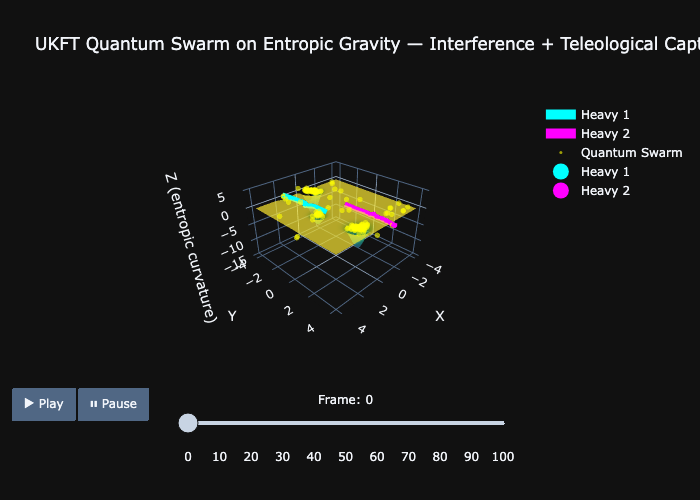

# Experiment 10: UKFT Quantum Swarm on Entropic Gravity

## Objective
To simulate the **Grand Unification** of UKFT: combining **Emergent Entropic Gravity** (Macroscopic/GR) with **Bohmian Pilot Wave Dynamics** (Microscopic/QM) in a single coherent 3D visualization. 

## The Theory
This experiment tests the hypothesis that "Gravity" and "Quantum Potential" are two sides of the same information-theoretic coin.

1.  **Entropic Gravity (The Sheet)**: 
    *   Large "Knowledge Centers" (Stars) create deep wells of Information Density ($\rho$). 
    *   Space-time "warps" because the system maximizes entropy by pulling matter into these high-density regions ($\vec{F} = \alpha \nabla \ln \rho$).
    
2.  **Quantum Pilot Wave (The Swarm)**:
    *   The test particles are not classical marbles; they are a **Quantum Swarm**.
    *   They surf a shared **Pilot Wave** derived from the total density ($R = \sqrt{\rho}$).
    *   Their motion is guided by both the **Classical Entropic Pull** (Gravity) and the **Quantum Potential** ($Q$).
    *   The Quantum Potential prevents them from simply collapsing into the center, creating **Interference Fringes** and stable, non-crossing flows.

## The Simulation
*   **System**: Binary "Star" system (Cyan/Magenta) acting as the heavy gravity source.
*   **Swarm**: 400 Quantum Test Particles (Yellow) released in a ring.
*   **Dynamics**: The swarm falls inward due to gravity but starts to "bunch" and "fringe" due to quantum wave interference, eventually forming a stable, structured cloud around the attractors.

## Results

Open the **[Interactive 3D Simulation](../results/10_ukft_quantum_swarm_3d.html)** to explore:
*   **Play/Pause**: Watch the swarm collapse and evolve.
*   **Rotate**: See the depth of the entropic gravity wells.
*   **Scrub**: Move the slider to see how the quantum interference pattern stabilizes over time.
