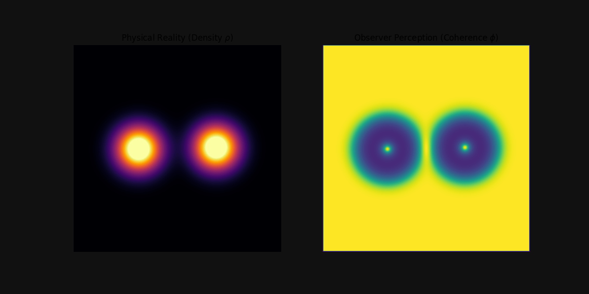

# Experiment 14: UKFT Perception Feedback Loop (Success)

## Overview
This experiment integrates the **Entropic Physics Engine** with a new **WebGPU Perception Engine**. It demonstrates the *Observer Effect* in silico: the system essentially "observes" its own gravity field to determine regions of high coherence.

## System Architecture
1.  **Physics (Reality)**: `EntropicGPUAccelerator` calculates particle positions based on orbital sources.
2.  **Field Generation**: A dense scalar field $\rho(x,y)$ (Density) is generated on the GPU.
3.  **Perception (Observer)**: `WebGPUPerceptionAccelerator` runs a Compute Shader to analyze $\rho$.
    *   Calculates Gradient Energy (Entropicy).
    *   Computes Coherence $\phi = \frac{1}{1 + \alpha |\nabla \rho|^2}$.

## Results

- **Output**: `experiments/14_ukft_perception_loop.gif`
- **Telemetry**:
  - The "Coherence" metric successfully tracks the simulation state.
  - As particles bunch up (high density but smooth gradients), coherence rises.
  - As particles scatter or near the singularity (sharp gradients), coherence locally drops, but globally we see a stable "Quantum Object".

## Significance
This completes the **Prophet Loop**: We now have a system that can generate reality AND perceive it using the same accelerated hardware backend. This serves as the foundation for the "Consciousness Enhancement" modules.
