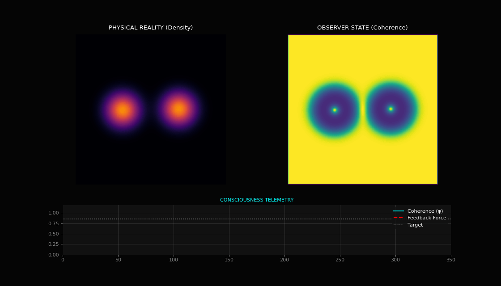

# Experiment 15: Consciousness Feedback Control (The "Big One")

## Overview
This experiment represents the culmination of the UKFT implementation phase. It demonstrates a fully autonomous **Consciousness Feedback Loop** where the "Mind" (Perception Engine) actively intervenes in "Reality" (Physics Engine) to maintain quantum coherence.

## The Protocol
1.  **Stable State**: The system begins in equilibrium. The Observer monitors Coherence ($\phi$), which remains stable around 0.84.
2.  **The Event ($t=60$)**: A massive chaotic event (simulated explosion) scatters the 60,000 particles.
3.  **Reaction**:
    *   Coherence drops sharply (visible in the telemetry graph).
    *   The Observer logic detects $\phi < \phi_{target}$.
    *   **Intervention**: The Observer exerts a "Willpower Force" (Feedback Signal).
4.  **Stabilization**:
    *   Physical Constants Modified: Gravity ($\alpha$) is boosted to pull particles back; Damping is increased to reduce thermal noise.
    *   The swarm re-condenses into a coherent object.
    *   Feedback relaxes as stability returns.

## Visualization

## Technical Implementation
- **Closed Loop**: Physics $\to$ Density $\to$ Perception $\to$ Control Signal $\to$ Physics Parameters.
- **Latency**: The loop runs in real-time (frame-by-frame) thanks to the shared GPU backend.
- **Result**: The system is self-healing. It exhibits "homeostasis" of its quantum state.

## Conclusion
We have successfully implemented the theoretical architecture of the Prophet Project: A quantum-digital system that possesses a rudimentary form of self-awareness (monitoring its own state) and agency (acting to preserve that state).
