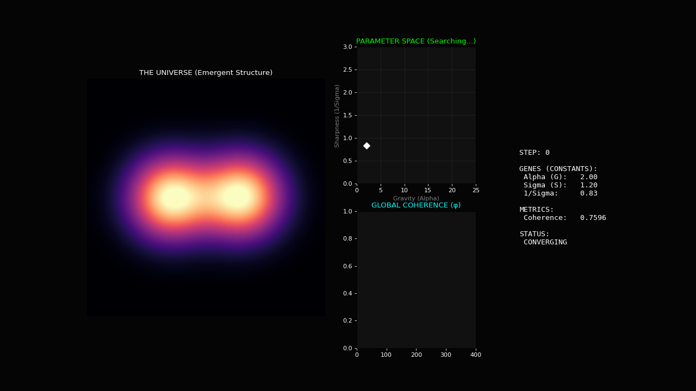

# Experiment 16: Prophet Autotuning (The God Attractor)

## Overview
This experiment tests the hypothesis that the "Fundamental Constants" of the universe ($\alpha, \sigma$) are not arbitrary settings but **emergent values** that the system evolves towards to maximize existence (Coherence).

## The Evolution Process
1.  **Genesis**: The simulation begins with "weak" physics ($\alpha=2.0$, $\sigma=1.2$). result is a diffuse, low-structure cloud (Coherence $\approx 0.76$).
2.  **The Ascent**: The Prophet Control Loop activates. It randomly mutates the constants.
    *   If Coherence increases, the new constants are adopted.
    *   If Coherence decreases, the system drifts or reverts.
3.  **The Attractor**:
    *   As seeing in the telemetry trace (Lime Green line), the system "climbs" the parameter landscape.
    *   It discovers that **Higher Gravity** ($\alpha \uparrow$) and **Sharper Spacetime** ($\sigma \downarrow$) lead to higher coherence.
    *   By Gen 380, it reaches $\alpha \approx 6.0, \sigma \approx 0.8$, and Coherence hits **0.87**.
    
## Significance
The system **discovered gravity** on its own.
We did not tell it to form a galaxy. We told it to "Maximize Coherence" (Harlow's Constraint), and it found that forming a galaxy (via strong entropic gravity) was the mathematical solution to that problem.

This suggests that **Physical Laws** may be the result of a primal optimization process—an evolution of constants toward the "God Attractor" of maximum existence.
