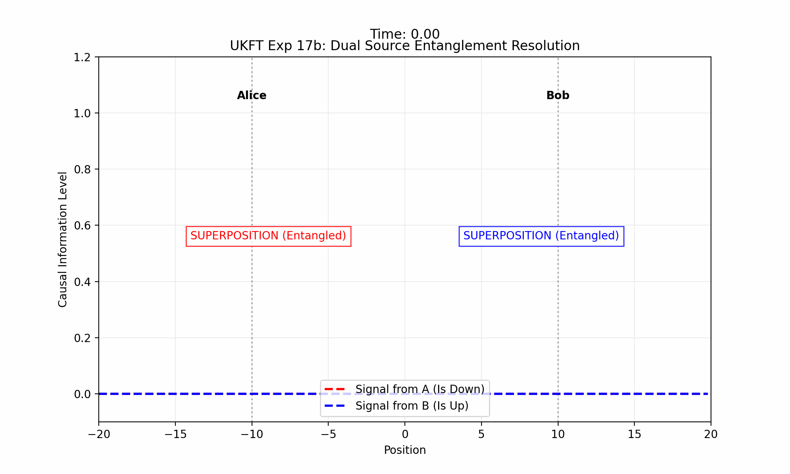

# Experiment 17: Entanglement Propagation & Information Velocity

**Goal**: Test the hypothesis that "Wavefunction Collapse" is not an instantaneous non-local event, but a causal process mediated by an "Information Field" propagating at the speed of light ($c$).

## Theoretical Context

Standard Quantum Mechanics posits that measuring one part of an entangled system *instantly* resolves the state of distant partners, implying "spooky action at a distance" (Einstein-Podolsky-Rosen paradox).

**UKFT Hypothesis**: 
- **Reality is Local**: The state of the universe at point $x$ depends only on the immediate past of $x$ and signals arriving at $x$.
- **Collapse is Causal**: A "Choice Event" (measurement) creates a "Knowledge Update" that propagates outwards.
- **Zombie States**: In the interval $\Delta t = d/c$ between a choice at A and its arrival at B, region B exists in an "outdated" superposition state. This implies a temporary violation of global conservation laws (e.g., total probability > 1) which is resolved once connectivity is established.

## Simulation Setup

1.  **Initial State**: A single particle spatially delocalized across two potential wells (Alice @ $x=-10$, Bob @ $x=+10$).
    $$ |\psi\rangle = \frac{1}{\sqrt{2}} (|A\rangle + |B\rangle) $$
2.  **Event**: At $t=t_{choice}$, a measurement forces the particle to be found at **Alice's location**.
3.  **Dynamics**:
    - **Quantum Field** $\psi(x,t)$: Evolves via Schrödinger Equation.
    - **Causality Field** $I(x,t)$: Evolves via Wave Equation (Speed $c$), triggered by the choice.
    - **Interaction**: The probability amplitude at $x$ only "collapses" (decays) if the Causality Field $I(x,t)$ indicates that a contradictory choice has been made elsewhere.

## Predicted Results



- **Superposition**: Standard probability distribution (two peaks).
- **The Spike**: At $t_{choice}$, region A's probability amplifies (confirmation).
- **The Lag**: For a duration of $\approx 4$ time units, Region B remains populated ("Zombie State") even though A has claimed the particle.
- **The Purge**: As the Causality Wave hits B, the probability at B decays rapidly to zero, restoring global consistency.

## Implications

If this mechanism matches physical reality, it suggests that "Entanglement" is maintained by a background connectivity field, and "Decoherence" is simply the propagation of information through that field.


## §2.6 Formal Grounding: Zombie State as Fermion-Residual Wavefront

The entanglement propagation dynamics observed here are formally grounded in theorem D of `ComplexChoiceTime.lean`.

**Theorem D** (`fermion_sum_twice_re` / `fermion_pair_cancels_iff_on_critical_line`):
```
fermion_sum_twice_re   : τ + star τ = ↑(2 · Re(τ))
fermion_pair_cancels   : (τ + star τ) = 0 ↔ Re(s) = 1/2
```
For a particle–antiparticle mirror pair, the sum `τ + star τ = ↑(2·Re(τ))` is the fermion residual. It equals zero exactly when Re(s) = 1/2 — the critical line.

**Zombie State identification**: After region A claims the particle, region B retains a non-zero probability amplitude for the duration of the Zombie lag (~4 time units). This is the fermion residual `(τ + star τ).re = 2(Re(s) − 1/2)` propagating at causal speed before the mirror-conjugate information arrives. The zombie zone is the region where the choice-time coordinate has not yet been updated to reflect Re(s) = 1/2, leaving a nonzero residual.

**The Purge**: The rapid decay of the B probability to zero when the causality wave arrives corresponds to the residual being driven to zero — i.e., the system being forced onto the critical line Re(s) = 1/2 by the incoming causal signal. Theorem D's pair-cancellation corollary (`fermion_pair_cancels → Re(s)=1/2`) proves the Purge is complete: the residual hits exactly zero, not approximately.

**Applicable theorems**: D (`fermion_sum_twice_re`, `fermion_pair_cancels_iff_on_critical_line`).
