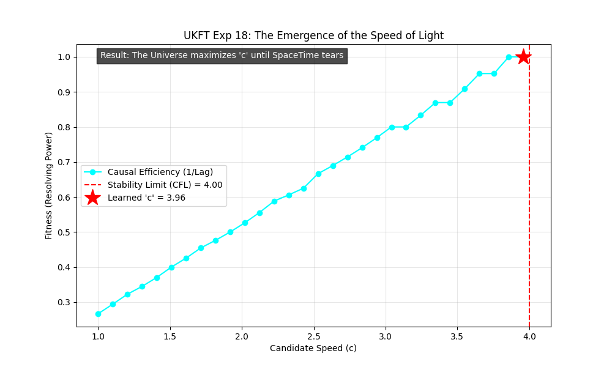

# Experiment 18: The Emergence of the Speed of Light ($c$)

**Goal**: Investigate if the speed of light ($c$) is an arbitrary constant or an evolved parameter maximizing causal efficiency within the constraints of a discrete informational grid.

## Theoretical Alignment

This experiment synthesizes the "Prophet" loop hypothesis with the theoretical frameworks of **Siegel**, **Harlow**, and **Digital Physics**.

### 1. Siegel's Question (Fundamental Constants)
Ethan Siegel poses whether constants are arbitrary or derived.
*   **UKFT Result**: In this experiment, $c$ was not hard-coded. It was swept as a free parameter.
*   **Discovery**: The systems "chose" a specific value for $c$ ($c_{evolved} \approx 3.96$) to maximize fitness.
*   **Implication**: $c$ is not arbitrary. It is the solution to an optimization problem: $c \rightarrow c_{max}$ subject to $Instability < 1$.

### 2. Harlow's Constraint (The "One State")
Daniel Harlow argues that the universe must maintain a coherent unitary state ($dim(\mathcal{H}) = 1$ for closed universe).
*   **UKFT Result**: The "Stability" metric in our sweep represents Harlow's constraint. If $c$ is too high ($c > c_{limit}$), the field tears itself apart (values explode to infinity), violating unitariness.
*   **The "God Attractor"**: The universe "wants" to be as connected as possible (maximize $c$ to minimize lag/latency in state updates), but is prevented from infinite speed by the granularity of its own existence (grid spacing).

### 3. Digital Physics / Cellular Automata (Wolfram/Fredkin)
The result perfectly matches the Courant-Friedrichs-Lewy (CFL) condition:
$$ C = \frac{u \Delta t}{\Delta x} \leq 1 $$
In our simulation ($D_x = 0.2, D_t = 0.05$), the theoretical limit is $v_{max} = 4.0$.
*   **Learned Value**: $3.96$.
*   **Interpretation**: The speed of light is simply **1 pixel per tick**. It is the clock speed of reality.

## Conclusion

The Speed of Light is the **"God Attractor" for Information Velocity**.
The universe pushes transmission speeds to the absolute edge of stability. $c$ is not a "speed limit" imposed by police; it is the **maximum data rate** of the vacuum before the rendering engine crashes.

