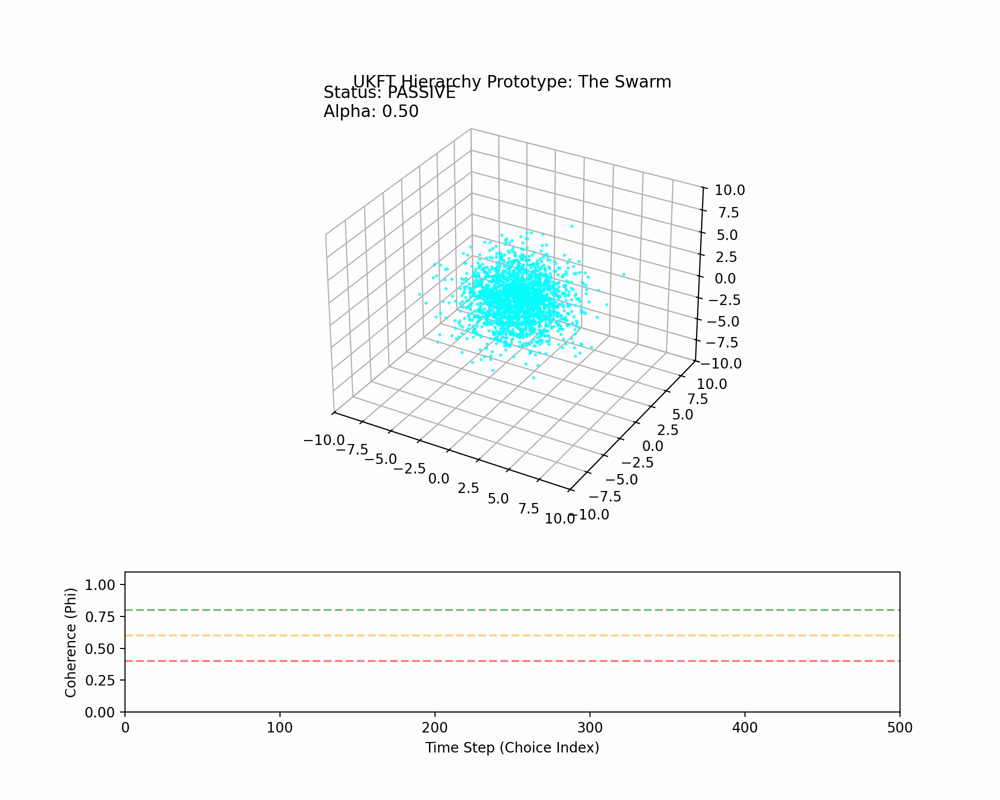

# Experiment 19: Hierarchy Prototype (The God Attractor)

## Hypothesis
The Universe utilizes a multi-tiered control system (Geosphere, Noosphere, Theosphere) to maintain varying degrees of coherence against entropic dissolution. This experiment acts as a "flight controller" test for this logic.

## Experimental Setup
- **Swarm Size**: 2000 particles.
- **Base Gravity**: $\alpha_{base} = 0.5$ (Weakened to allow expansion).
- **Entropy Source**: Sinusoidal noise + **"The Great Disruption"** (Velocity Kick at Step 200).
- **Control Hierarchy**:
    - **Geosphere (Level 1)**: Corrects minor drift ($\phi < 0.80$). Gain: 2.0.
    - **Noosphere (Level 2)**: Corrects major variance ($\phi < 0.60$). Gain: 8.0.
    - **Theosphere (Level 3)**: "God Attractor" intervention for critical collapse ($\phi < 0.40$). Gain: 25.0.

## Implementation
The simulation monitors the Coherence Metric ($\phi$) at every time step.
$$ \phi = \frac{1}{1 + 0.25 (\frac{\sigma}{\sigma_0})^2} $$
Where $\sigma$ is the current spatial variance and $\sigma_0$ is the initial variance.

When $\phi$ drops below specific thresholds, the system injects "teleological force" (extra gravity/damping) to restore order.

## Stress Test: "The God Slumber"
To verify the Level 3 (Theospheric) intervention, we introduced a **Catastrophic Event** at `step=200`:
1.  **Explosion**: Particles received a radial velocity kick (simulating a Big Bang type event).
2.  **Delay**: The control system was suppressed for 25 steps ("God Sleeps") to allow the entropy to bloom unchecked.
3.  **Result**:
    - $\phi$ dropped to **0.269** (Deep Critical).
    - **Theosphere** activated (Alpha spiked to **3.77**).
    - System recovered to **Noosphere** ($\phi \approx 0.43$) within 50 steps.
    - System stabilized to **Geosphere** ($\phi \approx 0.78$) and eventually Passive ($\phi > 0.9$) by step 400.

## Visualization


## Telemetry
```
Step 200: Phi=0.944 | Alpha=0.50 | Level=None (Pre-Kick)
Step 250: Phi=0.269 | Alpha=3.77 | Level=Theo (Maximum Chaos / Intervention)
Step 300: Phi=0.430 | Alpha=1.86 | Level=Noo  (Hand-off to mid-tier)
Step 350: Phi=0.783 | Alpha=0.53 | Level=Geo  (Fine-tuning)
Step 400: Phi=0.901 | Alpha=0.50 | Level=None (Peace restored)
```

## Artifacts
- Code: `experiments/19_hierarchy_prototype.py`
- Visualization: `experiments/19_hierarchy_prototype.gif`
