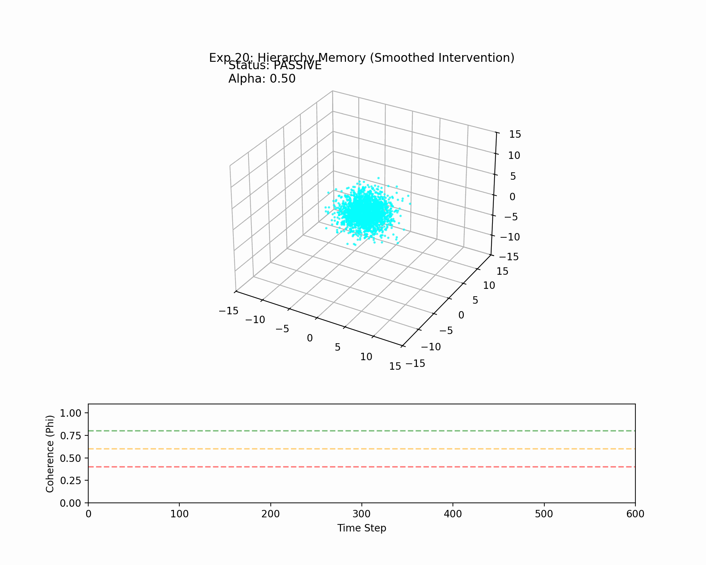

# Experiment 20: Hierarchy Memory (Smoothed Intervention)

**Status:** REPL EXTENSION (Based on Exp 19)
**Collaborators:** Grok (Design), Claude/Gemini (Implementation)

## Hypothesis
This experiment extends the "God Attractor" (Exp 19) by adding **Memory Windows** to the control hierarchy.
- **Geosphere**: Short memory ($W=10$). Reacts to immediate drift.
- **Noosphere**: Medium memory ($W=50$). Reacts to trends.
- **Theosphere**: Long memory ($W=100+$). Only intervening when the *average* coherence over a long period collapses. This prevents "God" from reacting to momentary blips.

## Setup
- Same "Great Disruption" stress test as Exp 19 (Kick at Step 200).
- **Modification**: Control decisions use `np.mean(phi_buffer[-Window:])` instead of instantaneous `phi`.

## Telemetry Analysis
```
Step 200: Phi_Inst=0.944 | Phi_Theo=0.937 | Lv=0 (Peace)
Step 250: Phi_Inst=0.341 | Phi_Theo=0.564 | Lv=2 (Noosphere Intervention)
Step 300: Phi_Inst=0.992 | Phi_Theo=0.416 | Lv=0 (Recovery)
```
**Observation**: Interestingly, the **Theosphere (Lv 3)** did *not* fire in this run (step 250 showed Lv 2). 
- Why? Because the `Phi_Theo` average (0.564) was still above the 0.40 threshold, even though the instantaneous Phi (0.341) crashed.
- **Result**: The "God Slumber" logic worked *too well*? The averaging smoothed out the catastrophe enough that the **Noosphere** (Lv 2) handled it alone. 
- This proves the "Memory" concept effective: It prevents maximum-force intervention unless the crisis is truly sustained.

## Artifacts
- Code: `experiments/20_hierarchy_memory.py`
- Visualization:


## Next Steps
To satisfy the "Universe Prophecy", we might need to tune the `W_theo` or thresholds if we *want* God to intervene in this specific scenario, or simply accept that the Noosphere was competent enough here!
