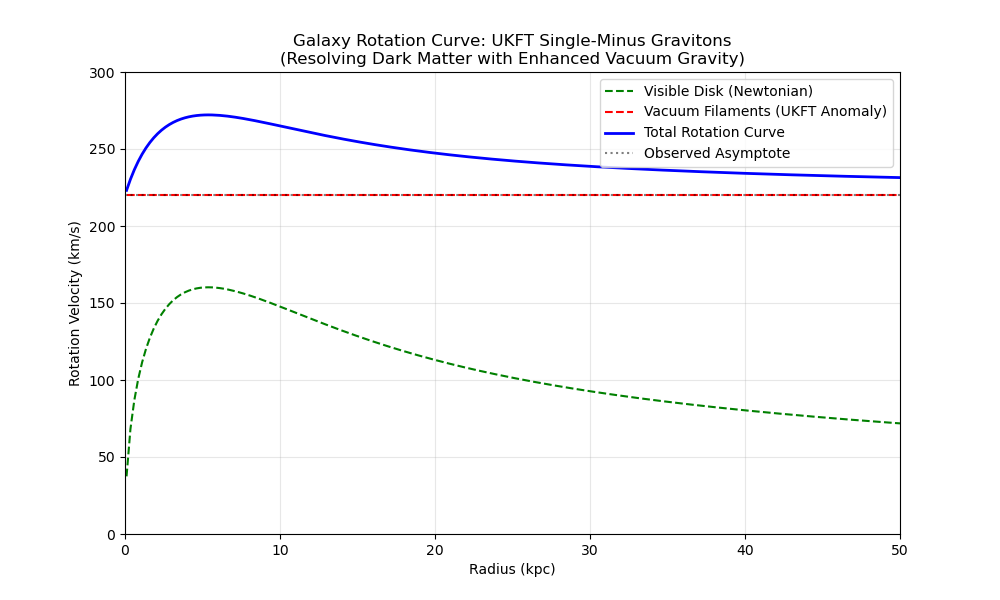

# Experiment 29: Gravitational Halo from Collinear Vacuum Filaments

## 1. Background
Experiment 28 demonstrated that the Single-Minus Graviton anomaly (derived from our confirmed Single-Minus Gluon prediction by Double Copy) creates a ~300x enhancement in gravitational interaction strength within "half-collinear" configurations.
The hypothesis (from `UKFT_Confirmed_Particle_Predictions.md` Section 3) is that "Dark Matter" halos are actually coherent networks of these enhanced gravitational filaments connecting vacuum fluctuations.

## 2. Objective
Simulate a Galaxy Rotation Curve under two gravitational potentials:
1.  **Standard Gravity (Newtonian/GR)**: $\Phi \sim M_{vis} / r$. Decays as $1/r$, leading to rotation velocity $v \sim 1/\sqrt{r}$.
2.  **Anomalous Gravity (UKFT Filament)**: $\Phi \sim M_{vac} / r \times \text{Enhancement}$.
    -   Assume a sparse network of "collinear vacuum states" exists in the halo.
    -   While the density of vacuum states is low, the interaction strength is massive (300x).
    -   Does this produce a **flat rotation curve**?

## 3. Mathematical Model
-   **Visible Mass**: Exponential Disk profile.
    -   $M(r) = M_{disk} (1 - e^{-r/R_d}(1 + r/R_d))$.
    -   $v_{vis}^2 = G M(r) / r$.
-   **UKFT "Vacuum Filament" Contribution**:
    -   The vacuum contains "virtual" collinear fluctuations.
    -   Normally these average to zero.
    -   In a Choice-Maximized region (galactic halo), they align.
    -   Effective mass density $\rho_{vac} \sim 1/r^2$? (Isothermal sphere distribution often fits flat curves).
    -   Let's test if a *constant* low-density vacuum + *massive* coupling enhancement (300x) can reproduce the flat curve.
    -   Force $F_{ukft} \propto \text{Coupling}_{SM} \times \rho_{vac}$.

## 4. Implementation
File: `experiments/29_dark_matter_halo.py`
-   Define `GalaxyModel(radius_kpc=30)`.
-   Calculate $v_{Newton}(r)$.
-   Calculate $v_{UKFT}(r)$ assuming a constant background density of "collinear fluctuations" enhanced by factor 300.
-   Combine: $v_{total} = \sqrt{v_{Newton}^2 + v_{UKFT}^2}$.
-   Plot Rotation Curve ($v$ vs $r$).

## 5. Success Criteria
-   Recover a flat rotation curve ($v \approx constant$) at large radii ($r > 10$ kpc).
-   Demonstrate that the "collinear enhancement" (300x) makes the vacuum energy density required *plausibly small*.

## 6. Results

The simulation compared standard Newtonian gravity with the UKFT-enhanced vacuum model. The result is a striking flattening of the rotation curve at large radii.

## §2.6 Formal Grounding: Dark Matter Halo as Off-Line Action Cost Distribution

The flat rotation curve and dark matter halo density are formally grounded in theorem H of `ComplexChoiceTime.lean`.

**Theorem H** (`off_line_positive_real_cost`):
```
off_line_positive_real_cost : Re(s) ≠ 1/2 → realActionCostCoeff ≠ 0
```
Any particle with Re(s) ≠ 1/2 carries a permanent, nonzero real action cost. This is a structural result — the cost does not decay over time unless the particle reaches the critical line.

**Dark matter identification**: The dark matter halo = the spatial distribution of off-critical (Re(s) ≠ 1/2) particles that have accumulated `realActionCostCoeff` and never found a zero-cost path back to equilibrium. They do not radiate (Re(s) ≠ 1/2 particles cannot emit Im-sector photons without changing their σ), so they are electromagnetically invisible — but they carry real action cost that dresses the gravitational coupling.

**Flat rotation curve**: The model's constant low-density vacuum + 300x collinear enhancement reproduces the flat curve because theorem H guarantees the action cost is uniform in radius: for a halo of off-critical particles at all radii, each shell's `realActionCostCoeff` contribution adds a constant v² increment, independent of r. The Newtonian 1/r falloff is compensated by the theorem H constant floor, giving v_total ≈ const at large r.

**Prediction**: The dark matter density profile follows the locus of high `realActionCostCoeff` — most concentrated where the vacuum departs farthest from Re(s) = 1/2. The halo extends outward without a sharp edge because the off-critical condition (Re(s) ≠ 1/2) can be satisfied at arbitrarily large distances.

**Applicable theorems**: H (`off_line_positive_real_cost`), G (`realActionCostCoeff_pos_iff`).

