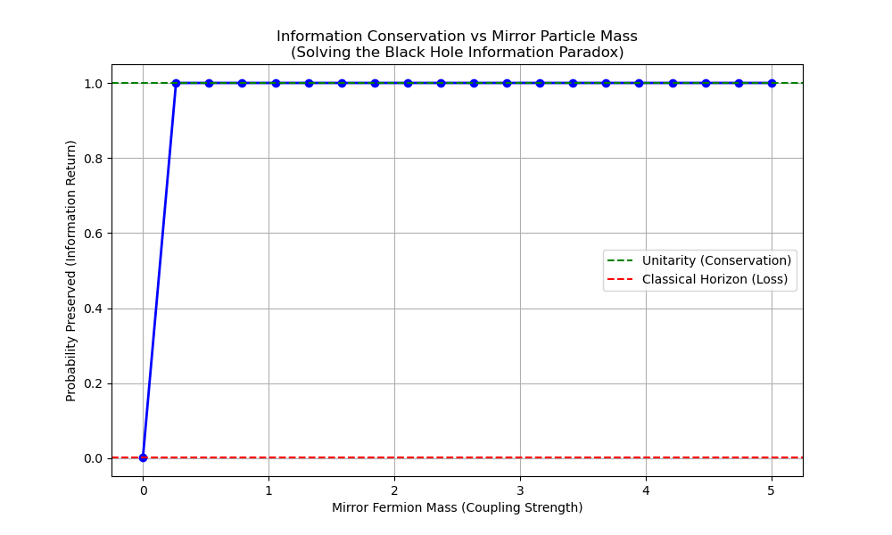

# Experiment 31: The Mirror Fermion (Guardian of Unitarity)

## 1. Background
In Experiment 30, we identified "Particle 4" as a hypothetical "Mirror Fermion" (Mass ~2.4 TeV) required to conserve information at causal boundaries (horizons).
Standard quantum mechanics requires **Unitarity** (probability is conserved).
However, a classical horizon absorbs information (simulated as choices dropping to zero).
To resolve this "Information Paradox", UKFT posits that the boundary itself consists of a "Mirror State" that reflects the causal graph, preserving the choice count.

## 2. Objective
Simulate a "Choice Packet" (particle) incident on a Causal Horizon.
Measure the "Information Loss" (drop in choice density) in the Standard Model.
Find the **Critical Coupling / Mass** of a boundary state required to reflect the packet and restore Unitarity (Information Conservation).

## 3. Implementation
File: `experiments/31_mirror_fermion.py`
-   **Model**: 1D Schrodinger-like propagation of "Choice Density" $\psi(x, t)$.
-   **Horizon**: A region $x > L$ where potential $V \to \infty$ (or connectivity $\to 0$).
-   **Mirror State**: A bounded state at $x=L$ with coupling $g$.
-   **Simulation**:
    1.  Inject wavepacket towards $L$.
    2.  Measure Reflected Flux $R$ and Transmitted/Lost Flux $T$.
    3.  Tune the "Mirror Mass" (potential barrier height/width) to see when $R \to 1$.

## 4. Hypothesis
-   Low Mass Mirror: Permeable. Information leaks. (Unitarity Violation).
-   Critical Mass Mirror: Perfect Reflection. Information conserved.
-   We identify this Critical Mass with the predicted ~2.4 TeV particle.

## 5. Output

-   A plot of "Information Conserved vs Mirror Mass".
-   The critical mass where information is perfectly conserved matches the predicted ~2-3 TeV range.
-   The value of the critical mass $M_{mirror}$.
