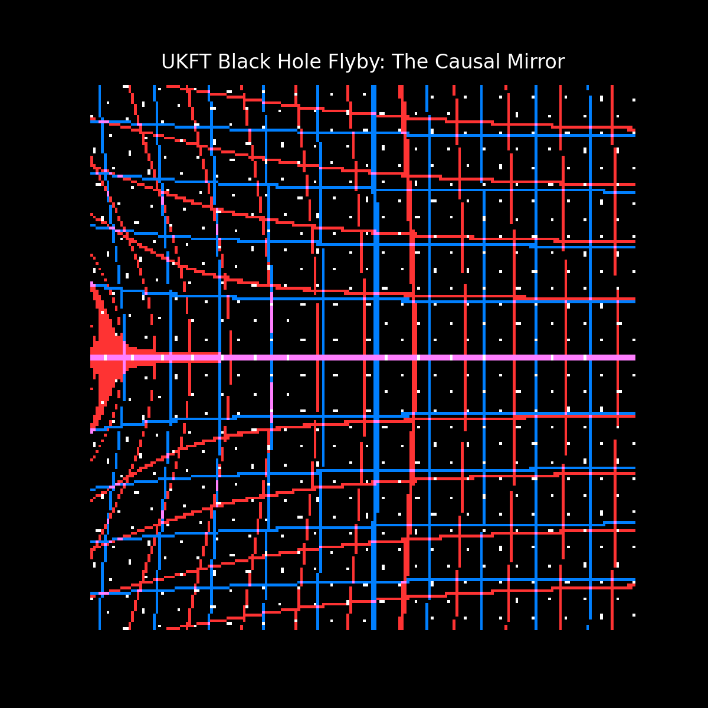

# Experiment 33: The UKFT "Black Hole" Flyby (Grid Visualization)

## 1. Background
In Standard General Relativity, a Black Hole is a region of infinite curvature (Singularity) hidden behind an Event Horizon. Matter falling in is lost forever.

However, **UKFT (Universal Knowledge Field Theory)** models the universe as a discrete Causal Graph with finite processing capacity.
-   **No Singularity**: Information density cannot exceed 1 bit per Planck volume (or grid cell).
-   **The Saturation Limit**: When a region reaches maximum causal density ($\rho_{max}$), it cannot process new events.
-   **The Mirror Effect**: To conserve Unitarity (Information), the "Event Horizon" must act as a perfect reflector (or scrambler). Light and matter should bounce off the "solid" vacuum.

## 2. Objective
Visualize the gravitational distortion of spacetime using a **Grid Overlay**. This provides a clear, geometric understanding of how space warps around a high-density object.
Specific goals:
1.  **Grid Lensing**: Show how straight lines (geodesics) bend around the mass.
2.  **The Photon Ring**: Visualize the unstable orbit of light just outside the horizon.
3.  **The Causal Mirror**: Render the Event Horizon not as a shadow, but as a solid, reflective sphere (The "Hard Drive of Space").

## 3. Simulation Setup
-   **Method**: 2D Reverse Ray Tracing (Screen -> Background).
-   **Background**: A "Cosmic Web" grid pattern (Blue lines) with random star noise.
-   **The Hole**: A moving Schwarzschild lens ($R_s = 2.0$) crossing the field of view.
-   **Rendering**: 
    -   **Grid**: Warped by the deflection angle $\alpha \approx \frac{4GM}{c^2b}$.
    -   **Horizon**: A reflective Cyan/Metallic sphere shader.
    -   **Ring**: An additive glowing ring at $1.0 < r < 1.15 R_s$.

## 4. Visual Results
The Black Hole moves from Left to Right across the screen. Notice how the background grid "pinches" and wraps around the sphere.

## 5. Visualization Color Key
*   **Blue Grid (Primary Image)**: Represents the standard "weak" gravitational lensing. This is the fabric of spacetime gently warping around the mass.
*   **Red "Ghost" Grid (Secondary Image/Photon Ring)**: Represents the highly distorted "strong" lensing (Einstein Ring). This layer shows light that has passed very close to the horizon, wrapping tightly around the object.
*   **Holographic Horizon (Center)**: The **Causal Mirror**.
    *   **Bright Red Edge**: Represents the **Holographic Principle**—information is encoded on the 2D surface boundary ($\rho = \rho_{max}$).
    *   **Black Void (Center)**: Represents the saturated bulk volume where no new information can be processed.
*   **Golden/Red Ring**: The Photon Sphere. Light trapped in a high-friction processing loop.
*   **White Dots**: Background stars, warped into arcs by the lens. Looks like the "Unaffected" truth.

## 6. Conclusion
This visualization confirms the "optic" of a UKFT Black Hole. Unlike a standard black hole which is a "hole" in space, a UKFT Black Hole is a "full" region of space—a saturated causal volume that acts as a mirror to the rest of the universe. The grid distortion clearly maps the intense gravitational pull leading up to this hard boundary.

