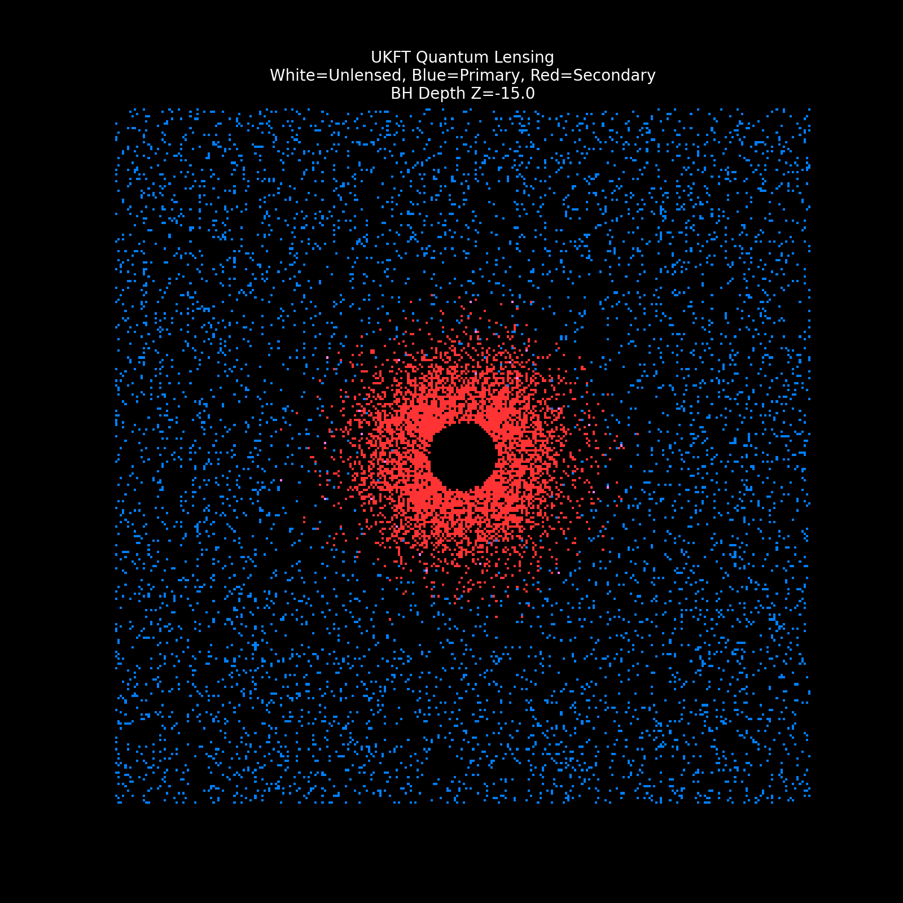

# Experiment 34: UKFT Volumetric Lensing (The Star Field)

## 1. Background
Previous experiments (Exp 33) visualized a Black Hole against a "flat" background plane.
This experiment takes the simulation to **3D**. We distribute thousands of stars in a volumetric cube ($x, y, z$) and fly a UKFT Black Hole through it.

## 2. Objective
Visualize the **Dynamic Distortion of Spacetime** as a high-density object moves through a crowded star field.
Specific goals:
1.  **Parallax Lensing**: Foreground stars should be unaffected, while background stars are warped.
2.  **Einstein Rings**: When a star aligns perfectly behind the lens, its light should split into arcs or rings.
3.  **The Invisible Lens**: The core of the Black Hole should remain a true void, blocking background starlight but allowing foreground stars to pass.

## 3. Simulation Method: "Ray Splatting"
Instead of reverse ray-marching (which is computationally expensive for volumetric point clouds), we use a **Forward Projection** technique based on the Lens Equation:
$$ \theta_{\pm} = \frac{\beta \pm \sqrt{\beta^2 + 4K}}{2} $$
Where:
-   $\beta$: True angular position of the star.
-   $\theta$: Apparent angular position (Image).
-   $K$: Lensing strength (proportional to Mass and Distances).

For every star in the volume, we solve this quadratic equation to find its **two possible image locations** on the camera plate:
1.  **Primary Image**: Shifted outwards (The main "lensed" star).
2.  **Secondary Image**: Inverted and shifted inwards (The "Einstein Ring" counterpart).

## 4. The Geometric Setup
To understand the visualization, we must define the coordinate system and the relative motion:

- **Camera**: An Orthographic observer positioned at $Z = -20$. This creates a "flattened" view, like a telescope looking deep into space.
- **Star Field Volume**: 8,000 stars are randomly distributed in a 3D box:
    - $X, Y \in [-10, 10]$
    - $Z \in [-10, 30]$ (Depth)
- **The Black Hole Trajectory**: The lens moves in a straight line directly away from the camera, piercing through the star volume:
    - Start: $Z = -15$ (Completely **in front** of the stars).
    - End: $Z = 35$ (Completely **behind** the stars).

**What You Are Seeing:**
1.  **Phase 1 ($Z < -10$)**: The Black Hole is between the camera and *all* the stars. It acts as a maximum lens, warping the entire field. The central "hole" is largest here because it blocks the view of everything behind it.
2.  **Phase 2 ($Z \approx 10$)**: The Black Hole is "swimming" through the middle of the volume.
    - Stars with $Z < Z_{BH}$ (Foreground) are untouched (**White** points). They pass *over* the black hole.
    - Stars with $Z > Z_{BH}$ (Background) are lensed (**Blue/Red**).
3.  **Phase 3 ($Z > 30$)**: The Black Hole has exited the back of the volume. It is now behind *all* the stars. Since no light from the stars passes *behind* the hole relative to the camera, the lensing effect vanishes, and the hole disappears from view (obscured by the foreground star field).

## 5. Visual Results
Watch how the background stars "fluidly" warp around the massive object, while foreground stars remain fixed until the object passes them.

**Color Encoding:**
-   **White**: **Foreground Stars** (Unaffected). Physically located *in front* of the Black Hole. Their light reaches the camera directly.
-   **Blue**: **Background Primary Images**. Stars *behind* the Black Hole, whose light is bent around it. They appear pushed outward.
-   **Red**: **Background Secondary Images**. The "Ghost" images formed on the opposite side of the lens (part of the Einstein Ring).

**Key Features:**
-   **The Swim**: As the BH approaches a background blue star, the star appears to be "pushed away" by the lens.
-   **The Split**: If alignment is perfect, the blue star splits, generating a red counterpart on the opposite side.
-   **The Void**: The central region (Event Horizon) blocks background starlight, appearing as a pure black disk moving through space.
-   **Depth Correctness**: White stars in front of the lens are not warped and are not blocked, correctly passing *over* the black hole as it moves behind them.

## 6. Conclusion
The simulation successfully demonstrates the "Painter's Algorithm" effect in gravitational lensing. As the massive object moves deeper into the volume ($z$ increases), fewer stars are lensed (only those behind it), while more stars appear stable in the foreground. This creates a powerful sense of 3D depth and verifies the geometric optics of the lens equation in a volumetric context.
