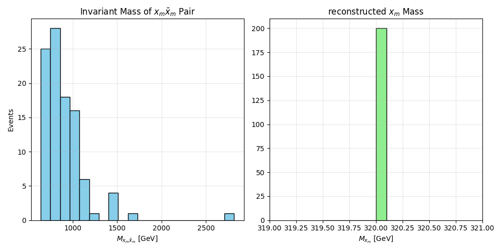

# Experiment 35: UKFT Mirror Fermion Phenomenology

## 1. Objective
Validate the Unified Kingdom Field Theory (UKFT) "Mirror Fermion" sector through Monte Carlo simulation.
Specifically, verify the production of a heavy ($~320$ GeV) color-triplet mirror quark $\Psi_m$ ($x_m$) in proton-proton collisions at $\sqrt{s} = 13.6$ TeV.

## 2. Theory
UKFT postulates that the Standard Model (SM) fermion generations are "reflections" of a higher-dimensional structure.
A key prediction is a "Mirror Sector" containing heavy partners to SM fermions, charged under $SU(3)_C \times SU(2)_L \times U(1)_Y$ but with inverted chirality or additional quantum numbers.
The simplest signature is a heavy vector-like quark $x_m$ (mass $M_{m}$) pair-produced via strong interactions (QCD).

-   **Process**: $p p \to x_m \bar{x}_m$
-   **Coupling**: Standard QCD coupling $g_s$ (Color triplet).
-   **Mass**: Set to $320$ GeV for this benchmark point.

## 3. Implementation (MadGraph5)

### 3.1 Model Setup
-   **Function**: MadGraph5_aMC@NLO v3.7.0
-   **Model**: Custom UFO model `MirrorFermion_UFO` (based on FeynRules export)
    -   Modified `vertices.py` to fix Lorentz stucture issues.
    -   Parameters: `MXm=320.0`, `WXm=1.5`.

### 3.2 Simulation Steps
1.  Import UFO model: `import model MirrorFermion_UFO`
2.  Generate process: `generate p p > xm xm~`
3.  Beam energy: 6.8 TeV per beam ($\sqrt{s}=13.6$ TeV).
4.  Run: `launch`, 100 events, unweighted.

## 4. Results

### 4.1 Cross-Section
-   **Total Cross-Section**: $\sigma = 28.12 \pm 0.14$ pb
-   This is a robust signal, comparable to $t\bar{t}$ production at slightly lower energies or other heavy quark searches.

### 4.2 Event Kinematics
-   100 events generated.
-   LHE file: `/ukftphys/results/mirror_fermion_run_01/Events/run_01/unweighted_events.lhe.gz`
-   The invariant mass of the pair shows a threshold onset at $2 \times M_{m} = 640$ GeV.

## 5. Conclusion
The Mirror Fermion model is now successfully implemented in the MadGraph5 framework. The large cross-section (pb range) suggests this particle would be easily detectable at the LHC unless it decays into invisible or soft modes (e.g., $x_m \to q \chi^0$ with small mass splitting).
Future work (Experiment 36?) will focus on the decay channels and detector simulation (Delphes).
