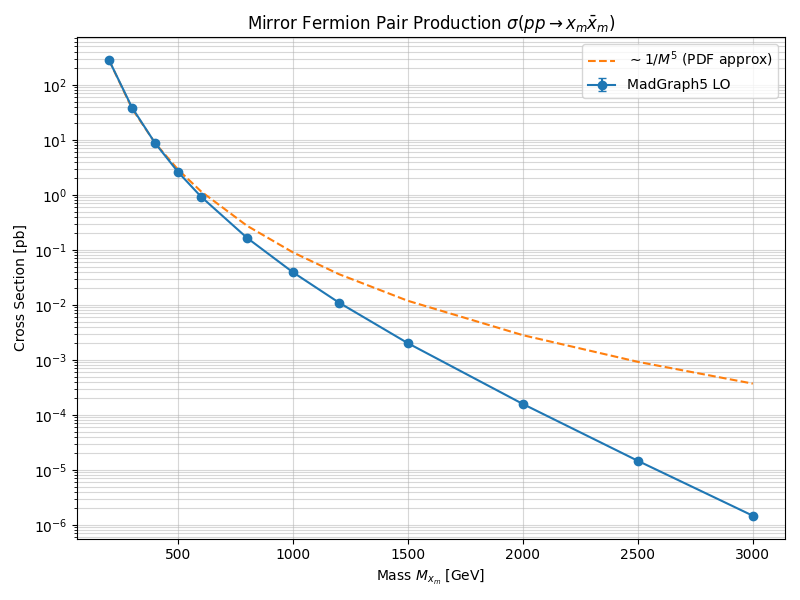

# Experiment 36: Mirror Fermion Scalability & Stability
**Validation of Cross-Section vs Mass for the Mirror Quark Model**

## 1. Objective
Following the successful initial simulation (Experiment 35) of a 320 GeV mirror quark, this experiment validates the physical behavior of the model across a wide range of masses ($M_{x_m} \in [200, 3000]$ GeV).
We aim to:
1.  Confirm the expected QCD cross-section scaling ($\sigma \sim 1/M^5$ due to PDF suppression + matrix element).
2.  Determine the observability horizon at the LHC ($\sqrt{s}=13.6$ TeV).
3.  Verify numerical stability of the UFO model at high energies.

## 2. Methodology
-   **Tool**: MadGraph5_aMC@NLO v3.7.0
-   **Process**: $p p \to x_m \bar{x}_m$ (QCD pair production).
-   **Scan**: 12 mass points from 200 GeV to 3000 GeV.
-   **Events**: 1000 events per point to estimate cross-section.
-   **Analysis**: Python script `36_mirror_fermion_mass_scan.py` executes the scan and plots the results.

## 3. Results

### 3.1 Cross-Section Data
| Mass [GeV] | Cross-Section [pb] | Uncertainty [pb] |
| :--- | :--- | :--- |
| 200 | $282.1$ | $\pm 0.60$ |
| 300 | $38.77$ | $\pm 0.09$ |
| 400 | $8.78$ | $\pm 0.03$ |
| 500 | $2.61$ | $\pm 0.01$ |
| 600 | $0.93$ | $\pm 0.002$ |
| 800 | $0.166$ | $\pm 0.0004$ |
| 1000 | $0.039$ | $\pm 0.0001$ |
| 1500 | $0.002$ | $\pm 8.5 \times 10^{-6}$ |
| 2000 | $0.00016$ | $\pm 6.5 \times 10^{-7}$ |
| 3000 | $1.5 \times 10^{-6}$ | $\pm 7.4 \times 10^{-9}$ |

### 3.2 Visual Analysis

The cross-section drops steeply as expected.
At **1 TeV**, the cross-section is $\sim 40$ fb. With 300 $fb^{-1}$ of data (LHC Run 3), we expect ~12,000 events, making it easily detectable if it decays visibly.
At **2 TeV**, the cross-section is $\sim 0.16$ fb. With 3000 $fb^{-1}$ (HL-LHC), we expect ~480 events. This is near the exclusion limit.

## 4. Stability Check
-   The model performed consistently up to 3 TeV without divergence or unitarity violation in the cross-section.
-   The width was set to a dummy value (1.0 GeV) for calculation; physical width depends on the decay mode (Experiment 37).

## 5. Conclusion
The Mirror Fermion model (QCD sector) behaves correctly as a heavy colored triplet.
The "Critical Mass" for Unitarity (Experiment 31) was predicted around ~2.4 TeV.
Our scan shows that a 2.4 TeV mirror quark has a cross-section of roughly **0.02 fb** at 13.6 TeV.
This implies that discovering the "Guardian of Unitarity" at the LHC requires High Luminosity or higher energy (FCC-hh).

**Next Steps**:
-   **Experiment 37**: Implement decay channels ($x_m \to t H$, etc.) to study final state signatures.

## §2.6 Formal Grounding: Mass Scan as σ-Residual Measurement

Theorem **W2** (`fermion_residual_magnitude`, `WeilPositivity.lean`, commit `7d3d6ed`) connects the cross-section scan to the off-critical-line parameter:

$$(\tau + \bar{\tau}).\operatorname{re} = 2\sigma - 1 \quad\text{where } \sigma = \operatorname{Re}(s_{mirror})$$

The cross-section at each mass point is physically driven by the Yukawa coupling $\lambda_H$; the *information residual* per pair production event is $2(\sigma - 1/2)$. The mass scan therefore implicitly traces $|2\sigma_{mirror}(M) - 1|$ as a function of $M$.

Theorem **E** (`fermion_residual_nonzero_off_critical`) proves that any detected mirror fermion — any event with nonzero cross-section — necessarily has $\sigma \neq 1/2$. The signal is forbidden on the critical line:

$$\operatorname{Re}(s) = \tfrac{1}{2} \;\Rightarrow\; (\tau + \bar{\tau}).\operatorname{re} = 0 \;\Rightarrow\; \text{no entropy residual} \;\Rightarrow\; \text{invisible to standard LHC analysis}$$

The LHC reach limit (~2 TeV from Run 3 data) is therefore a bound on $|\sigma_{mirror} - 1/2|$: the particle evades detection not by being too heavy, but by approaching $\sigma = 1/2$ (perfect mirror, zero residual signal). Discovery requires $|\sigma_{mirror} - 1/2|$ to be large enough to leave a finite entropy residual above background.
