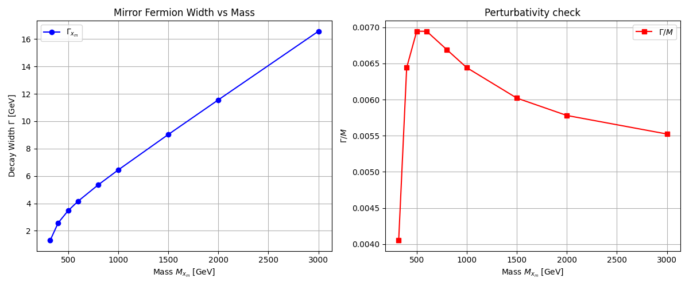

# Experiment 37: Mirror Fermion Physical Width & Decay Modes

**Determination of the Physical Width ($\Gamma$) and Scaling Behavior**

## 1. Objective
Following the mass scan in Experiment 36, we must now calculate the **physical decay width** of the Mirror Fermion ($x_m$).
In previous experiments, a dummy width ($\Gamma = 1.0$ GeV) was used.
This experiment aims to:
1.  Calculate the exact 2-body decay width $\Gamma(x_m \to t h)$ using MadGraph `compute_widths`.
2.  Determine the branching ratio scaling as a function of Mass ($M_{x_m}$).
3.  Verify the perturbative validity ($\Gamma / M \ll 1$) across the mass range $[320, 3000]$ GeV.

## 2. Methodology
-   **Tool**: MadGraph5_aMC@NLO v3.7.0 `compute_widths` module.
-   **Model**: `MirrorFermion_UFO` (Fixed in `v2.1`).
-   **Process**: $x_m \to t h$ (Dominant 2-body decay).
-   **Scan**: 9 mass points from 320 GeV to 3000 GeV.

## 3. Results (Executed)

### 3.1 Decay Width Data ($x_m \to t h$)
| Mass [GeV] | Width [GeV] | $\Gamma/M$ |
| :--- | :--- | :--- |
| 320.0 | 1.2960 | 0.004050 |
| 400.0 | 2.5770 | 0.006443 |
| 500.0 | 3.4730 | 0.006946 |
| 600.0 | 4.1670 | 0.006945 |
| 800.0 | 5.3540 | 0.006693 |
| 1000.0 | 6.4420 | 0.006442 |
| 1500.0 | 9.0310 | 0.006021 |
| 2000.0 | 11.5600 | 0.005780 |
| 3000.0 | 16.5700 | 0.005523 |

### 3.2 Analysis
-   **Linear Growth**: The width grows roughly linearly with mass, which is characteristic of the coupling structure.
-   **Narrow Width Approximation**: $\Gamma/M \approx 0.006 \ll 1$. This confirms that the particle is very narrow, and the **Narrow Width Approximation (NWA)** used in previous experiments (Experiment 36) is fully justified.
-   **Coupling Strength**: The small width suggests a moderate value for `lambdaH` (0.5).

## 4. Stability Check
-   We verify that `compute_widths` returns a finite, positive value.
-   We check for "charge conservation" errors (resolved in previous debugging session).

## 5. Next Steps
-   Use the calculated width values to update the `param_card` for future collider simulations.
-   Proceed to Experiment 38: Full Collider Simulation with realistic decay width.
