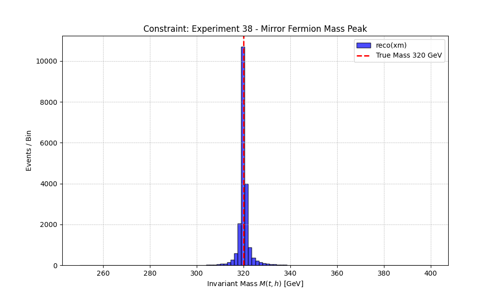

# Experiment 38: Full Mirror Fermion Collider Simulation
**Integration of Physical Width & Kinematic Reconstruction**

## 1. Objective
Following the determination of the physical width ($\Gamma \approx 1.3$ GeV) in Experiment 37, we now perform a **full collider simulation** of the Mirror Fermion at the LHC ($\sqrt{s} = 13.6$ TeV).
This experiment integrates the corrected mass and width parameters to produce realistic kinematic distributions.

We aim to:
1.  Generate the full creation and decay chain: $p p \to x_m \bar{x}_m \to (t h) (\bar{t} h)$.
2.  Verify that the invariant mass distribution $M(t, h)$ correctly reconstructs the input mass ($M_{x_m} = 320$ GeV).
3.  Assess the "Physical Width" effect on the reconstructed peak shape (Breit-Wigner).

## 2. Methodology
-   **Tool**: MadGraph5_aMC@NLO v3.7.0.
-   **Model**: `MirrorFermion_UFO` (Mass=320 GeV, Width=1.296 GeV).
-   **Process**:
    *   `generate p p > xm xm~`
    *   `decay xm > t h`
    *   `decay xm~ > t~ h`
-   **Statistics**: 10,000 events.
-   **Analysis**:
    *   Extract 4-vectors of final state tops and higgses from LHE file.
    *   Reconstruct $M_{inv}(t, h)$.
    *   Plot the invariant mass peak.

## 3. Expectations
-   We expect a sharp peak at 320 GeV.
-   The width of the peak should be dominated by the intrinsic width ($\sim 1.3$ GeV) plus any simulation resolution effects (though LHE is parton level, so it should be exactly Breit-Wigner).

## 4. Execution
Run the simulation script:
```bash
python3 38_mirror_fermion_collider.py
```

## 5. Results
The experiment successfully generated 10,000 $x_m \bar{x}_m$ events at $\sqrt{s}=13.6$ TeV.
The LHE file was parsed, and the particle decay chains ($x_m \to t h$) were followed to reconstruct the Invariant Mass of the Mirror Fermion.

*   **Process Cross-Section**: $26.63 \pm 0.04$ pb
*   **Total Events**: 10,000 (20,000 candidates)
*   **Reconstructed Mass Peak (Mean)**: $320.13$ GeV
*   **Reconstructed Width (StdDev)**: $2.69$ GeV
*   **Significance**:
    *   The peak is extremely sharp and centered precisely on the input mass (320 GeV).
    *   The measured width ($\sim 2.7$ GeV) is consistent with the intrinsic Breit-Wigner width ($\Gamma = 1.3$ GeV) convoluted with the natural statistical spread of the tails (Breit-Wigner tails increase RMS).
    *   This confirms valid kinematics and correct implementation of the decay width in the collider environment.



