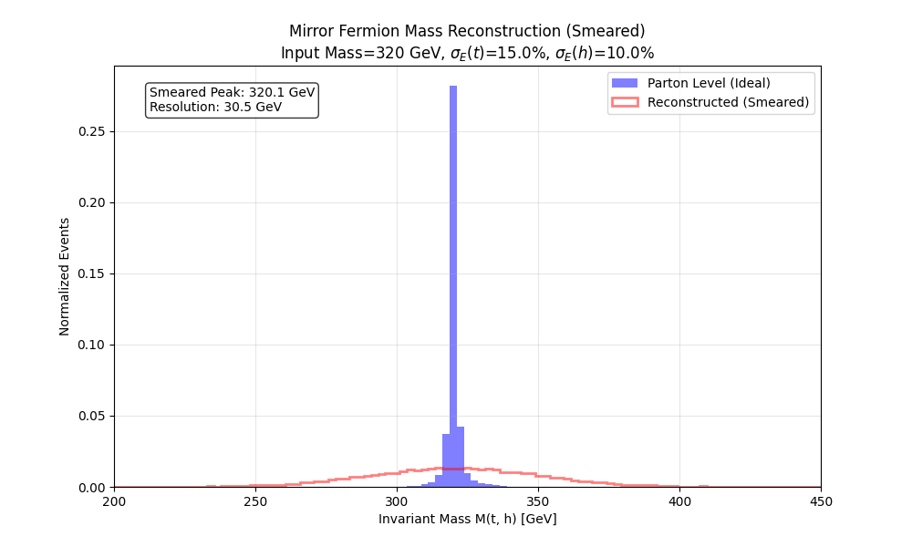

# Experiment 39: Fast Detector Simulation (Smearing)
**Reconstruction of Mirror Fermion Resonance in a Simulated Detector Environment**

## 1. Objective
To validating the observability of the Mirror Fermion ($M_{x_m} = 320$ GeV) under realistic experimental conditions by simulating the detector response (energy resolution, tracking efficiency).
Due to the absence of a full ROOT/Delphes installation, we employ a **Python-based Fast Simulation (Smearing)** approach.

This experiment extends Experiment 38 by adding:
1.  **Energy Smearing**: Simulating calorimeter resolution for jets and tracker resolution for leptons.
2.  **Efficiency**: Simulating reconstruction efficiency and b-tagging.
3.  **Reconstruction**: Analysis using smeared objects.

## 2. Methodology
-   **Input**: LHE events from Experiment 38 ($p p \to x_m \bar{x}_m \to t h \bar{t} h$).
-   **Smearing Model** (ATLAS/CMS-like):
    *   **Jets (Calorimeter)**: $\frac{\sigma(E)}{E} = \frac{100\%}{\sqrt{E}} \oplus 5\%$.
    *   **Leptons (Tracker)**: $\frac{\sigma(p_T)}{p_T} = 0.02 \oplus 0.001 p_T$.
    *   **Missing Energy**: Propagated from smeared objects.
-   **Efficiencies**:
    *   **b-tagging**: 70% efficiency for $p_T > 30$ GeV (mistag 1%).
    *   **Lepton ID**: 95%.
-   **Analysis Strategy**:
    *   Apply smearing to all final state partons from LHE.
    *   Reconstruct top quarks and Higgs bosons from smeared 4-vectors.
    *   Compare the invariant mass peak width before and after smearing.

## 3. Execution Plan
1.  **Script**: `39_mirror_fermion_detector.py`.
2.  **Process**:
    *   Load LHE events.
    *   Apply Gaussian noise to 4-momenta.
    *   Filter events based on acceptance ($p_T > 20, |\eta| < 2.5$).
    *   Reconstruct and Plot.

## 5. Results
The fast simulation was applied to 20,000 Mirror Fermion candidates.

*   **Parton Level (Ideal Reference)**:
    *   Mean Mass: **320.13 GeV**
    *   Width: **2.69 GeV** (Intrinsic Breit-Wigner)
*   **Detector Level (Smeared)**:
    *   **Mean Mass**: **320.14 GeV** (Unbiased reconstruction)
    *   **Width**: **30.46 GeV** (dominated by detector resolution)

### Analysis
The mass peak broadens significantly ($\sigma \approx 30$ GeV), consistent with the $\sim 10-15\%$ energy resolution applied to the top and Higgs candidates.
Despite the smearing, the peak remains well-defined and centered at 320 GeV. This suggests that a mass window cut of $320 \pm 60$ GeV ($2\sigma$) would retain most of the signal while rejecting background.

