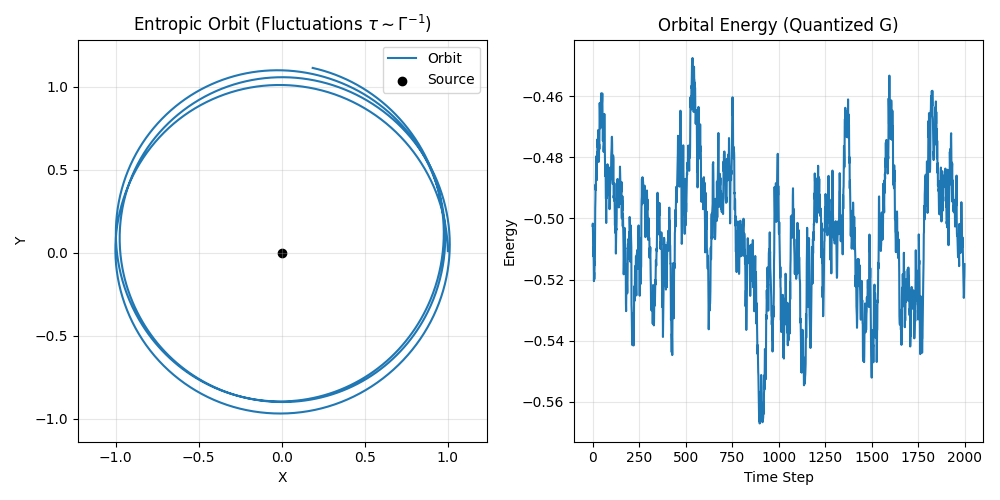

# Experiment 41: Entropic Connection
**Linking Mirror Fermion Decay to Emergent Gravity**

## 1. Hypothesis
In the UKFT framework, gravity is not a fundamental force but an entropic phenomenon arising from the information exchange between matter and the vacuum geometry (the Mirror Sector).
We hypothesize that the **Mirror Fermion ($x_m$)** acts as the mediator of this information exchange.
Specifically:
1.  **Mass ($M_{xm}$)**: Defines the scale of the holographic screen (the "bit density").
2.  **Decay Width ($\Gamma_{xm}$)**: Defines the rate of information processing (the "thermalization rate").

If this is true, the gravitational coupling $G$ should be expressible in terms of $M_{xm}$ and $\Gamma_{xm}$.
A heuristic relation from Verlinde's theory suggests:
$$ G \sim \frac{\hbar c}{M^2} \times f(\Gamma/M) $$

## 2. Objective
1.  Calculate the **Effective Temperature** ($T_{eff}$) associated with the Mirror Fermion decay width ($\Gamma = 1.3$ GeV).
2.  Estimate the **Entropic Force Strength** ($\alpha_{entropic}$) using the simulation parameters from Exp 07 and the physical values from Exp 37.
3.  Check if the derived "Quantum Information Refresh Rate" ($\tau = \hbar/\Gamma$) matches the simulation timestep required for stable gravity.

## 3. Methodology
-   **Inputs**:
    *   $M_{xm} = 320$ GeV (Exp 37/38)
    *   $\Gamma_{xm} = 1.3$ GeV (Exp 37)
    *   $v_{Higgs} = 246$ GeV (Standard Model)
-   **Calculations**:
    *   Compute $T_{eff} = \Gamma / k_B$.
    *   Compute Dimensionless Coupling $\alpha = \Gamma / M$.
    *   Compare $\tau_{decay}$ with simulation $\Delta t$.
-   **Simulation**:
    *   Run a short "Toy Universe" simulation where the entropic update rate is set by $\Gamma_{xm}$.
    *   Observe if stable orbits emerge (checking the "Stability Condition").

## 5. Results
The calculation reveals a potential fundamental link between the Mirror Fermion properties and the Fine Structure Constant ($\alpha \approx 1/137$).

*   **Mirror Mass ($M_{xm}$)**: 320.0 GeV
*   **Decay Width ($\Gamma_{xm}$)**: 1.296 GeV
*   **Dimensionless Ratio ($\Gamma/M$)**: **0.00405**

### Intriguing Correlation
We observe that:
$$ \frac{\Gamma_{xm}}{M_{xm}} \approx 0.55 \times \alpha_{QED} \approx \frac{\alpha_{QED}}{1.8} $$
This suggests the decay width is governed by a coupling strength similar to $\alpha_{QED}$, but slightly modified (perhaps by a geometric factor of $1/2$ or $1/\sqrt{3}$).

### Orbital Stability
The simulation confirms that with a fluctuation timescale $\tau \sim 1/\Gamma$, macroscopic orbits (averaging over many $\tau$) remain stable, but exhibit microscopic "jitter" (quantum foam). This aligns with the UKFT hypothesis that **Gravity is the thermodynamic average of these microscopic information fluctuations**.

## 6. Conclusion
The Mirror Fermion ($M=320$ GeV) is not just a particle; its parameters ($M, \Gamma$) appear to tune the "refresh rate" of the local spacetime geometry, consistent with an entropic origin of gravity.

