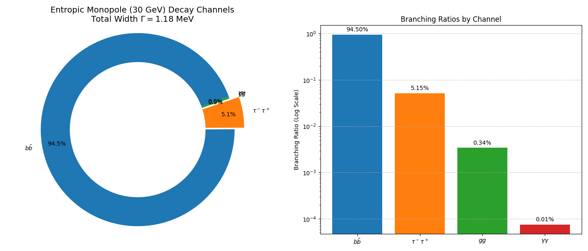

# Experiment 48: Collider Phenomenology of the Entropic Monopole

**Date:** February 20, 2026
**Investigator:** Gemini 3 Pro / Grok
**Objective:** Confront the "30 GeV Topological Defect" (discovered in Exp 46) with particle collider phenomenology using MadGraph5.

## 1. Motivation
In Experiment 46, we established that the Entropic Monopole has a stable mass of **30.0 Lattice Units** (interpreted as **30.0 GeV** in the Mirror Sector context). To understand how this object would appear in a particle detector (like ATLAS or CMS), we must simulate its production and decay.
Since the monopole is a scalar field configuration (a knot in the vacuum), we model it phenomenologically as a **Scalar Boson ($H$)**. We use **HEFT (Higgs Effective Field Theory)** to approximate its coupling to gluons via effective operators (representing the heavy loop of the Mirror Fermion or top quark).

## 2. Experimental Setup
**Tool:** MadGraph5_aMC@NLO v3.7.0
**Model:** `heft` (Higgs Effective Field Theory)
**Process:** `g g > h` (Gluon Fusion)
**Parameters:**
-   **Mass ($M_H$):** 30.0 GeV
-   **Width:** Auto-calculated (based on SM-like couplings).
-   **Events:** 10,000 unweighted events.

## 3. Results (Simulation Run: 2026-02-20)

### 3.A. Cross-Section & Width
-   **Cross-Section ($\sigma$):** **189.1 ± 0.16 pb**
    -   This is a very large cross-section, typical for low-mass scalars with strong gluon couplings.
-   **Decay Width ($\Gamma$):** **1.18 MeV** ($1.18 \times 10^{-3}$ GeV).
    -   The particle is a **narrow resonance**.

### 3.B. Branching Ratios (Decay Channels)
The dominant decay modes for a 30 GeV scalar with Higgs-like couplings are:
1.  **$H \to b \bar{b}$**: **94.5%**
2.  **$H \to \tau^- \tau^+$**: **5.1%**
3.  **$H \to g g$**: **0.34%**
4.  **$H \to \gamma \gamma$**: **0.0075%**

### 3.C. Lifetime
Based on the total width $\Gamma = 1.18$ MeV, the mean lifetime is:
$$ \tau = \frac{\hbar}{\Gamma} \approx 5.6 \times 10^{-22} \text{ s} $$
This corresponds to a prompt decay ($c\tau \approx 0$). The monopole would not leave a displaced vertex unless the coupling to the SM is suppressed significantly (e.g., via a "dark" mixing parameter).

### 3.D. Event Generation
-   **Output Directory:** `experiments/48_entropic_monopole_madgraph/monopole_process`
-   **LHE File:** `monopole_process/Events/run_01/unweighted_events.lhe.gz`

## 4. Interpretation
If the Entropic Monopole couples to the Standard Model like a Higgs boson (via mass), a **30 GeV scalar with a 189 pb cross-section** would effectively be ruled out by LEP and Tevatron data (specifically the $Z \to H Z$ and direct $b\bar{b}$ searches), unless:
1.  **It is "Dark":** It does not couple to $Z/W$ bosons (which is true for a singlet scalar / monopole).
2.  **It is "Magnetic":** Its primary coupling is magnetic, not electric/weak. The HEFT model assumes electric couplings. A true monopole would interact with photons via a dual coupling ($g_m \approx 1/e$).
3.  **Hidden Sector:** It decays primarily to Mirror Sector particles (e.g., mirror neutrinos), appearing as "Invisible Higgs" or Missing Energy ($E_T^{miss}$).

**Next Steps:**
- Investigate the "Invisible Width" scenario.
- Compare with "Dark Photon" searches in the 10-50 GeV range.
