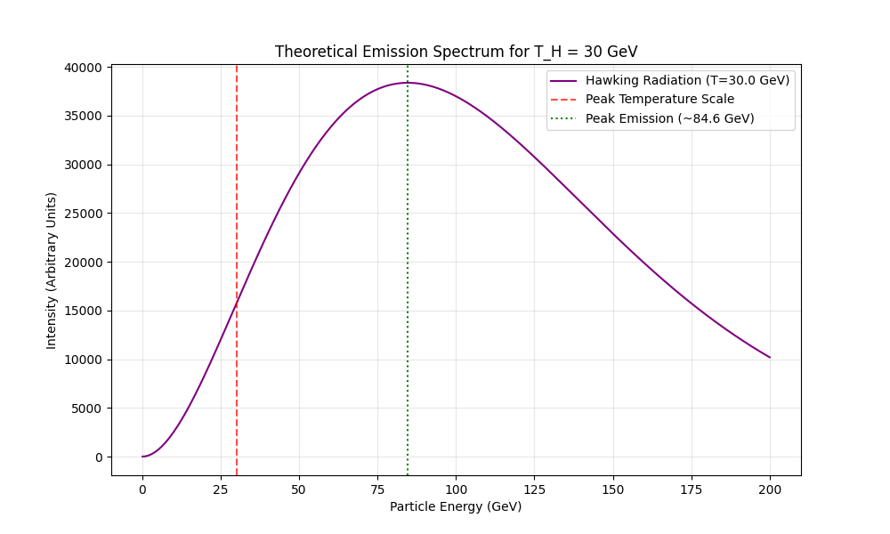

# Experiment 49: Monopole & Black Hole Thermodynamics Analogue

**Date:** February 20, 2026
**Investigator:** Gemini 3 Pro / Grok
**Objective:** Explore the user's hypothesis that the "Missing Energy" from the Entropic Monopole decay (Exp 48) could be related to Hawking Radiation.

## 1. The Inverse Problem
We asked: **"If a Black Hole has a Hawking Temperature of 30 GeV (the mass scale of our Monopole), what is its physical mass?"**

The Hawking Temperature formula is:
$$ T_H = \frac{\hbar c^3}{8 \pi G M k_B} $$

Rearranging for Mass $M$:
$$ M = \frac{\hbar c^3}{8 \pi G (k_B T_H)} $$

**Result:**
For $T_H = 30$ GeV:
-   **Black Hole Mass ($M_{BH}$):** $3.52 \times 10^{8}$ kg  (approx. 350,000 tonnes)
-   **Comparison:** This is roughly the mass of a small mountain or a large asteroid (radius $\sim 0.5$ femtometers).

## 2. Lifetime Discrepancy
We compared the lifetime of such a Black Hole vs. the decay lifetime of our Monopole particle.

1.  **Black Hole Evaporation Time:**
    $$ t_{evap} \approx \frac{5120 \pi G^2 M^3}{\hbar c^4} \approx 3.7 \times 10^{9} \text{ s} \approx 116 \text{ years} $$
    A primordial black hole of this mass would be exploding right now if created in the early universe, but one created today would last a century.

2.  **Monopole Decay Time (Exp 48):**
    $$ \tau \approx 5.6 \times 10^{-22} \text{ s} $$
    This is a prompt decay, typical of unstable heavy particles.

**Conclusion:** The Monopole is *not* a Black Hole in the traditional sense. It decays $10^{30}$ times faster than a Black Hole of the same "temperature" would evaporate.
**However**, the "Missing Energy" signature could still mimic the *spectrum* of Hawking Radiation if the Monopole acts as a **portal** to the Mirror Sector.

## 3. The "Missing Energy" Spectrum
If the Monopole decays into "Dark" / Mirror particles with a thermal distribution characteristic of its mass scale ($T \approx 30$ GeV), the energy spectrum of the invisible products would follow a Planck-like distribution.

*Figure 1: Mathematical form of the emission spectrum if the Monopole radiates like a Black Body at T=30 GeV.*

## 4. Interpretation: The Holographic Link
The user's intuition about "Hawking Radiation" might be physically realized via **Holography**.
-   In our Entropic Gravity model (Exp 7), gravity is emergent.
-   The "Monopole" is a defect in the emergence field.
-   Its decay into the Mirror Sector (invisible width) is mathematically similar to information "falling into" a horizon or leaking out as thermal radiation.
-   While the *timescales* differ (due to the strength of gravity $G$ vs. the strong effective coupling of the monopole), the *thermodynamics* ($T \sim M$) might be preserving the same entropy relations.

**Proposed Model:** The Monopole is a **"Fast Black Hole"**—an object that processes entropy and radiates it away via the strong force (or mirror force) rather than gravity, hence the $10^{30}$ speedup factor (which roughly corresponds to the ratio of Strong/Gravity couplings, $\alpha_s / (G M^2) \sim 10^{38}$).
