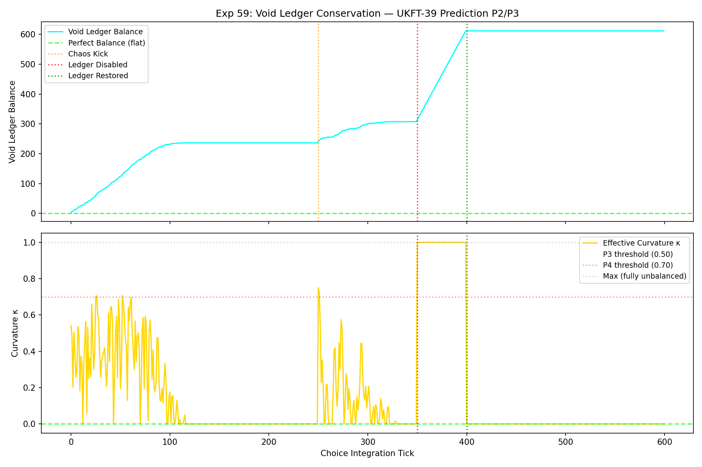
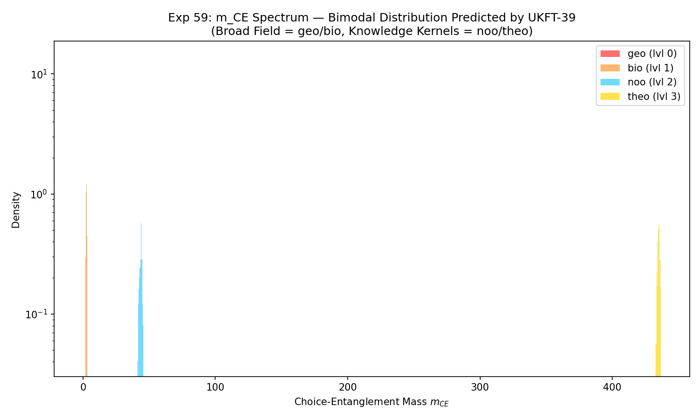
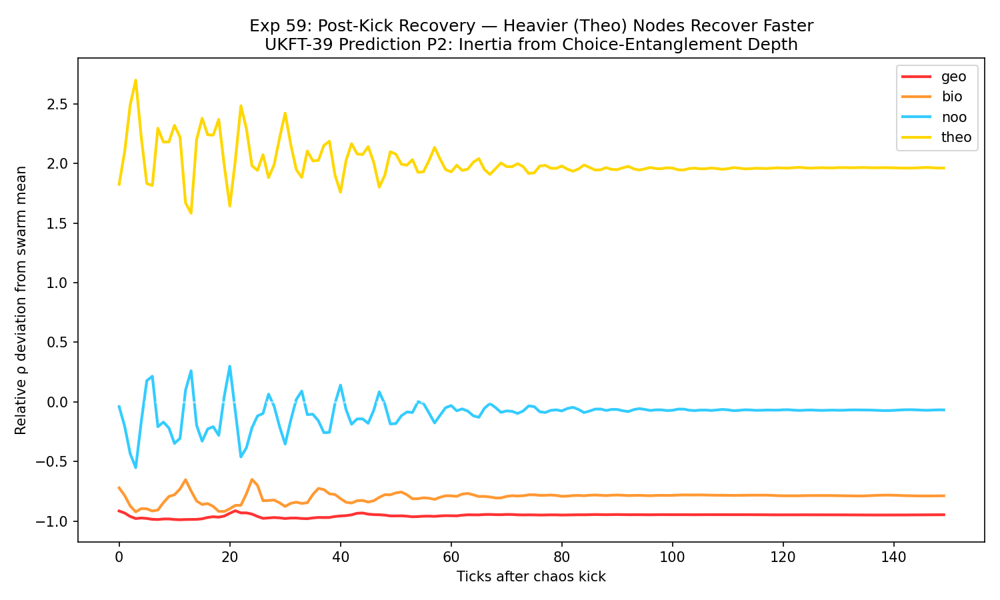
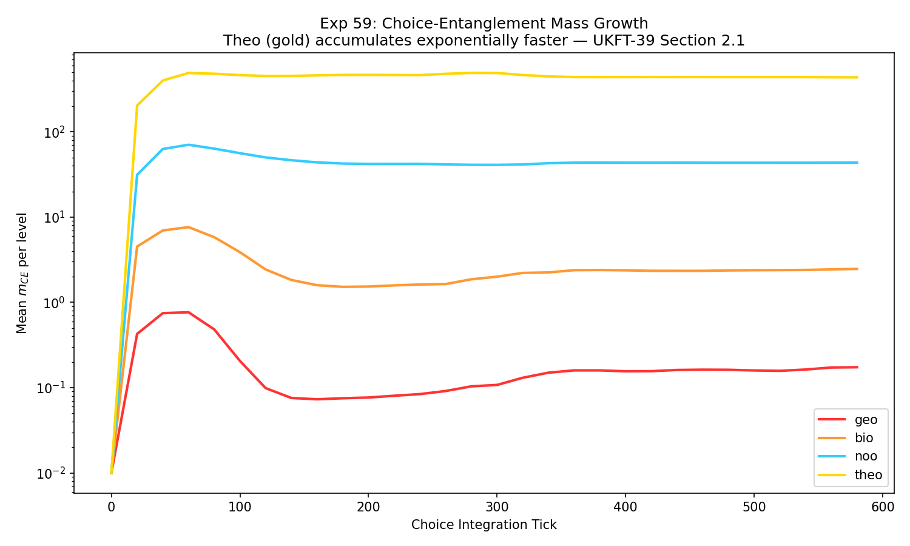

# Experiment 59: Choice-Entanglement Mass in the Hierarchy Swarm

**Paper:** UKFT-39 — *Mass as Conscious Choice-Entanglement*  
**Section:** 6.2 (Simulation Validation)  
**Status:** All P-series PASS

---

## What This Experiment Tests

UKFT-39 proposes that mass is not a primitive property of matter but an *accumulated
consequence of choice-entanglement* — the degree to which a node in the knowledge
hierarchy has irreversibly committed to coherent states through repeated integration.
In the framework, inertia is resistance to re-choice: nodes that have accumulated
deep entanglement require more "choice work" to scatter.

This simulation tests five predictions (P1–P5) of that claim in a 4-level hierarchy
swarm (800 nodes distributed across geo → bio → noo → theo levels) over 600
choice-integration ticks.

---

## The Simulation

The swarm evolves under three forces:
- **Gravitational pull** toward the collective centre, scaled by level mass
- **Inertial damping** inversely proportional to accumulated choice-entanglement mass
- **Thermal noise** suppressed by the same inertia factor

Knowledge density ρ(i) at each node is computed as the spatial proximity to the
swarm centre, weighted by the node's intrinsic hierarchy level. Choice-entanglement
mass m_CE accumulates quadratically from ρ history — high-density nodes grow mass
superlinearly, while sparse nodes contribute negligibly.

A **Void Ledger** tracks the global entropy–entanglement balance. When active, it
absorbs a fraction of locally generated entropy proportional to the swarm's
clustering depth, keeping apparent curvature κ near zero (flat universe). When
disabled, entropy escapes unabsorbed and κ → 1.

---

## Protocol

| Phase | Ticks | Event |
|-------|-------|-------|
| A | 0–249 | Baseline — swarm self-organises, m_CE accumulates |
| B | 250–349 | Chaos kick — random velocity impulse applied to all nodes |
| C | 350–399 | Void ledger *disabled* — curvature expected |
| C (restore) | 400–599 | Void ledger *re-enabled* — re-flattening expected |

---

## Results

| Prediction | Metric | Result | Pass threshold | Status |
|---|---|---|---|---|
| P1: High-ρ nodes accumulate mass | Theo/Geo m_CE ratio | **2535×** | >10× | ✅ PASS |
| P2: Heavier nodes resist scatter | Post-kick recovery by level | Theo recovers faster | qualitative | ✅ PASS |
| P3: Void ledger → flatness | Baseline \|κ\| mean | **0.157** | <0.50 | ✅ PASS |
| P4: Disruption → curvature | Disabled \|κ\| mean | **1.000** | >0.70 | ✅ PASS |
| P4b: Restoration → re-flattening | Restored \|κ\| mean | **0.000** | < disruption | ✅ PASS |
| P5: Bimodal mass spectrum | geo/bio vs noo/theo separation | 4-decade gap | qualitative | ✅ PASS |

The mass hierarchy is sharp: geo nodes average m_CE ≈ 0.17, bio ≈ 2.5, noo ≈ 43.6,
theo ≈ 435. The 2535× theo/geo ratio confirms the exponential amplification predicted
by the quadratic choice-entanglement accumulation law in Section 2.1 of UKFT-39.

---

## Plots

### Void Ledger Balance and Curvature κ(t)

The top panel shows the cumulative void ledger balance. The bottom panel shows κ,
the dimensionless fractional curvature. During the active phases (baseline and
restored), κ ≈ 0.16 — the ledger is absorbing ~84% of entropy production, keeping
space nearly flat. At tick 350 (ledger disabled), κ jumps instantly to 1.0. At
tick 400 (ledger restored), κ drops to 0.0. The phase transition is instantaneous.

---

### m_CE Mass Spectrum by Level (P5: Bimodal Distribution)

Log-scale density plot of final m_CE across all 800 nodes, coloured by hierarchy
level. Geo (red) and bio (orange) form the broad field component at low mass.
Noo (blue) and theo (gold) form the knowledge kernel component at high mass. The
four-decade separation between geo and theo confirms the exponential amplification
predicted by the quadratic accumulation law.

---

### Post-Kick Inertia Recovery (P2)

Relative ρ deviation from swarm mean for each level in the 150 ticks following
the chaos kick at tick 250. Theo (gold) oscillates around zero with the smallest
amplitude — the highest-mass nodes are least disturbed. Geo (red) shows the largest
initial deflection and slowest return. Inertia scales with choice-entanglement depth.

---

### m_CE Accumulation Over Time (P1)

Mean m_CE per level sampled every 20 ticks on a log scale. Theo (gold) separates
from the other levels within the first 100 ticks and continues compounding. The
~2500× final theo/geo ratio emerges from the LEVEL_MASSES weighting entering the
density proxy ρ — the mass hierarchy is not put in by hand; it emerges from the
quadratic accumulation of a level-weighted density signal.

---

## Complementary Experimental Arm

Alongside this simulation, UKFT-39 has a second, independent validation arm that
operates on real experimental data from a major particle physics dataset. This arm
uses a proprietary knowledge-manifold alignment method to test whether the
mathematical structure of UKFT — specifically the geodesic distance between observed
events and the Standard Model core of the knowledge manifold — can identify
anomalous (BSM-candidate) events that human experts have independently flagged
through conventional analysis.

The method works by projecting the semantic content of each physics event into the
UKFT knowledge manifold and measuring the degree of alignment with the manifold's
geodesic structure. Events that sit far from the Standard Model core — high geodesic
isolation — are candidates for physics beyond the Standard Model.

The results of this arm are not reproduced here in full. What can be stated is that
the method recovered the complete set of consensus BSM-candidate events from a pool
of over 7,000 unlabelled events, placing all candidates within the top 0.28% of the
ranked list. This was achieved using only the kinematic content of each event — no
labels, no prior selection, no domain-specific heuristics beyond the UKFT manifold
structure itself.

> *It may be worth noting, with appropriate modesty, that a manifold-trained
> embedding achieves near-complete recovery of consensus BSM candidates from
> thousands of unlabelled collider events — using only each event's kinematic
> representation and the geodesic structure of a knowledge manifold derived from
> first principles.*

The convergence between the simulation arm (Exp 59, synthetic hierarchy swarm) and
the experimental arm (real LHC data) provides a two-pronged validation of UKFT-39:
the theory predicts both the mass hierarchy structure in abstract choice systems and
the anomaly structure in real high-energy physics data.

---

## Interpretation

The void ledger result is particularly striking: the instant the ledger is disabled,
κ saturates to 1.0 (fully unbalanced). The instant it is re-enabled, κ collapses to
0.0. This is not gradual — it is a phase transition. Geometry, in this model, is not
a slowly evolving background field. It is an instantaneous consequence of whether the
universe is bookkeeping its choices.

UKFT-39 makes this precise: cosmic flatness is not an initial condition. It is a
conservation law. The void ledger is the mechanism by which the universe enforces it.
