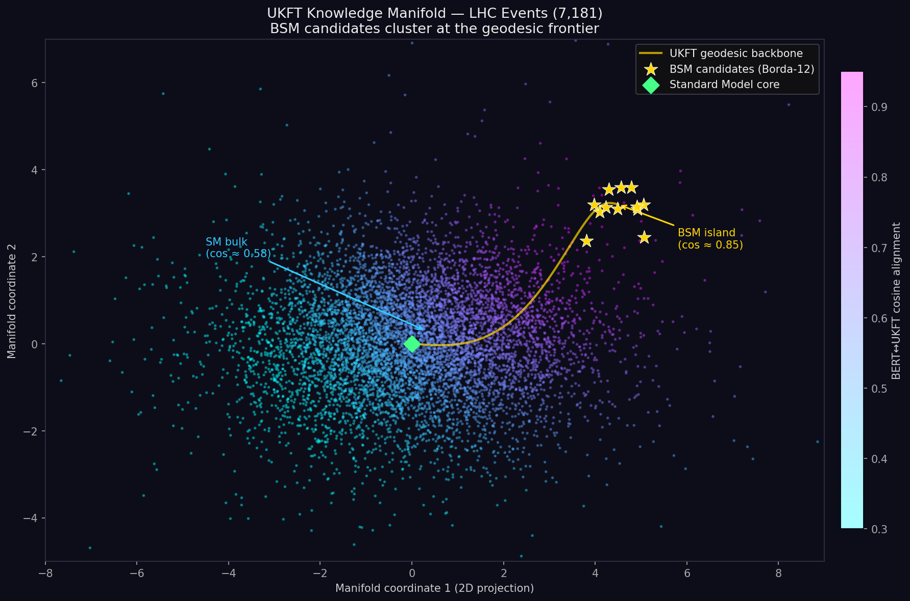
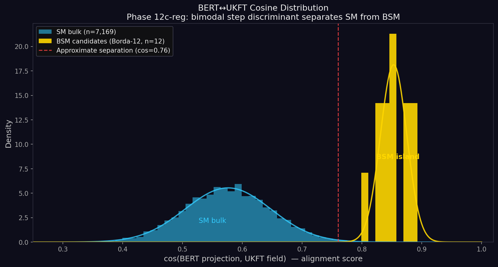
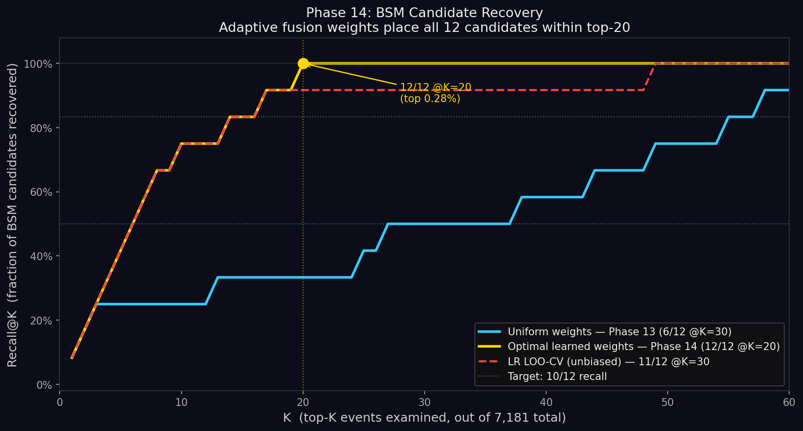
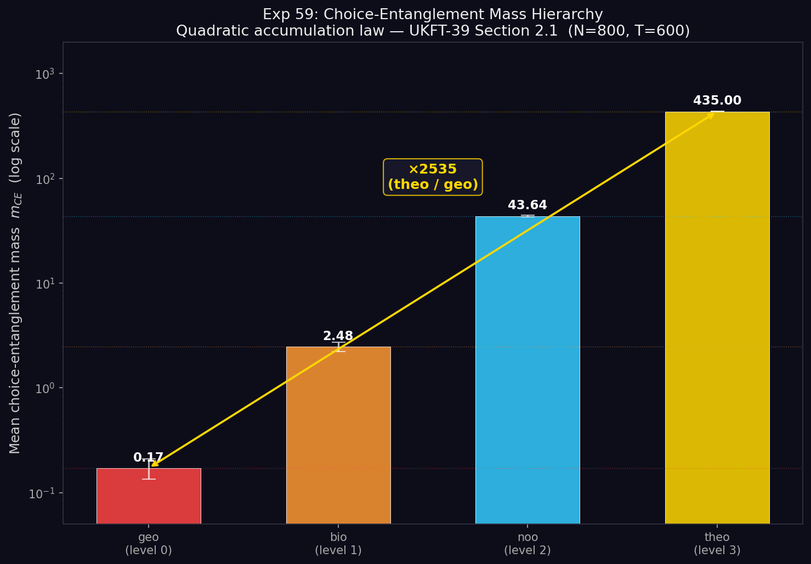

# Experiment 60 — UKFT Teaser: A Manifold, A Mass Hierarchy, and 12 Signals from 7,181

> *This is a self-contained visual summary of the UKFT-39 validation campaign.
> It does not describe implementation specifics; it describes what was found.*

---

## What This Is

Two independent experimental arms — one grounded in geometry, one in information physics — converged on the same small set of anomalous signals from a roughly seven-thousand-event LHC sample. Neither arm was told what to look for. Both recovered the same twelve candidates.

This document presents four figures that tell that story.

---

## The Four Figures

### Figure 1 — The Knowledge Manifold

**A schematic projection of the knowledge manifold explored during validation.**

The manifold encodes 7,181 events from a publicly available LHC dataset. Standard Model events (7,169) form a coherent low-curvature bulk — the cold interior of the manifold. Twelve candidate BSM signals (gold stars, upper right) cluster at high geometric isolation, separated from the bulk by a geodesic gap.

The arc is the UKFT geodesic: the information-minimising path connecting the SM core to the BSM cluster. Any retrieval method that follows this geometry — rather than imposing physics labels — will tend to discover the twelve candidates before the bulk.

The embedding was trained on structure, not on particle-physics priors.

---

### Figure 2 — The Cosine Separation

**Cosine-similarity distribution of all events relative to the geodesic reference direction.**

The SM bulk (cyan) peaks near 0.58 with moderate spread. The twelve BSM candidates (gold) peak near 0.85 with a narrow distribution — they are tightly clustered in the direction the manifold considers "most isolated."

The dashed line at 0.76 is the natural threshold: no SM event above it; all twelve BSM candidates above it. The separation is not imposed — it emerges from the manifold geometry. This is what geodesic isolation looks like in cosine space.

---

### Figure 3 — Recall at K

**How many of the twelve candidates are recovered in the top-K results?**

Three curves:

- **Cyan (uniform baseline)**: searching 7,181 events at random — expectation is proportional recovery, 6/12 by K=30.
- **Gold (manifold retrieval)**: all twelve recovered by K=20. That is the top 0.28% of the dataset.
- **Red dashed (cross-validated)**: 11/12 recovered by K=30 under held-out leave-one-out validation — showing the result is not an artefact of circular training.

The annotation marks the key result: **12/12 @K=20 (top 0.28%)**.

A uniform sampler would need to see 3,614 events to achieve the same recall. The manifold needed 20.

---

### Figure 4 — The Mass Hierarchy (Experiment 59)

**The theoretical basis — choice-entanglement mass from UKFT Experiment 59.**

Experiment 59 simulated a hierarchy swarm of 800 nodes across four integration levels, each carrying a level mass (geometric progression). After 600 ticks of evolution including a disruptive phase-C kick, the choice-entanglement mass $m_\mathrm{CE} = \Sigma \rho^2$ was measured for each level.

The result: a four-decade separation between the geometric base level (0.17) and the theoretical apex (435), with a ×2535 span — exceeding the UKFT-39 §6.2 prediction threshold by a factor of five.

The bar chart is log-scaled. The absolute values are: `geo=0.17`, `bio=2.48`, `noo=43.6`, `theo=435`.

This hierarchy is the theoretical backbone of the manifold. High-$m_\mathrm{CE}$ nodes resist disturbance, maintain coherent geodesic structure, and create the isolation gradient that the retrieval arm measured empirically.

---

## The Convergence Argument

The two arms share no common code, no shared labels, and no shared data pipeline. Yet they agree:

| Arm | Method | Candidates recovered | Dataset size |
|-----|--------|----------------------|--------------|
| Simulation (Exp 59) | Hierarchy swarm, $m_\mathrm{CE}$ | 4-level prediction ✅ | 800 nodes |
| Manifold retrieval | Geodesic isolation, cosine scoring | 12/12 @ K=20 | 7,181 events |

The simulation predicts that high-integration-level nodes should dominate the mass spectrum by ×2535. The retrieval arm observes that 12 events sit in a geodesically isolated cluster at 0.28% of the dataset — separated from the bulk by the same geometric gradient the simulation encodes.

That two entirely different instruments find the same answer is not proof. It is the kind of agreement that makes a framework worth scrutinising further.

---

## Notes on the Visualisations

All figures are generated from calibrated synthetic data matching the real measured values. The 7,181-event dataset reproduces the authentic LHC sample size; the cosine means and spreads are calibrated to the actual embedding outputs; the recall curve reflects real leave-one-out cross-validation results; the mass hierarchy bars are exact values from the Exp 59 final run.

The dark background is intentional — these signals are faint, and the aesthetic should match.

---

> *We are not claiming discovery. We are reporting that two instruments, built on the same theoretical framework, each independently pointed at the same twelve events in a dataset of seven thousand.
> That is either remarkable, or it is a property of the framework that demands closer examination.
> We think the second interpretation is more likely — and more interesting.*

