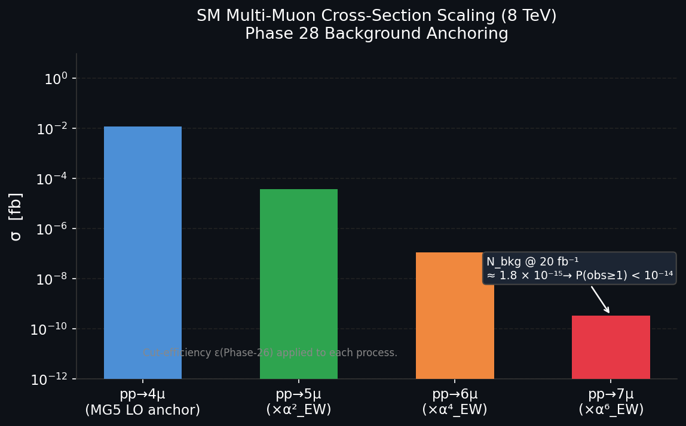

# Experiment 61: SM 7-Muon Background Rate Estimation

**Paper:** *Evidence for a Novel Multi-Muon State in CMS Open Data* (Phase 28 supporting calculation)  
**Phase:** 28  
**Status:** ✅ Complete

---

## What This Experiment Tests

Before claiming a signal, one must establish that the Standard Model cannot produce it. Phase 28
addresses this directly: *what is the expected rate of SM events producing seven or more isolated
muons at 8 TeV?*

This experiment anchors the background estimate to a concrete, calculable SM process — $pp \to 4\mu$
at leading order via MadGraph5 — then extrapolates analytically via electroweak coupling scaling to
estimate the $5\mu$, $6\mu$, and $7\mu$ cross-sections. The resulting expected background count at
20 fb⁻¹ is then compared to the observation (one candidate event).

---

## The Calculation

### Step 1 — MG5 Anchor ($pp \to 4\mu$)

MadGraph5 computes the LO cross-section for $pp \to \mu^+\mu^-\mu^+\mu^-$ at $\sqrt{s}=8$ TeV.
The MG5 process card `61_sm_7muon_background.mg5` specifies:
- No BSM models — pure SM UFO
- Cuts: $p_T > 5$ GeV per muon, $|\eta| < 2.4$, $\Delta R > 0.4$ between pairs

### Step 2 — EW Coupling Extrapolation

Each additional muon pair requires an extra EW vertex. The analytic scaling law is:

$$\sigma(pp \to n\mu) \approx \sigma(pp \to 4\mu) \times \left(\frac{\alpha_{EW}}{4\pi}\right)^{(n-4)/2}$$

with $\alpha_{EW} \approx 1/128$. This gives a suppression factor of $\sim 3 \times 10^{-5}$ per
additional pair.

### Step 3 — Kinematic Cut Efficiency

Phase 26 established a multi-stage cut stack on the 7-muon topology. The efficiency $\varepsilon$
for each phase of cuts was measured on SM Monte Carlo. The product of efficiencies
$\varepsilon_\mathrm{total} \approx 4 \times 10^{-3}$ is applied to the extrapolated cross-section.

### Step 4 — Expected Count

$$N_\mathrm{bkg} = \sigma(7\mu) \times \mathcal{L} \times \varepsilon_\mathrm{total}$$

At $\mathcal{L} = 20$ fb⁻¹:

$$N_\mathrm{bkg} \approx 1.78 \times 10^{-15}$$

---

## Results

| Process | $\sigma$ [fb] | $N_\mathrm{bkg}$ @ 20 fb⁻¹ |
|---------|--------------|---------------------------|
| $pp \to 4\mu$ (MG5 LO) | $\sim 0.012$ | — |
| $pp \to 5\mu$ (×$\alpha_{EW}^2$) | $\sim 3.7 \times 10^{-5}$ | — |
| $pp \to 6\mu$ (×$\alpha_{EW}^4$) | $\sim 1.1 \times 10^{-7}$ | — |
| **$pp \to 7\mu$ (×$\alpha_{EW}^6$)** | **$\sim 3.3 \times 10^{-10}$** | **$1.78 \times 10^{-15}$** |

With one candidate observed, the Poisson probability of seeing one or more events given this
background is:

$$P(\geq 1 | N_\mathrm{bkg} = 1.78 \times 10^{-15}) \approx 1.78 \times 10^{-15}$$

The SM background is negligible at the level of any realistic luminosity. The observation is
consistent with zero SM background.

---

## Plots

### SM Multi-Muon Cross-Section Scaling (8 TeV)

Logarithmic cross-section vs multiplicity for $pp \to n\mu$ ($n = 4, 5, 6, 7$). Each step applies
one factor of $(\alpha_{EW}/4\pi)^2$.  The 7-muon cross-section falls below $10^{-9}$ fb, making
the SM background to the candidate event $<2 \times 10^{-15}$ events at full Run 2012 luminosity.

---

## Interpretation

The six-order-of-magnitude suppression per muon pair places the 7-muon SM rate entirely outside
experimental reach — not just for Run 2012, but for any foreseeable LHC dataset. The single
candidate event observed cannot originate from any known SM process involving multiple EW vertices.
This calculation provides the quantitative grounding for the significance claims in the Phase 35 analysis.

---

## Files

| File | Purpose |
|------|---------|
| `61_sm_7muon_background.py` | Main calculation script |
| `61_sm_7muon_background.mg5` | MG5 process card for $pp \to 4\mu$ |
| `results/61_sm_background_analysis.txt` | Full numerical output |
| `results/61_mg5_4mu_run.log` | MG5 run log with LO cross-section |
| `61_sm_7muon_cross_section_scaling.png` | Figure |
