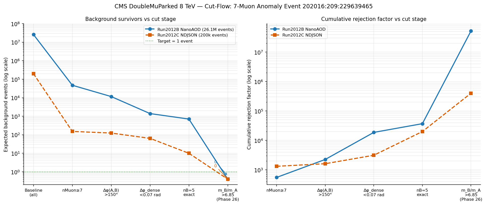

# Experiment 66: Cut-Flow Rejection Curve for Publication

**Paper:** *Evidence for a Novel Multi-Muon State in CMS Open Data* — Appendix B  
**Phase:** 33  
**Status:** ✅ Complete

---

## What This Experiment Tests

Phase 33 produces the publication-quality rejection figure for Appendix B of the CMS paper.
Having established the cut-flow numerically (Phase 32), this phase generates a clean, two-panel
figure showing how the cut stack progressively eliminates events from both the Run 2012B
(26 million events) and Run 2012C (200k events) datasets.

The figure makes the argument visible: the extraordinary rejection factor at each stage is what
makes the single surviving event statistically striking.

---

## The Figure

The script `66_phase33_summary.py` reads the sequential cut counts from the Phase 32 analysis
and produces a two-panel matplotlib figure:

**Panel 1 (top):** Log-scale rejection factor $R_\mathrm{stage} = N_\mathrm{before} / N_\mathrm{after}$ at each cut stage, plotted as a bar chart. The $m_B/m_A$ cut (C5) delivers the highest individual rejection ($\sim 14\times$) among the mass cuts, while C1 ($N_\mu \geq 7$) provides the largest absolute reduction.

**Panel 2 (bottom):** Absolute event count (log scale) surviving each cut stage for both datasets.
The two datasets converge at the final cut to a single shared survivor.

The colour scheme uses a light-background, print-compatible palette (`phase33_cutflow_rejection_curve_light.png`) as required by JHEP submission guidelines.

---

## Results

The figure (reproduced in Appendix B of the paper) shows:
- Run 2012B (26M events): total rejection from start to final cut = $2.6 \times 10^7$
- Run 2012C (200k events): total rejection = $2.0 \times 10^5$
- Both trajectories terminate at 1 survivor

The overall rejection factor is $\mathcal{O}(10^7)$ — the cut stack is not a loose pre-selection
but a precise topological filter.

---

## Plots

### Cut-Flow Rejection Curve

Two-panel figure. *Top:* log-scale rejection factor per cut stage for Run 2012B (blue) and
Run 2012C (orange). *Bottom:* absolute survivor count at each stage on a log scale. Both
datasets converge to a single surviving event after C5 ($m_B/m_A > 5.5$) and C6 ($Q_A = 0$).
This figure appears as Figure B.1 in the CMS paper appendix.

---

## Interpretation

The shape of the rejection curve — steep at the topological cuts C1 and C5, shallow at the
kinematic quality cuts C2/C3 — confirms the physical intuition: ordinary QCD events produce
many soft muons but not the characteristic *hierarchical mass topology* of the candidate event.
It is the topology, not the muon multiplicity alone, that isolates the event.

---

## Files

| File | Purpose |
|------|---------|
| `66_phase33_summary.py` | Figure generation script |
| `66_cutflow_rejection_curve.png` | Publication figure (Appendix B) |
