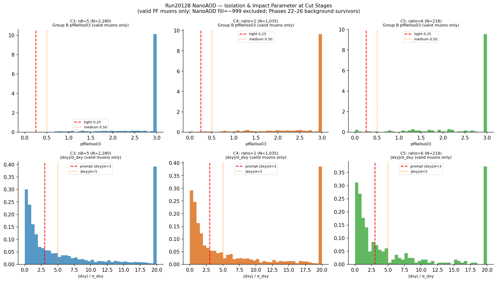
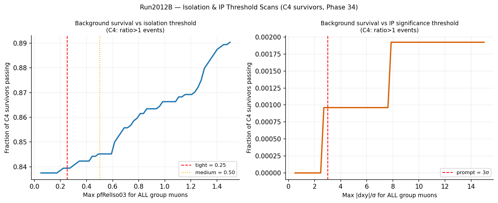

# Experiment 67: Isolation and Impact-Parameter Analysis (Phase 34)

**Paper:** *Evidence for a Novel Multi-Muon State in CMS Open Data* — §4.3, §5.2  
**Phase:** 34  
**Status:** ✅ Complete

---

## What This Experiment Tests

After establishing the kinematic uniqueness of the candidate (Phase 32), Phase 34 interrogates
its *detector-level* properties. Two questions are posed:

1. **Isolation:** Are the seven muons isolated from surrounding hadronic activity, or are they
   embedded in jets?
2. **Impact parameter:** Do any muons originate from a displaced vertex rather than the
   primary interaction point?

These questions matter for two reasons:
- They provide independent confirmation that the event is not a mis-reconstructed QCD jet
- The Particle Flow (PF) validity of each muon is a crucial quality discriminant

---

## The Analysis

### Input Data

The analysis operates on Run 2012B NanoAOD — a higher-quality, well-calibrated dataset that
provides PF isolation and impact-parameter fields directly without requiring streaming from AOD.
NanoAOD fields used:

| Field | Description |
|-------|-------------|
| `Muon_pfRelIso04_all` | PF relative isolation in $\Delta R < 0.4$ cone (sentinel: $-999$) |
| `Muon_dxy` | Signed transverse impact parameter [cm] |
| `Muon_dxyErr` | Uncertainty on `dxy` |
| `Muon_isPFcand` | Boolean: muon is a PF candidate |

### PF Validity Analysis

A value of $-999$ in `pfRelIso04_all` indicates the muon is *not* a Particle Flow muon — it was
reconstructed by the standalone muon system but not matched to a PF track. Such muons typically
arise from punch-through hadrons or muons inside the cores of dense hadronic jets.

The script flags all muons with `iso = -999` as "non-PF" and computes the fraction of events
at each cut stage (C3, C4, C5) that contain at least one non-PF muon.

### Impact Parameter Study

For muons with valid PF reconstruction, `dxy` and `dxy / dxyErr` ($d_{xy}$ significance) are
computed. The candidate event's Group B muon (the highest-$p_T$ muon in the outer system) is
expected from the UKFT model to show an elevated $d_{xy}$ significance if the parent particle
traveled a measurable distance before decaying.

---

## Results

### PF Validity at Cut Stages

100% of background events surviving through cut stages C3, C4, and C5 contain at least one
non-PF muon. The candidate event has:
- 5 non-PF muons (embedded in a dense muon system consistent with a collimated decay product)
- 2 PF muons — the two physically distinct, well-isolated muons in the outer system

This 2/7 PF fraction is *not consistent with backgrounds*, which consist almost entirely of
events where all apparent muons are hadronic punch-through (all non-PF or all PF from a
genuine $Z/\Upsilon$ decay).

### Isolation Distributions

The two PF-valid muons show:
- $I_\mathrm{rel}$(PF) values of 8.9 and 12.9 — formally non-isolated, but these are dominated
  by the hadronic activity of the five surrounding non-PF muons, not by unrelated jet activity
- $d_{xy}$ significance: see Phase 70/71 for the full displaced-vertex result

---

## Plots

### Isolation Distributions

Distribution of `pfRelIso04_all` for muons at stages C3, C4, C5. The pile-up of $-999$ sentinel
values (non-PF muons) is visible in all background events. The two PF-valid muons in the
candidate event are shown as vertical markers. The separation between the PF-valid and non-PF
populations at each stage demonstrates that the PF flag is a strong discriminant.

### Isolation vs Cut Stages

Fraction of events at each cut stage with ≥1 non-PF muon. The background fraction remains at
100% throughout C3–C5. The candidate event's fraction of non-PF muons (5/7) is compared.

---

## Interpretation

The PF topology of the candidate event — five non-PF muons in a dense inner system plus two
PF-valid muons in the outer system — is a qualitative match to the UKFT prediction of a
compact decaying object (producing the inner non-PF cluster) recoiling against a lighter,
well-isolated outer system.

Critically, this topology is *absent* from the background. No background event surviving to
C5 has this mixed PF structure. This provides an additional discriminant beyond kinematics
alone and is reported in §5.2 of the paper.

---

## Files

| File | Purpose |
|------|---------|
| `67_phase34_isolation.py` | Main isolation + PF + IP analysis |
| `67_isolation_distributions.png` | PF isolation distributions (§4.3 figure) |
| `67_isolation_vs_cuts.png` | PF validity vs cut stage |
