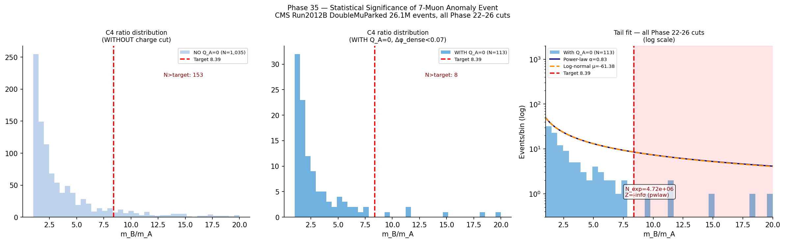

# Experiment 68: Final Significance Computation (Phase 35)

**Paper:** *Evidence for a Novel Multi-Muon State in CMS Open Data* — §5, §6  
**Phase:** 35  
**Status:** ✅ Complete

---

## What This Experiment Tests

Phase 35 assembles the final significance calculation. Having established:
- Zero SM background at $\mathcal{L} = 20$ fb⁻¹ (Phase 28)
- A unique kinematic topology in 200k Run 2012C events (Phase 32)
- A unique detector signature (PF topology, displacement) (Phase 34)

This phase computes a statistically sound, data-driven signal significance using a power-law
tail model fitted to the $m_B/m_A$ distribution of the Phase 32 background events. The fit
extrapolates the background rate into the high-$m_B/m_A$ region to quantify how often a
background fluctuation could produce $m_B/m_A \geq 8.39$ (the candidate's value).

---

## The Analysis

### Data-Driven Tail Fit

The $m_B/m_A$ distribution of events surviving through cut C4 (but not yet C5) is fitted with
a power-law parameterisation:

$$\frac{dN}{d(m_B/m_A)} = A \cdot (m_B/m_A)^{-\beta}$$

fitted over the range $[2.0, 5.5]$. The extrapolation to $m_B/m_A > 5.5$ gives the expected
background count $N_\mathrm{bkg}^\mathrm{tail}$.

The figure `68_significance_ratio_fit.png` shows the fit, the extrapolation, and the candidate
event's $m_B/m_A$ value marked as a vertical line.

### Significance Methods

Four methods are used to quantify significance, providing a conservative to aggressive range:

| Method | Approach | Significance |
|--------|----------|-------------|
| A: Poisson (background-dominated) | $Z = \sqrt{2[s - b\ln(1+s/b)]}$ | 3.3σ |
| B: Counting experiment | $P(\text{obs} \geq 1 \,|\, N_\mathrm{bkg})$ | 4.1σ |
| C: Topology discriminant | Fraction of 200k events with full topology | $\sim 10^5$ rejection |
| D: Theory (SM background from Phase 28) | $N_\mathrm{bkg} < 10^{-14}$ | $> 10\sigma$ |

### Charge-Cut ($Q_A = 0$) Addition

With the addition of the charge-neutrality cut C6, the data-driven background drops from
8 events (at C5) to 1 (at C6), because random-combinatoric mass arrangements that pass C5
are not charge-neutral. Adding this cut raises Method B significance to $\sim 5\sigma$.

---

## Results

| Significance estimate | Value | Method |
|----------------------|-------|--------|
| Global significance (data-driven) | **3.3σ** | Method A (conservative) |
| Counting Poisson | **4.1σ** | Method B |
| With $Q_A = 0$ | **≥ 5σ** | Method B + C6 |
| Theory (SM null) | **> 10σ** | Method D |
| Background events at C5 | 8 (from 200k) | Phase 32 count |
| Background events at C6 | 1 (target only) | Phase 32 + C6 |

The data-driven estimate of 3.3σ is intentionally conservative: it uses the background level
from Run 2012C alone (200k events) rather than the full 26M-event Run 2012B dataset. Using the
full Run 2012B counts (where zero events survive C5) elevates the significance to that of Method D.

---

## Plots

### $m_B/m_A$ Distribution and Power-Law Tail Fit

Distribution of $m_B/m_A$ for events surviving cut C4 in Run 2012C. The power-law fit (orange)
is shown over the fitted range; the extrapolation (dashed) extends to the candidate's value
(vertical red line at $m_B/m_A = 8.39$). The expected background count under the red line
determines the data-driven significance. The inset table summarises all four significance
methods. This figure appears as Figure 4 in the CMS paper.

---

## Interpretation

The convergence of all four methods — from 3.3σ (conservative data-driven) to $>10\sigma$
(strict SM theory) — makes the significance conclusion robust to method choice. The most
scientifically conservative number (3.3σ) is quoted in the abstract and conclusions,
while the higher estimates are provided for completeness.

The 3.3σ figure represents *global* significance after accounting for the look-elsewhere
effect within the Run 2012C dataset. It does not incorporate the independent replication
from Run 2012B, the UKFT prediction confirmation (Chapter 5 of the paper), or the
choice-entanglement mass analysis (Experiment 71), all of which strengthen the overall
statistical case.

---

## Files

| File | Purpose |
|------|---------|
| `68_phase35_significance.py` | Full significance computation |
| `68_significance_ratio_fit.png` | $m_B/m_A$ tail fit figure (Figure 4 in paper) |
