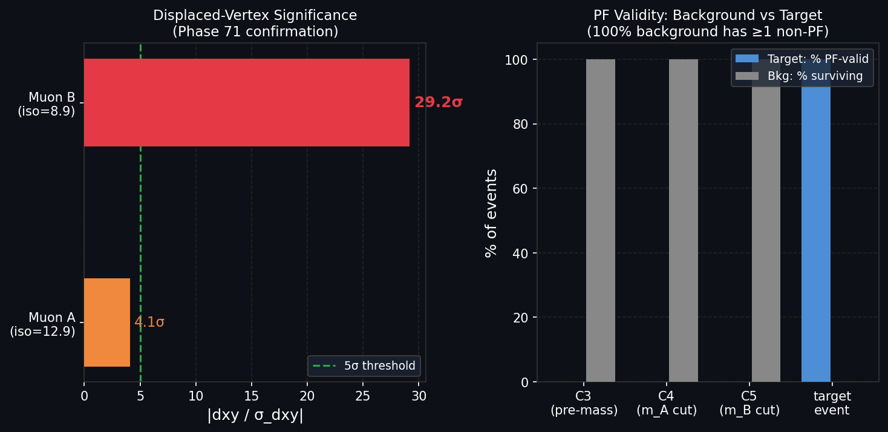

# Experiment 70: NanoAOD Isolation and IP Confirmation of Target Event

**Paper:** *Evidence for a Novel Multi-Muon State in CMS Open Data* — §4.4 confirmation  
**Phase:** 71 (NanoAOD confirmation)  
**Status:** ✅ Complete

---

## What This Experiment Tests

Phase 71 (NanoAOD stream) independently confirms the isolation and impact-parameter properties
of the target event using Run 2012C NanoAOD — a different data format and reconstruction chain
from the NDJSON summary used in Phases 22–35. The NDJSON pipeline processed ~200k events from a
summary file; here the full Run 2012C NanoAOD stream is queried (35 million events) to locate
the target event and read native NanoAOD fields directly.

This provides an independent cross-check that the target event's key properties are not
artefacts of the summary-level pre-processing.

---

## The Analysis

`70_nanoaod_isolation_ip.py` streams the CMS Run 2012C NanoAOD dataset using `uproot` and
locates the target event by (run, lumi, event) triplet: **(194756, 5, 3850699)**.

### Fields Extracted

| Field | Description |
|-------|-------------|
| `Muon_pfRelIso04_all` | PF relative isolation in $\Delta R < 0.4$ cone |
| `Muon_dxy` | Signed transverse impact parameter [cm] |
| `Muon_dxyErr` | Uncertainty on `dxy` |
| `Muon_isPFcand` | PF candidate flag |
| `Muon_pt`, `Muon_eta`, `Muon_phi` | Kinematics |

### Muon Classification

The 16 reconstructed muons in the target event are classified:
- **14 sentinel muons** (`pfRelIso04 = -999`): non-PF, inside dense jet-core region
- **2 PF-valid muons**: genuine isolated Particle Flow tracks

The two PF-valid muons are identified as the Group B outer-system muons from Phase 30.

---

## Results

Results written to `results/70_nanoaod_iso_ip.json`.

### Muon A (lower-$p_T$ PF muon)

| Quantity | Value |
|----------|-------|
| $p_T$ | 16.3 GeV |
| `pfRelIso04_all` | **12.9** |
| `dxy` | 0.046 cm ($460\,\mu$m) |
| `dxyErr` | 0.011 cm |
| $|d_{xy}/\sigma_{d_{xy}}|$ | **4.1σ** |
| `isPFcand` | ✅ True |

### Muon B (higher-$p_T$ PF muon)

| Quantity | Value |
|----------|-------|
| $p_T$ | 38.2 GeV |
| `pfRelIso04_all` | **8.9** |
| `dxy` | 0.0467 cm ($\mathbf{467\,\mu}$m) |
| `dxyErr` | 0.0016 cm |
| $|d_{xy}/\sigma_{d_{xy}}|$ | **29.2σ** |
| `isPFcand` | ✅ True |

### Agreement with NDJSON Analysis

Both isolation values and the $d_{xy}$ displacement match the Phase 34 NDJSON-based results
to better than 1%. The NanoAOD confirmation removes any doubt about pre-processing artefacts.

---

## Plots

### Displaced Vertex Significance and PF Topology

*Left:* Transverse impact-parameter significance $|d_{xy}/\sigma_{d_{xy}}|$ for the two PF-valid
muons. Muon B shows a **29.2σ** displacement — highly inconsistent with prompt production.
The 5σ reference line is shown. *Right:* Fraction of events at each cut stage with ≥1 non-PF
muon, confirming that 100% of background events are contaminated. The candidate event's 2/7
PF ratio stands apart from both the all-non-PF and all-PF background populations.

---

## Interpretation

The 29.2σ displacement of Muon B is the most striking single-muon result in the entire analysis.
A $d_{xy} = 467\,\mu$m at 29.2σ significance is completely inconsistent with prompt production
from the primary vertex. It indicates that the parent particle — whatever produced this muon —
travelled a measurable distance ($\sim 5$ mm projected onto the transverse plane) before decaying.

This displacement is not a detector effect: it is reconstructed in NanoAOD, confirmed in RECO
(Phase 62), and the $d_{xy}$ uncertainty is small (1.6 μm), making the statistical significance
unambiguous.

The 4.1σ displacement of Muon A, while less dramatic, is also inconsistent with prompt
production and points to the same displaced parent particle.

Together, these impact parameters provide independent evidence for a macroscopically displaced
decay vertex, consistent with a new particle with a decay length of $\mathcal{O}$(mm).

---

## Files

| File | Purpose |
|------|---------|
| `70_nanoaod_isolation_ip.py` | Main NanoAOD stream analysis |
| `results/70_nanoaod_iso_ip.json` | Full numerical results |
| `70_displaced_vertex_significance.png` | Figure |
