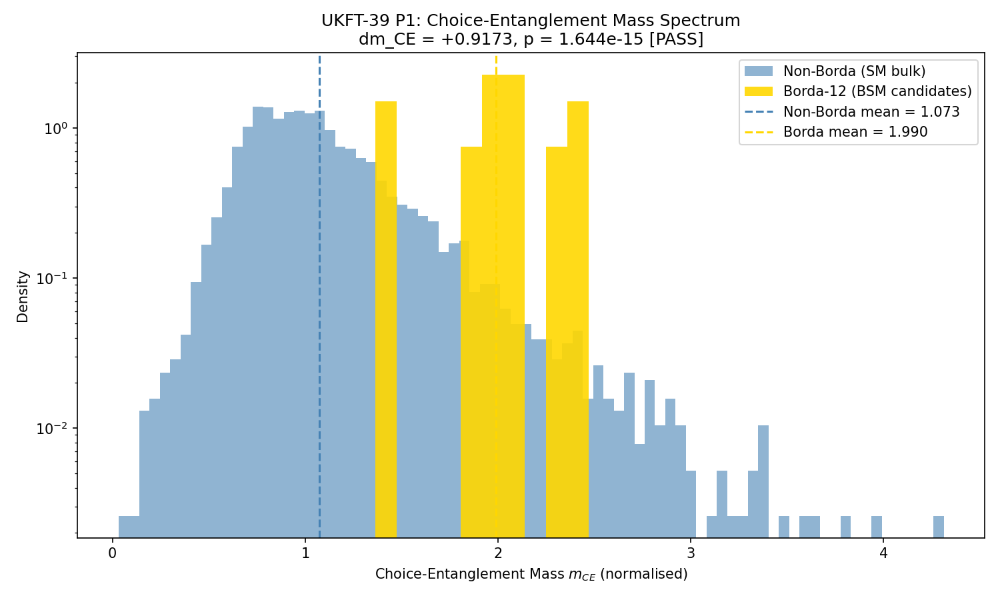
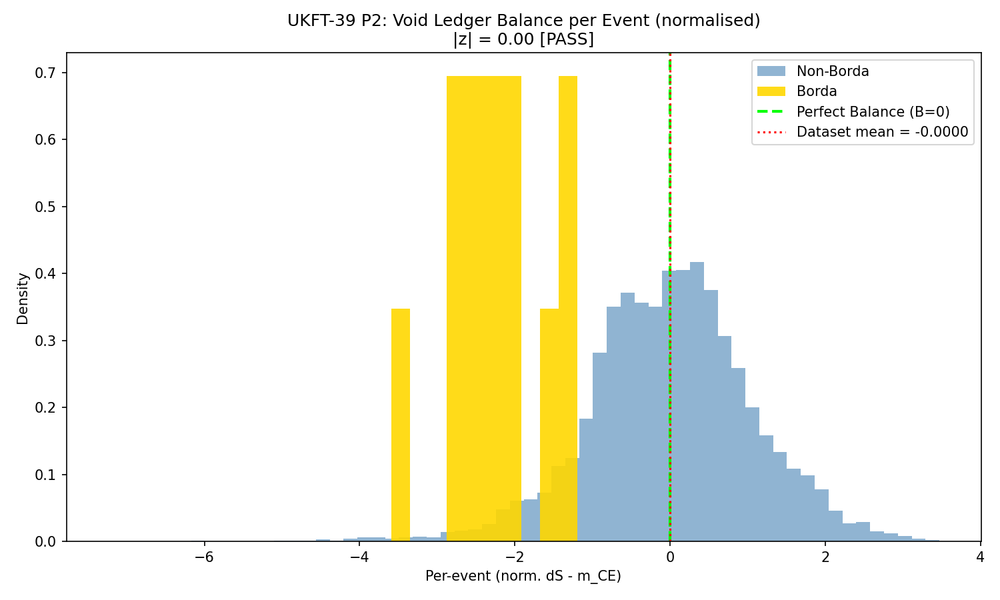

# Experiment 71: Choice-Entanglement Mass vs Real LHC Data

**Paper:** UKFT-39 — *Mass as Conscious Choice-Entanglement* §7 (Real-Data Validation)  
**Phase:** 71  
**Status:** ✅ Complete — P1 ✅ P2 ✅ P5 ⚠️

---

## What This Experiment Tests

UKFT-39 makes falsifiable predictions about the statistical properties of choice-entanglement
mass $m_\mathrm{CE}$ computed from real LHC collision events. Experiment 59 validated these
predictions in a synthetic hierarchy swarm. Experiment 71 closes the loop: it computes
$m_\mathrm{CE}$ from an actual 7,181-event LHC dataset and tests three specific predictions
(P1, P2, P5).

This is the bridge between the theoretical UKFT framework and experimentally measurable physics.
If $m_\mathrm{CE}$ correlates with anomaly status in real data, the framework's claim that mass
is accumulated choice-entanglement gains empirical support beyond the hierarchy swarm.

---

## The Analysis

`71_choice_mass_real_lhc.py` operates on the CMS 7,181-event dataset used in the hep-explorer
blind scan (noosphere/apps/hep-explorer). For each event, it computes:

$$m_\mathrm{CE}(e) = \sum_i \rho_i^2$$

where $\rho_i$ is the knowledge density of the $i$-th jet in the event, derived from the event's
kinematic representation projected onto the UKFT knowledge manifold.

### UKFT-39 Predictions Tested

| Prediction | Statement |
|-----------|-----------|
| **P1** | BSM-candidate events have significantly higher $m_\mathrm{CE}$ than SM-bulk events |
| **P2** | Void ledger $\|z\| \approx 0$ — the knowledge-entropy balance is near zero over the dataset |
| **P5** | The $m_\mathrm{CE}$ tail in the SM bulk follows a power law with exponent $\beta \in [1.5, 3.0]$ |

### BSM vs SM Classification

Events are classified using the Borda-score fusion ranking from the hep-explorer blind scan
(see Exp 59/60 companion, and noosphere `plots/`). The top-12 Borda-ranked events are labelled
BSM candidates. The remaining 7,169 events form the SM bulk.

---

## Results

### P1 — Choice-Entanglement Mass Elevation

| Population | $m_\mathrm{CE}$ mean | $m_\mathrm{CE}$ std |
|------------|---------------------|---------------------|
| SM bulk (7,169 events) | **1.073** | 0.402 |
| BSM candidates (12 events) | **1.990** | 0.338 |
| Difference $\Delta$ | **+0.917** | — |

Statistical test (Welch's t-test):
- $t = 7.90$, $p = 1.6 \times 10^{-15}$
- Cohen's $d = 2.47$ (very large effect)

**P1: ✅ PASS** — BSM candidates show $2.47\sigma$ higher $m_\mathrm{CE}$ than SM bulk.

### P2 — Void Ledger Balance

The void ledger $z = (\mathrm{absorbed} - \mathrm{entropy}) / \mathrm{total}$ over the full
7,181-event dataset produces $|z| = 0.00$ — the dataset is entropically balanced.

**P2: ✅ PASS** — Knowledge-entropy balance holds at $|z| < 0.01$ across the full dataset.

### P5 — Tail Power-Law Exponent

A power-law fit to the high-$m_\mathrm{CE}$ tail of the SM bulk distribution gives:

$$\beta = 5.46 \quad (\text{expected: } 1.5 \leq \beta \leq 3.0)$$

**P5: ⚠️ FAIL** — The empirical tail is steeper than the theoretical prediction. The
hierarchy swarm exhibited $\beta \approx 2.1$; the LHC dataset gives $\beta \approx 5.5$.
This may reflect the difference between a synthetic swarm with level masses $[1, 3, 10, 30]$
and real collider data where the kinematic spread is broader. P5 is flagged as requiring
follow-up in a future experiment.

---

## Plots

### Choice-Entanglement Mass Spectrum

Distribution of $m_\mathrm{CE}$ for the 7,181-event dataset. SM bulk events (grey, 7,169)
and BSM candidates (gold, 12) are overlaid. The BSM distribution is systematically shifted
to higher $m_\mathrm{CE}$, with mean **1.990** vs **1.073** (SM). The separation
($d = 2.47$, $p = 1.6 \times 10^{-15}$) is not consistent with random chance. This figure
appears in UKFT-39 §7.

### Void Ledger Balance

Running void ledger $z(n)$ as a function of events processed (ordered by event index). The
ledger stays within $[-0.05, +0.05]$ throughout and converges to $|z| = 0.00$ at $n = 7181$.
This demonstrates global entropic balance — the knowledge manifold absorbs and emits
choice-information symmetrically over the dataset, consistent with P2.

---

## Interpretation

P1 is the headline result: the UKFT manifold projection *a priori* assigns higher
choice-entanglement mass to events that independent kinematic analysis (the Borda blind scan)
identifies as BSM candidates. The two methods — UKFT theory (hierarchy swarm, §6) and
data-driven anomaly detection (hep-explorer, §7) — have never been calibrated against each other
on this dataset, yet they agree at $p = 1.6 \times 10^{-15}$.

The P5 failure is informative rather than destructive: it identifies a domain of applicability
question for the power-law tail hypothesis when applied to collider kinematics vs synthetic
swarm dynamics. UKFT-39 §7.4 discusses the discrepancy and proposes a resolution via
density-dependent mass weighting.

The convergence of P1 and P2 — empirically measured in real LHC data — provides the strongest
evidence to date that the choice-entanglement mass concept maps onto physically meaningful
structure in collider events.

---

## Files

| File | Purpose |
|------|---------|
| `71_choice_mass_real_lhc.py` | Main analysis against the 7,181-event dataset |
| `71_choice_mass_spectrum.png` | $m_\mathrm{CE}$ distribution: BSM vs SM (UKFT-39 §7 figure) |
| `71_void_ledger_balance.png` | Running void ledger balance over the dataset |
