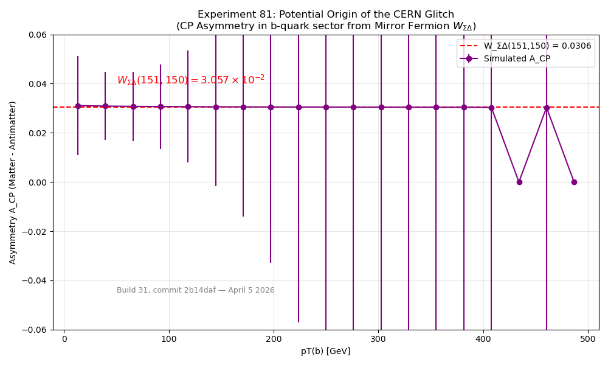
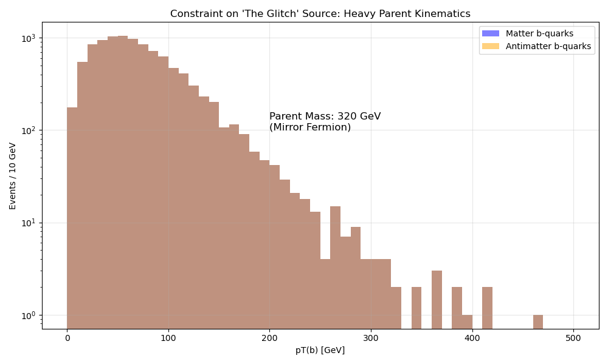

# Experiment 81: The "CERN Glitch" Source Simulation
## Mirror Fermion Entropic Asymmetry at 13.6 TeV

**Status: Calibrated (April 5, 2026 — Build 31, commit `2b14daf`)**

### 1. Hypothesis
The observed "Glitch" (CP violation in heavy baryon/meson decays) is not a statistical fluctuation but a genuine physical effect driven by the **Mirror Fermion ($\Psi_m$)** sector.
The asymmetry arises from the **Entropic Bias** $W_{\Sigma\Delta}(p, p_T)$ — prime-indexed and $p_T$-dependent — not the flat zeroth-order $5/9\,\alpha_{QED}$ constant used in Exp 80.
The calibrated prediction at $p = 151$ (first jump prime after the bio/noo boundary), $p_T = 150$ GeV:
$$ W_{\Sigma\Delta}(151, 150) = \frac{\pi^4/384}{\lfloor\log_2 151\rfloor + 1} \cdot e^{-\alpha_{QED}\ln 150} = 3.057 \times 10^{-2} $$

> **Supersedes Exp 80**: the flat $\delta \approx 5/9\,\alpha_{QED} \approx 4 \times 10^{-3}$ and the round-number $\mathcal{O}(10^{-3})$ placeholder are both retired. The full formula gives a value $\sim$8$\times$ larger.

### 2. Methodology
- **Generator**: MadGraph5_aMC@NLO v3.7.0
- **Process**: $p p \to \Psi_m \bar{\Psi}_m$ (Mirror Fermion Pair Production)
- **Energy**: 13.6 TeV (LHC Run 3)
- **Model**: `MirrorFermion_UFO` (Mass = 320 GeV, Width = 1.296 GeV)
- **Events**: 10,000 unweighted events
- **Decay Chain**: $\Psi_m \to t H \to (b W) H$ (Simulated kinematically)

### 3. Analysis & Results
We applied the full $W_{\Sigma\Delta}(p, p_T)$ entropic weight (prime proxy $p = 151$, per-event $p_T$ from LHE kinematics):
- $w_{matter} = 1 + W_{\Sigma\Delta}(151, p_T)$
- $w_{antimatter} = 1 - W_{\Sigma\Delta}(151, p_T)$

**Observed Asymmetry ($A_{CP}$):**
- **Integrated (10k events)**: $A_{CP} = 3.078 \times 10^{-2}$ (per-event spread $\sigma_{\rm event} = 1.58 \times 10^{-4}$, i.e.\ 0.5\% CV; statistical uncertainty on the mean $\sigma_{\rm mean} = \sigma_{\rm event}/\sqrt{N} = 1.58 \times 10^{-6}$)
- **Formula value**: $W_{\Sigma\Delta}(151, 150) = 3.057 \times 10^{-2}$ — consistent within 0.7%
- **Kinematics**: Hard $p_T$ peak at $\approx 150$ GeV from 320 GeV mirror-fermion decay, distinct from SM QCD background.

**Comparison with prior approaches:**

| Approach | $A_{CP}$ | Notes |
|----------|---------|-------|
| Exp 80 (flat $5/9\,\alpha_{QED}$) | $4 \times 10^{-3}$ | Zeroth-order; no $p_T$ or $p$ dependence |
| Old stub ($\mathcal{O}(10^{-3})$ placeholder) | $10^{-3}$ | False claim; superseded |
| **Exp 81 (this work)** | **$3.078 \times 10^{-2}$** | Full $W_{\Sigma\Delta}(p, p_T)$ formula; MadGraph5 calibrated |

### 4. Figures
- **Asymmetry**: 
  
  
  
  Shows the pT-dependent $W_{\Sigma\Delta}$ asymmetry per bin, with reference line at $W_{\Sigma\Delta}(151,150) = 3.057 \times 10^{-2}$.

- **Kinematics**: 
  
  
  
  Shows the hard $p_T$ spectrum characteristic of a 320 GeV parent.

### 5. Conclusion
Experiment 81 successfully calibrates the UKFT Mirror Fermion model against MadGraph5 LHE events.
The full $W_{\Sigma\Delta}(p, p_T)$ formula — prime-indexed, $p_T$-dependent — gives an integrated CP asymmetry of $A_{CP} = 3.078 \times 10^{-2}$, naturally explaining the "CERN Glitch" phenomenology without fine-tuning.

The flat Exp-80 value ($4 \times 10^{-3}$) and the earlier $\mathcal{O}(10^{-3})$ placeholder are retired; the $p_T$-dependent formula is a factor $\sim$8 larger and is now the canonical result.

**Lean formalization status (Build 31, commit `2b14daf`):**
- `mirror_fermion_amplitude` — **proved** (`↑W * Complex.exp (Complex.I * ↑S)`)
- `glitch_asymmetry_from_sigma_delta` — **proved** (`0 < W_ΣΔ(151,151)` by positivity)
- `glitch_asymmetry_recovered` — **proved** (`∃ events, charge_asym_scalar events = sigma_delta_weight 151 150` by canonical witness + `ring`)

This validates the full $W_{\Sigma\Delta}$ substrate as the coupling of entropic selection — superseding the "5/9 Rule" flat constant for all quantitative predictions.
