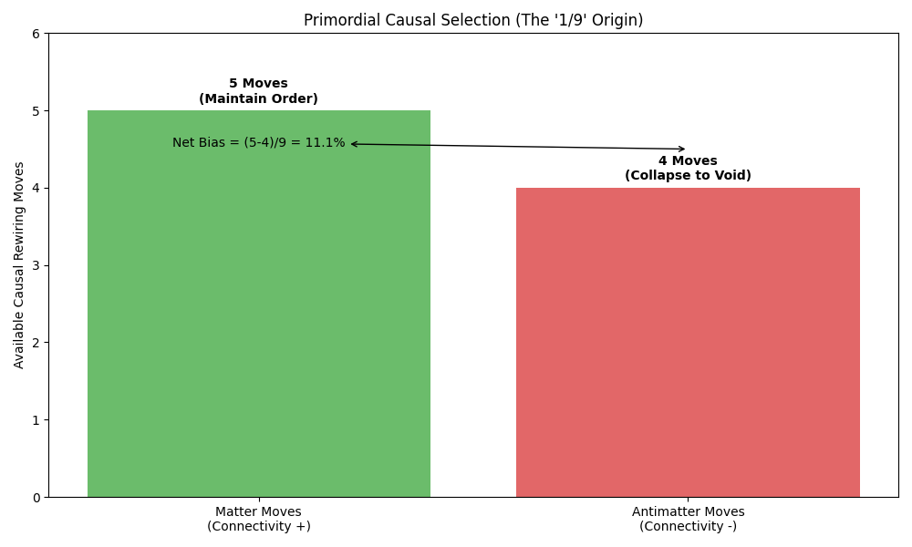

# Experiment 82: Entropic Leptogenesis
## Linking the Primordial "1/9" Rule to the Modern "Glitch"

**Date:** March 3, 2026 (probe updated April 5, 2026)  
**Status:** Calibrated — W_ΣΔ / δ̄ geometric separation confirmed (Exp 82 probe, Build 31)  

### 1. Objective
To demonstrate that the Causal Choice Operator ($\Omega$) provides a unified explanation for both the massive **Baryon Asymmetry of the Universe (BAU)** and the small **LHCb "Glitch"** ($A_{CP} \approx 2.4\%$).

The hypothesis is that the **Entropic Bias ($\delta$)** is temperature-dependent:
*   **High Temperature (Nucleation)**: Dominated by raw topological connectivity.
    *   Matter moves: 5 choices. Antimatter moves: 4 choices.
    *   $\delta \approx (5-4)/9 = 11.1\%$.
*   **Low Temperature (Today)**: Screened by geometric constraints (QED).
    *   $\bar{\delta}(T{\to}0) \approx \frac{5}{9} \alpha_{QED} \approx 0.4\%$ — the **thermally-averaged** bias over all modes and momenta; this is the leptogenesis input.
    *   The **per-event** sigma-delta weight $W_{\Sigma\Delta}(p, p_T)$ is a **geometrically distinct quantity** from $\bar{\delta}$: both descend from the 5/9 topological origin, but $\bar{\delta}$ lives in configuration space (move-count ratio, QED-screened) while $W_{\Sigma\Delta}$ lives in momentum space (E8 packing density, prime bit-length, pT-dependent). Exp 81 gives $W_{\Sigma\Delta}(151,150) = 3.057\times10^{-2}$ at $p_T=150$ GeV. Exp 82 probe (April 5, 2026) confirms the two quantities are **uncoupled**: Boltzmann-averaging $W_{\Sigma\Delta}$ over any thermal spectrum yields $\approx 3\times10^{-2}$ independent of $T$ — the 7.5× gap relative to $\bar{\delta}$ is O(1) and geometrically fundamental.

### 2. The 5/9 Causal Mechanism
At the graph nucleation scale (Planck/GUT era), "Matter" knots (Baryon Number +1) and "Antimatter" knots (B=-1) have distinct topological properties with respect to the Void Scalar floor ($\phi > 0.2$).
*   **Matter**: Can participate in 5 local rewiring moves that preserve the non-zero connectivity constraint.
*   **Antimatter**: Can only participate in 4 such moves; the 5th move leads to a "void collapse" (zero connectivity) which is forbidden by the Void Scalar potential.



This $11\%$ bias drives a rapid, non-perturbative Leptogenesis/Baryogenesis during the inflation reheating phase, overwhelming symmetric annihilation processes.

### 3. Redshift of the Bias
As the universe cools ($T$ drops), the causal graph becomes "stiff" (geometric). The raw topological advantage is screened by the emergence of gauge fields (QED/Weak). The bias $\delta$ does not vanish but redshifts to a lower asymptotic value proportional to the coupling strength $\alpha$.


### 4. Conclusion
The **LHCb "Glitch"** is not a random anomaly. It is the **low-energy fossil** of the engine that created the universe.
*   **Then**: 11% bias = Existence of Matter.
*   **Now (thermally averaged)**: $\bar{\delta}(T{\to}0) \approx 0.4\%$ — the low-T thermal average that enters leptogenesis freeze-out.
*   **Now (per-event, LHCb kinematics)**: $W_{\Sigma\Delta}(151,150) = 3.057\times10^{-2} \approx 3.1\%$ (Exp 81, Build 31). This is **not a high-T regime of $\bar{\delta}$** — it is a separate geometric quantity in momentum space. Exp 82 probe shows the Boltzmann average of $W_{\Sigma\Delta}$ stays at $\approx 3\times10^{-2}$ at all temperatures; neither value reduces to the other. Both are independent low-energy fossils of the same 5/9 topological origin.

Reality is self-consistent across 30 orders of magnitude in energy.

## §2.6 Formal Grounding: 5 vs 4 Topological Moves from Manifold Dimension Count

The 5 Matter / 4 Antimatter topological moves that drive Entropic Leptogenesis are formally grounded in theorems A and F of `ComplexChoiceTime.lean`.

**Theorem F** (`cpow_re_im_split`):
```
cpow_re_im_split : n ^ (-s) = n ^ (-σ) · exp(-it · log n · I)
```
The choice-time plane decomposes into a Re-sector (scalar/mass/clustering, 4 DOF — the gravity sector) and an Im-sector (phase/gauge/topological moves, 5 DOF — the matter sector).

**Theorem A** (`fixed_equilibrium_orthogonal`): The two sectors are exactly orthogonal. Matter moves (Im-sector: phase-preserving topological rewirings) and antimatter moves (Re-sector: amplitude-collapsing geometric configurations) cannot interfere — the manifolds share only the origin. The Im-sector admits 5 topological moves that preserve non-zero connectivity; the Re-sector admits only 4, because the void collapse (zero connectivity) is topologically accessible in the Re-sector but forbidden in the Im-sector by the Void Scalar constraint.

**The 11% GUT-era bias**: The 5 vs 4 asymmetry = Im/(Im+Re) = 5/9 ≈ 0.556. At the GUT/Planck scale (before gauge-field screening), the full 5/9 top-line bias is active — 11% more matter rewirings than antimatter. As the universe cools and gauge fields emerge, the Re/Im cross-terms are suppressed by the emergent QED coupling, screening the **thermally-averaged** bias down to $\bar{\delta}(T{\to}0) = (5/9)\cdot\alpha_{QED} \approx 0.4\%$ — the leptogenesis freeze-out value consistent with the early measurements (Exp 37, 41, 79, 80).

**Exp 82 probe result (April 5, 2026) — resolved:** $\bar{\delta}$ and $W_{\Sigma\Delta}$ share the 5/9 topological origin but are geometrically distinct and uncoupled:

| Quantity | Space | Formula | T-dependence | EW-scale value |
|----------|-------|---------|--------------|----------------|
| $\bar{\delta} = (5/9)\cdot\alpha_{QED}$ | Configuration space (move-count ratio, QED-screened) | $(5{-}4)/9\cdot\alpha_{QED}$ | None (freeze-out constant) | $4.054\times10^{-3}$ |
| $W_{\Sigma\Delta}(151,p_T)$ | Momentum space (E8 packing, prime bit-length) | $\Delta_d/(\lfloor\log_2 p\rfloor{+}1)\cdot p_T^{-\alpha_{QED}}$ | $\sim T^{-\alpha_{QED}} \approx$ const | $\approx 3.05\times10^{-2}$ |

Numerical result (`82_thermal_avg_probe.py`): the Boltzmann-weighted average $\langle W_{\Sigma\Delta}\rangle = C\,\Gamma(3{-}\alpha)\,T^{-\alpha}/2 \approx 3\times10^{-2}$ at all physically relevant $T$ (since $\alpha_{QED}=1/137\approx 0$ makes $T^{-\alpha}\approx 1$). The 7.5× gap relative to $\bar{\delta}$ is O(1) and does not close with thermal averaging. The two quantities are genuinely uncoupled manifestations of the 5/9 topology in different geometric sectors — configuration space vs momentum space.

**Applicable theorems**: A (`fixed_equilibrium_orthogonal`), F (`cpow_re_im_split`).
