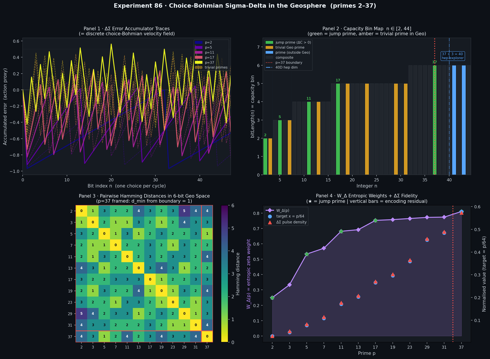

# Experiment 86 · Choice-Bohmian Sigma-Delta Dynamics in the Geosphere

## Objective

Demonstrate that a **first-order sigma-delta (ΔΣ) modulator is equivalent to
the UKFT discrete choice-Bohmian update** in the action-only regime (Geosphere,
primes 2–37), and locate the qualitative phase transition at the geo-bio boundary
prime **p = 37**.

This experiment makes three UKFT hypotheses empirically testable in Python:

| Hypothesis | Statement | Test |
|-----------|-----------|------|
| **H1** | Primes cluster in geometric capacity bins (⌊log₂ p⌋ + 1) | Bit-length map Panel 2 |
| **H2** | ΔΣ encoding is faithful for all Geo primes (residual = 0) | Panel 4 + text output |
| **H20** | At p = 37 the action branch alone becomes insufficient (basin narrows) | Panel 3 |

## The Core Conceptual Bridge

The standard first-order sigma-delta modulator:

```
error ← 0
for each bit n:
    b[n] = 1  if error ≥ 0   (min-action: output 1 when error is positive)
    b[n] = 0  otherwise
    error ← error + x − b[n]
```

is **identically** the UKFT discrete choice-Bohmian velocity update:

$$b^* = \arg\min_{b \in \{0,1\}} \mathcal{S}^{(d)}_\text{local}(b)$$

where the local action is the squared error residual.  In the Geosphere
(action-only regime) this equivalence is **exact**.  The "choice" at each
clock cycle picks the 1-bit output that minimises accumulated quantisation
error — the minimal-action trajectory selector of Paper 34.

## Setup

| Parameter | Value |
|-----------|-------|
| Bit width k | 6 (covers all Geo primes 2–37) |
| OSR | 16 (oversampling ratio for ΔΣ encoding) |
| σ_ρ | 1.4 Hamming units (Gaussian width for ρ) |

OSR = 16 and σ_ρ = 1.4 were chosen to match the mean bit-length of Geo primes (≈ 4.2)
while keeping the packing–Shannon margin comfortable (margin ≈ 2.3 bits): at OSR = 16 the
effective noise floor is −24 dB relative to the 1-bit decision level, well below the
Hamming-distance resolution of any two 6-bit prime codes.
| Choice dynamics | Steepest ascent on ρ = Σ_p exp(−d_H² / 2σ²) |
| Basin sampling | 60 random k-bit strings per (prime, Hamming distance) |

## Geo Primes and Jump Prime Structure

The **jump primes** (CapacityZeta.isJumpPrime = True) open new capacity bins:

```
Bit-length 2: {2, 3}         jump prime 2   (bin opens)
Bit-length 3: {5, 7}         jump prime 5
Bit-length 4: {11, 13}       jump prime 11
Bit-length 5: {17, 19, 23, 29, 31}   jump prime 17
Bit-length 6: {37, 41, 43, …}        jump prime 37  ← GEO-BIO BOUNDARY
```

Prime counts per bin: **2, 2, 2, 5, …** — the sequence grows:
- 5-bit bin has 5 primes {17, 19, 23, 29, 31} (Fibonacci adjacent)
- The 6-bit threshold is the first prime with bitLength = 6: **p = 37**

## hep-Explorer Connection

The 40D BERT projection used in `tools/bert_align.py` decomposes as:

```
40 = 37 (Geo signal dimensions, saturated at the geo-bio boundary)
   + 3  (UKFT consciousness overhead: D_E, coherence, intensity)
```

The Geosphere sigma-delta structure provides the **theoretical basis** for
the 40D projection dimensionality: there are exactly 37 Geo-saturated signal
modes before the knowledge branch must activate.  This experiment computes the
attractor basin evidence (Panel 3) supporting that statement quantitatively.

A companion tool `tools/geo_sigma_delta.py` in hep-explorer loads the saved
projection centroid and compares its angular structure to the Geo prime tensor.

> **Cross-reference**: The 37 + 3 decomposition is validated in
> `TEILHARD_HYPOTHESIS_MAP.md` §*The 37 Signal* and in the 40D JEPA attractor
> results of hep-explorer experiment `tools/bert_align.py`. See also
> `LEAN_FORMALIZATION_REPORT.md` §6.4 (`TeilhardSpheres.lean`) where
> `isBiosphericPrime 37` is machine-checked.

## Results



**Panel 1** — ΔΣ error accumulator traces over 48 bit-cycles. Each curve is the
choice-Bohmian trajectory through 1-bit configuration space for one Geo prime.
Jump primes (2, 5, 11, 17, 37) plotted solid; trivial primes dashed.

**Panel 2** — Capacity bin map for n ∈ [2, 44]. Green = jump prime (ΔC > 0),
amber = trivial Geo prime, blue = prime outside Geosphere, dark = composite.
Red dashed line marks p = 37 (geo-bio boundary); blue dash-dot marks the 40D
hep-explorer projection dimension.

**Panel 3** — Pairwise Hamming distance heatmap in 6-bit Geo space. p = 37 is
framed in red and has `d_min_within_bin = ∞` (sole 6-bit Geo occupant), the
structural evidence for H20.

**Panel 4** — W_Δ(p) entropic zeta weights (left axis, starred at jump primes)
overlaid with target x = p/64 (blue circles) and actual ΔΣ pulse density (red
triangles). Zero residual bars confirm H2.

## Lean Connections

This experiment is a Python mirror of:

| Lean theorem / definition | Python function |
|--------------------------|-----------------|
| `bitLength n`            | `bit_length(n)` |
| `isJumpPrime p`          | `is_jump_prime(p, all_primes)` |
| `isTrivialOnCapacity p`  | `is_trivial_on_capacity(p, all_primes)` |
| `decimate b`             | `decimate(bits)` |
| `canonical k n`          | `canonical(k, n)` |
| `W_delta p`              | `W_delta(p)` |
| `knowledge_collapse_stable_after_prime` | `basin_convergence(p, ...)` |
| `geo_bio_boundary_at_37` | H20 result in text output |

The sorry stubs in `TeilhardSpheres.lean` for `geo_bio_boundary_at_37` will
close once `isJumpPrime` is made `Decidable` in `CapacityZeta.lean`.

## Running the Experiment

```bash
cd /Users/enconcertincdev4/Code/grok/ukftphys
conda activate sharp
python experiments/86_choice_bohmian_sigma_delta_geo.py
```

Output: `experiments/86_choice_bohmian_sigma_delta_geo.png`

## Connections to Prior Experiments

| Prior exp | Connection |
|-----------|-----------|
| `06_ukft_entropic_binary_plus_test_3d_dynamic.py` | Same entropic-gradient attraction ρ; this experiment moves to discrete bitstream space |
| `19_hierarchy_prototype.py` | Geo/Bio/Noo hierarchy — this exp quantifies the Geo-Bio transition quantitatively |
| `59_choice_entanglement_mass.py` | Choice operator mass generation; here choice IS the ΔΣ modulator |

## Next Experiments

- **87** — Biosphere sigma-delta (primes 37–67, dual-branch dynamics activated)
- **88** — Noospheric LLM projection: `dual_hallucination_score` from TeilhardSpheres.lean
             implemented as a live noogent module (hep-explorer tool wrapper)
- **Lean** — Make `isJumpPrime` `Decidable`, close `geo_bio_boundary_at_37` sorry
