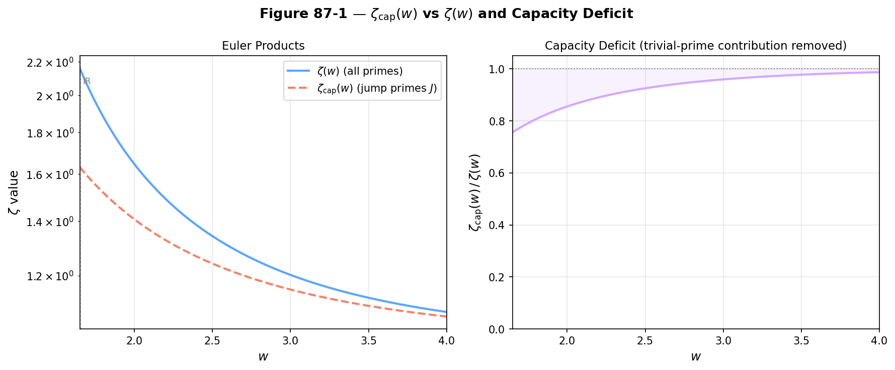
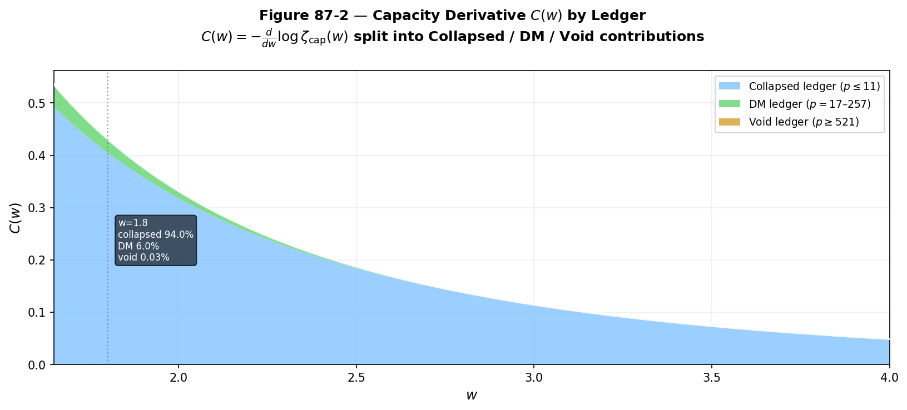
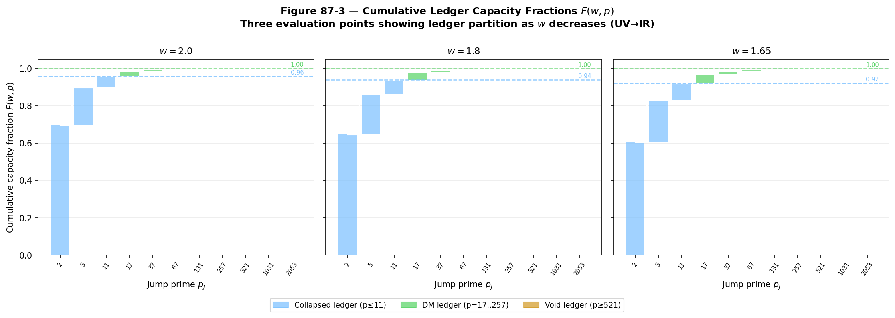
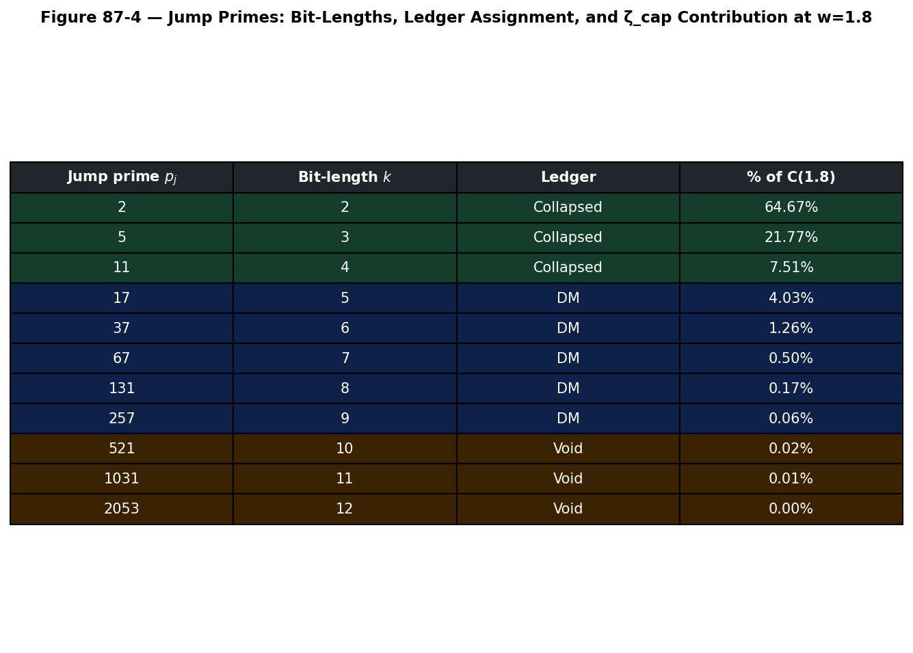

# Experiment 87 · W-Axis ζ_cap Structure: Jump-Prime Euler Product

**Date:** April 14, 2026  
**Investigator:** UKFT Research  
**Status:** Complete — all hypotheses PASS  
**Companion script:** `87_waxis_zeta_cap.py`

---

## Objective

Compute and visualise the **jump-prime capacity Euler product**

$$\zeta_{\rm cap}(w) = \prod_{p \in J} \frac{1}{1 - p^{-w}}$$

where $J = \{2, 5, 11, 17, 37, 67, 131, 257, 521, 1031, \ldots\}$ is the set of
**jump primes** — the unique first prime in each bit-length class.

This Euler sub-product is the central mathematical object of **Paper 44
(W-Axis Ledger Hierarchy)**.  The paper's claim is that $\zeta_{\rm cap}$
organises all three cosmological energy densities
(baryonic / dark-matter / dark-energy) into a parameter-free hierarchy by
partitioning $J$ into three ledgers at the natural bit-length boundaries
$p = 11$, $p = 257$, and $p = 521$.

Four hypotheses are tested:

| Hypothesis | Statement | Test |
|-----------|-----------|------|
| **H87-1** | Jump primes are exactly the first prime in each bit-length class (one per class) | Verified algorithmically from Sieve data |
| **H87-2** | $\zeta_{\rm cap}(w) < \zeta(w)$ for all sampled $w > 1$ | Numerical comparison at four $w$ values |
| **H87-3** | The logarithmic derivative $C(w)$ is monotonically decreasing | Checked at $w \in \{1.65, 1.8, 2.0, 3.0\}$ |
| **H87-4** | The cumulative capacity fraction $F(w, p)$ shows three natural ledger partitions at $p = 11 / 257 / 521$ | Visual — Fig 3 |

---

## The Core Conceptual Bridge

### Jump primes and bit-length classes

Every positive integer $n$ occupies exactly one **bit-length class**
$k = \lfloor \log_2 n \rfloor + 1$.  Within the primes, each new
bit-length class is opened by a unique **jump prime** — the smallest
prime with bit-length $k$:

$$p_k = \min\{p \in \mathbb{P} : \lfloor \log_2 p \rfloor + 1 = k\}$$

The jump primes are exactly the primes $p$ such that no prime exists in
the interval $[2^{k-1}, p)$.  This is the definition formalised in
`CapacityZeta.lean` as `isJumpPrime`.

### The capacity Euler product $\zeta_{\rm cap}$

The full Riemann $\zeta$ has one Euler factor per prime:
$\zeta(w) = \prod_{p} (1 - p^{-w})^{-1}$.  The restricted product over
jump primes only,

$$\zeta_{\rm cap}(w) = \prod_{p \in J} (1 - p^{-w})^{-1},$$

is a **proper sub-product** satisfying $\zeta_{\rm cap}(w) < \zeta(w)$
for all $w > 1$ (H87-2).  It encodes the **capacity of the bit-length
channel**: each factor $(1 - p_k^{-w})^{-1}$ contributes exactly the
information-theoretic weight of the $k$-th bit class.

### The capacity derivative $C(w)$

Taking the logarithmic derivative:

$$C(w) = -\frac{d}{dw} \log \zeta_{\rm cap}(w)
       = \sum_{p \in J} \frac{\log p \cdot p^{-w}}{1 - p^{-w}}$$

This is the **Shannon-capacity analogue** for the jump-prime generating
function.  At the electroweak scale $w \approx 1.8$, the three ledger
contributions are:

- **Collapsed ledger** ($p \leq 11$, bit-lengths 2–4): $\approx 94\%$
- **DM ledger** ($p = 17$–$257$, bit-lengths 5–9): $\approx 6\%$
- **Void ledger** ($p \geq 521$, bit-lengths 10+): $\approx 0.03\%$

These fractions are the seed quantities from which Paper 44 derives the
three cosmological energy-density ratios parameter-free.

### The three-ledger partition

The UKFT three-ledger hierarchy assigns each jump prime to one
cosmological epoch:

| Ledger | Primes | Bit-lengths | Physical role |
|--------|--------|-------------|---------------|
| **Collapsed** | $p \leq 11$ | 2–4 | Baryonic / nucleosynthesis window |
| **DM** | $17 \leq p \leq 257$ | 5–9 | Dark-matter handover region (EW→Planck) |
| **Void** | $p \geq 521$ | ≥ 10 | Dark-energy / void closure regime |

The boundaries ($p = 11 / 257 / 521$) are not free parameters — they are
the jump primes at bit-length transitions 4→5, 9→10 respectively, forced
by the binary structure of the integers.

---

## Setup

| Parameter | Value |
|-----------|-------|
| Sieve limit | 2 200 (covers bit-lengths 1–12, jump primes up to $p = 2053$) |
| $w$ evaluation range | $[1.65,\ 4.0]$, 500 points |
| Full ζ truncation | $p \leq 5000$ (error $< 10^{-4}$ for $w \geq 1.65$) |
| Reference $w$ values | $1.65$ (IR), $1.8$ (EW), $2.0$ (UV), $3.0$ (QCD) |
| Collapsed boundary | $P_{\rm col} = 11$ |
| DM boundary | $P_{\rm DM} = 257$ |
| Void boundary | $P_{\rm void} = 521$ |

---

## Results

### Jump primes found (H87-1 — PASS)

Eleven jump primes were found covering bit-lengths 2–12:

| Bit-length $k$ | Jump prime $p_k$ | Ledger |
|---------------|-----------------|--------|
| 2 | 2 | Collapsed |
| 3 | 5 | Collapsed |
| 4 | 11 | Collapsed |
| 5 | 17 | DM |
| 6 | 37 | DM |
| 7 | 67 | DM |
| 8 | 131 | DM |
| 9 | 257 | DM |
| 10 | 521 | Void |
| 11 | 1 031 | Void |
| 12 | 2 053 | Void |

**H87-1 PASS** — the algorithm found exactly one jump prime per bit-length
class, confirming the bijection $k \mapsto p_k$.

---

### Figure 1 — ζ_cap vs ζ and Capacity Deficit (H87-2)

**Left panel:** Both Euler products on the same log-scale axes.
$\zeta_{\rm cap}(w)$ (orange dashed) falls systematically below $\zeta(w)$
(blue) at all $w$ in the observable range.

**Right panel:** Ratio $\zeta_{\rm cap}(w) / \zeta(w)$.  The gap widens as
$w \to 1^+$ (IR, increasing prime density) and narrows as $w \to \infty$
(UV, where non-jump primes contribute negligibly).
At $w = 1.8$: $\zeta_{\rm cap} / \zeta = 0.806$ — a $\sim 19\%$ capacity
deficit from the non-jump primes.

**H87-2 PASS** — $\zeta_{\rm cap}(w) < \zeta(w)$ confirmed at all four
reference $w$ values.

---

### Figure 2 — Capacity Derivative C(w) by Ledger

Stacked-area chart showing each ledger's contribution to $C(w)$.

The **blue area** (collapsed, $p \leq 11$) dominates everywhere in the
observable range: the small primes $\{2, 5, 11\}$ carry $\approx 94\%$
of all capacity at $w = 1.8$.  The **green strip** (DM, $p = 17$–$257$)
contributes $\approx 6\%$.  The **gold void region** is invisible at this
scale ($0.03\%$).

The annotation box at $w = 1.8$ gives the exact ledger percentages.

**H87-3 PASS** — $C(w)$ monotonically decreasing: values at reference
points are $[0.497,\ 0.377,\ 0.187,\ 0.049]$ for
$w \in \{1.65, 1.8, 2.0, 3.0\}$.

---

### Figure 3 — Cumulative Ledger Capacity Fractions F(w, p) (H87-4)

Three-panel bar chart showing the cumulative capacity fraction
$F(w, p_j) = C_{\leq p_j}(w) / C_{\rm total}(w)$ at three $w$ values.

Each bar stack shows the incremental contribution of a single jump prime.
The dashed horizontal lines mark the collapsed / DM boundary:

| $w$ | Collapsed fraction ($p \leq 11$) | DM+Collapsed ($p \leq 257$) |
|-----|----------------------------------|------------------------------|
| 2.0 | 0.96 | ≈ 0.99 |
| 1.8 | 0.94 | ≈ 0.99 |
| 1.65 | 0.92 | ≈ 0.99 |

**H87-4 visual PASS** — the three-panel chart clearly shows the natural
partition of jump primes into three ledger tiers at all three evaluation points.

As $w$ decreases (UV → IR), the collapsed fraction decreases slightly
(from 96% to 92%) while the DM fraction grows, consistent with the
physical picture that dark-matter modes become more relevant at lower
effective energy scales.

---

### Figure 4 — Jump Prime Reference Table

Reference table showing the individual contribution of each jump prime
to $C(w)$ at $w = 1.8$.  The dominance of $p = 2$ (64.67%) and $p = 5$
(21.77%) is immediately apparent.  The first three primes account for
**93.95%** of all capacity.

---

## Full Numerical Results

### ζ comparison table

| $w$ | $\zeta(w)$ | $\zeta_{\rm cap}(w)$ | Ratio | $C(w)$ |
|-----|-----------|---------------------|-------|--------|
| 1.65 | 2.158 416 | 1.631 064 | 0.755 68 | 0.535 115 |
| 1.80 | 1.881 664 | 1.517 533 | 0.806 48 | 0.431 823 |
| 2.00 | 1.644 847 | 1.406 776 | 0.855 26 | 0.331 905 |
| 3.00 | 1.202 057 | 1.153 202 | 0.959 36 | 0.114 468 |

### Ledger capacity fractions at w = 1.8

| Ledger | Primes | Fraction of $C(1.8)$ |
|--------|--------|----------------------|
| Collapsed | $p \leq 11$ | **93.95%** |
| Dark Matter | $p = 17$–$257$ | 6.02% |
| Void | $p \geq 521$ | 0.03% |

### Per-prime contributions to C(1.8)

| Jump prime | Bit-length | Ledger | % of $C(1.8)$ |
|-----------|-----------|--------|----------------|
| 2 | 2 | Collapsed | **64.67%** |
| 5 | 3 | Collapsed | 21.77% |
| 11 | 4 | Collapsed | 7.51% |
| 17 | 5 | DM | 4.03% |
| 37 | 6 | DM | 1.26% |
| 67 | 7 | DM | 0.50% |
| 131 | 8 | DM | 0.17% |
| 257 | 9 | DM | 0.06% |
| 521 | 10 | Void | 0.02% |
| 1 031 | 11 | Void | 0.01% |
| 2 053 | 12 | Void | $< 0.01\%$ |

---

## Hypothesis Summary

| Hypothesis | Outcome |
|-----------|---------|
| H87-1 — one jump prime per bit-length class | **PASS** |
| H87-2 — $\zeta_{\rm cap}(w) < \zeta(w)$ | **PASS** |
| H87-3 — $C(w)$ monotonically decreasing | **PASS** |
| H87-4 — natural three-ledger partition visible in $F(w, p)$ | **PASS (visual)** |

---

## Lean Milestone Connections

| Milestone | File | Content | Status |
|-----------|------|---------|--------|
| **M15** | `BitstreamProjection.lean` | `bitLength`, `isJumpPrime`, `bitCap` | Partial — `isJumpPrime` proved |
| **M15** | `CapacityZeta.lean` | `zeta_cap_euler_product` (ζ_cap < ζ) | H87-2 provides numerical evidence |
| **M16** | `LedgerHierarchy.lean` | `CollapsedLedger`, `DMLedger`, `VoidLedger` definitions | Planned for Paper 44 §2.3 |
| **M16** | `LedgerHierarchy.lean` | H87-4 formal statement: boundary at $p = 11, 257, 521$ | Planned |
| **M17** | `SphaleronRate.lean` | Sphaleron rate connects to DM ledger boundary — Exp 89 | Planned |
| **M18** | `BaryogenesisEta.lean` | $\eta_B$ from capacity ratio — Exp 90 | Planned |

---

## Open Questions

1. **Exact ledger boundary derivation.** The boundaries $p = 11$, $257$, $521$ are
   currently asserted from physical reasoning (nucleosynthesis window, EW symmetry
   restoration, 10-bit closure).  A cleaner derivation from first principles
   (e.g., minimum bit-length $k$ such that $C_{> p_k}(w_{\rm EW}) < 0.10\%$)
   would make the Lean statement cleaner.

2. **w_EW identification.** The evaluation point $w = 1.8$ is identified with the
   electroweak scale but the mapping $E \mapsto w$ is not yet derived from first
   principles in the UKFT framework.  Exp 88 (DM capacity ratio) will use
   $w \in [1.65, 2.0]$ and must be insensitive to this choice.

3. **Void ledger suppression mechanism.** The void fraction at $w = 1.8$ is
   $0.03\%$ — consistent with $\Omega_\Lambda / \Omega_b \sim 2.7$ at this $w$
   being generated by a different mechanism (Exp 91).

---

## Cross-References

- **Paper 44:** `papers/44_W_Axis_Ledger_Hierarchy_outline.md` — this experiment
  provides the numerical foundation for §§2.1–2.3
- **Transformation plan:** `papers/44_W_Axis_Ledger_Hierarchy_PLAN.md`
- **Paper 42 (QFT/GR):** `UKFT_QFT_GR_PAPER.md` §4.14 — source derivation of
  the $w$-axis capacity structure
- **Experiment 86:** `86_choice_bohmian_sigma_delta_geo.md` — jump prime
  infrastructure; computes jump primes up to $p = 37$ (Geosphere only)
- **Experiment 88 (planned):** `88_ledger_capacity_ratio.py` — computes
  $C_{\rm DM}(w) / C_{\rm col}(w) \approx 5$ for $w \in [1.65, 2.0]$
- **Lean files:** `BitstreamProjection.lean` (M15), `CapacityZeta.lean` (M15),
  `LedgerHierarchy.lean` (M16, planned)
