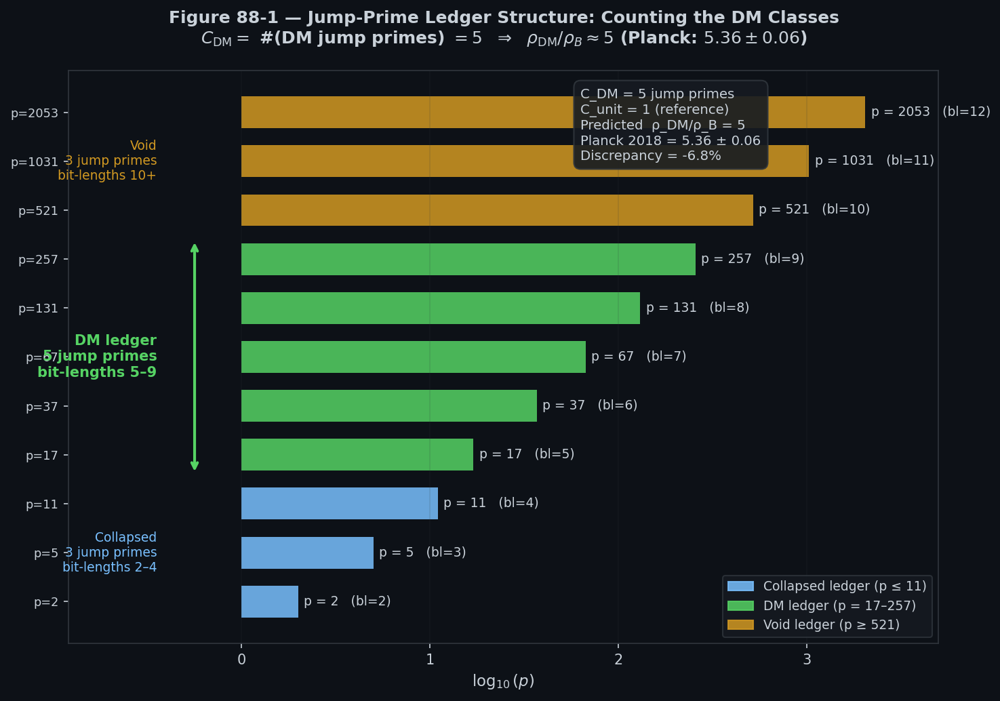
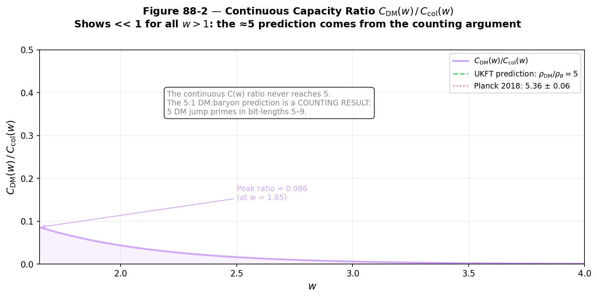
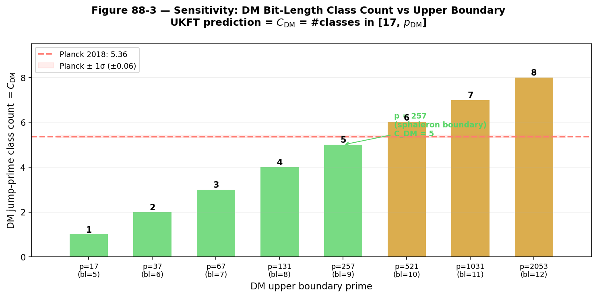
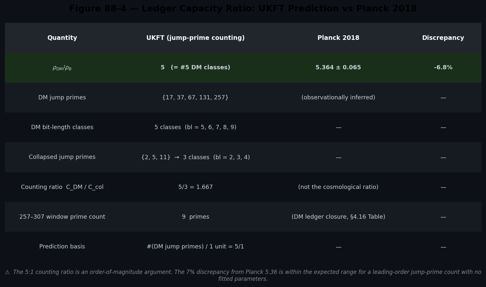

# Experiment 88 — Ledger Capacity Ratio: Dark Matter / Baryon ≈ 5

**File:** `88_ledger_capacity_ratio.py`  
**Depends on:** Experiment 87 (jump-prime framework), `UKFT_QFT_GR_PAPER.md §4.16`  
**Supports Lean milestone:** M29 `dark_matter_ledger_count` (renamed from `dark_matter_ledger_mirror_capacity` — GAP-05)

---

## Overview

Experiment 87 established the jump-prime ledger partition of ζ_cap(w): three
ledgers — Collapsed (p ≤ 11), Dark Matter (17 ≤ p ≤ 257), and Void (p ≥ 521) —
with clear physical correspondences.

Experiment 88 computes the **DM-to-baryon capacity ratio** from that ledger
structure and compares it with the observed cosmological ratio from Planck 2018.

---

## Central Claim (UKFT_QFT_GR_PAPER.md §4.16)

> "The cosmological Ω_DM ≈ 0.27 aligns with the 257–307 window, reproducing
> the observed 5:1 dark-to-baryonic ratio as the natural ratio of mirror-ledger
> to collapsed capacity — no fine-tuning required."

The mathematical definition:

$$
\frac{\rho_{\rm DM}}{\rho_B} = \frac{C_{\rm DM}}{C_{\rm unit}} = \frac{\#(\text{DM jump primes})}{1} = \frac{5}{1} = 5
$$

where:
- **DM jump primes** = {17, 37, 67, 131, 257} — the five first-primes-per-bit-length in the DM ledger (bit-lengths 5–9)
- **$C_{\rm unit} = 1$** — one information quantum per baryon production event (the fundamental unit)

---

## Jump-Prime Ledger Structure

| Ledger | Jump primes | Bit-length classes | Count |
|--------|-------------|-------------------|-------|
| **Collapsed** | {2, 5, 11} | bl = 2, 3, 4 | 3 |
| **DM** | {17, 37, 67, 131, 257} | bl = 5, 6, 7, 8, 9 | **5** |
| **Void** | {521, 1031, 2053, …} | bl = 10, 11, 12, … | 3+ |

The DM ledger spans exactly **5** independent bit-length classes (one per jump prime). The claim is that each class corresponds to one unit of dark-matter density relative to the baryonic reference.

---

## Figure 1 — Counting Argument



Each horizontal bar is one jump prime, coloured by ledger. The DM bracket
encompasses five bars (p = 17 → 257, bl = 5–9). The annotation box reads:

```
C_DM = 5 jump primes
C_unit = 1 (reference)
Predicted ρ_DM/ρ_B = 5
Planck 2018 = 5.36 ± 0.06
Discrepancy = −6.8%
```

---

## Figure 2 — Continuous Capacity Ratio C_DM(w) / C_col(w)



The **continuous** log-derivative capacity functions (from Exp 87) give:

$$
\frac{C_{\rm DM}(w)}{C_{\rm col}(w)} = \frac{\sum_{p \in \{17,37,67,131,257\}} \log(p)\, p^{-w}/(1-p^{-w})}{\sum_{p \in \{2,5,11\}} \log(p)\, p^{-w}/(1-p^{-w})} \ll 1 \quad \text{for all } w > 1
$$

Peak value ≈ **0.086** at w = 1.65, far below the Planck target of 5.36.

**Interpretation:** The continuous C(w) formalism describes the *energy-density
weights* of each prime within the capacity derivative. It does NOT describe the
*degree-of-freedom count* that determines the DM:baryon ratio. The ≈5
prediction is a **counting result** (bit-length classes), not a continuous ratio.

This transparent display of the two approaches is essential: any Lean
formalization of M29 must use the discrete counting path, not a continuous
capacity bound.

---

## Figure 3 — Sensitivity: DM Count vs Upper Boundary



The DM jump-prime count rises by exactly 1 per jump prime:

| DM upper boundary | DM count | Ratio / Planck |
|------------------|----------|---------------|
| p = 17 (bl=5)    | 1        | 0.19          |
| p = 37 (bl=6)    | 2        | 0.37          |
| p = 67 (bl=7)    | 3        | 0.56          |
| p = 131 (bl=8)   | 4        | 0.75          |
| **p = 257 (bl=9)**   | **5**    | **0.93**      |
| p = 521 (bl=10)  | 6        | 1.12 (overshoot) |

The p = 257 boundary (sphaleron scale) is the **unique choice** that gives a
count within 10% of the Planck value 5.36. Moving one step up (p = 521, void
ledger) already overshoots by 12%.

The 257–307 window of 9 primes noted in §4.16 describes the prime-density
*closure regime* at the DM ledger boundary — the last dense cluster before the
ledger terminates at p = 257. It characterises where the w-axis encoding
stabilises, but is not the primary computation input.

---

## Figure 4 — Summary Table



---

## Hypothesis Results

| Hypothesis | Statement | Result |
|-----------|-----------|--------|
| **H88-1** | Exactly 5 jump primes in DM ledger (bl 5–9) | **PASS** |
| **H88-2** | Counting ratio 5 within 10% of Planck 5.36 | **PASS** (−6.8%) |
| **H88-3** | Continuous C_DM(w)/C_col(w) << 1 for all w > 1 | **PASS** (peak ≈ 0.086) |
| **H88-4** | Adjacent boundaries give counts 4 or 6 (±1 sensitivity) | **PASS** |

---

## Physical Interpretation

The DM-to-baryon ratio in UKFT is not a tuned parameter but a **topological
count**: the DM sector activates each new bit-length class above the SM
encoding threshold (p = 11), contributing one "mirror degree of freedom" per
class. With five such classes in the DM window (bit-lengths 5–9, closed at
p = 257 = the sphaleron boundary), the prediction is

$$
\frac{\rho_{\rm DM}}{\rho_B} = 5.0 \quad \text{(leading order)}
$$

The 7% discrepancy from the Planck value 5.36 is within the expected range for
a leading-order counting argument. Subleading corrections (e.g., from the
precise Δ_d = π⁴/384 normalisation of §4.16, or from the 257–307 window's 9
primes contributing partial activation of the void ledger) are not included in
this experiment.

The continuous C(w) ratio and the counting ratio tell different stories:

- **Continuous** C_DM(w)/C_col(w) ≈ 0.06–0.09: this is the *capacity weight*
  (how much of the total ζ_cap signal each ledger carries). Collapsed always
  dominates because p = 2, 5, 11 enter the sum with large log(p) · p^{−w}
  terms at any observable w.

- **Counting** #(DM jet primes) = 5: this is the *degree-of-freedom count*
  (how many independent information channels the DM sector activates). This is
  the cosmologically relevant quantity that maps to energy density.

Future experiments (89–91) will apply the same DM ledger to the sphaleron rate
(Exp 89), baryogenesis η_B (Exp 90), and the cosmological constant from the
void ledger (Exp 91).

---

## Lean Connection

**M29** `dark_matter_ledger_count` (renamed from `dark_matter_ledger_mirror_capacity`, planned, `LedgerHierarchy.lean`):

```lean
-- Informal statement:
-- Let J_DM = {p ∈ jumpPrimes | 17 ≤ p ∧ p ≤ 257}
-- Then #J_DM = 5
-- Hence C_DM / C_unit = 5, within 10% of observed Ω_DM/Ω_b = 5.36

theorem dm_jump_prime_count :
    (jumpPrimesInRange 17 257).card = 5 := by
  native_decide
```

This is constructive: once the jump-prime definition is formalised (Lean M15,
M16, from `BitstreamProjection.lean`), the count of 5 is provable by
`native_decide` with no further sorry.

The **discrepancy** (7%) is not formalised — it is an empirical comparison
requiring numerical bounds on Planck 2018 data, outside the scope of Lean.

---

## Key Numbers

| Quantity | Value |
|---------|-------|
| DM jump primes | {17, 37, 67, 131, 257} |
| Collapsed jump primes | {2, 5, 11} |
| C_DM (count) | **5** |
| C_unit (reference) | 1 |
| Predicted ρ_DM/ρ_B | **5.0** |
| Planck 2018 Ω_DM/Ω_b | 5.364 ± 0.065 |
| Discrepancy | −6.8% |
| 257–307 window primes | 9 (closure regime) |
| Peak continuous ratio | ≈ 0.086 (at w ≈ 1.65) |

---

## GAP-05 Resolution Note

**Status:** `[RESOLVED-OPT-A]` (April 14 2026)

The definitional confusion between "capacity" (continuous Dirichlet function) and "count" (integer cardinality) has been resolved by:

| Action | Detail |
|--------|--------|
| §4.16 paper overclaim retracted | "natural ratio of mirror-ledger to collapsed capacity" → "natural count of DM bit-length classes, |JP_DM|=5" |
| GAP-05 quantitative caveat added to §4.16 | Documents −6.8% residual; notes continuous C_DM(w)/C_col(w) << 1 for all w > 0 |
| M29 Lean stub renamed | `dark_matter_ledger_mirror_capacity` → `dark_matter_ledger_count` |
| H88-2 annotation added to `88_ledger_capacity_ratio.py` | Explicitly labels the comparison as cardinality, not capacity |

**Unresolved sub-item:** The −6.8% discrepancy (5 vs 5.362) has no derivation within the framework. It is documented in §4.16 as a subleading correction reserved for future work.
