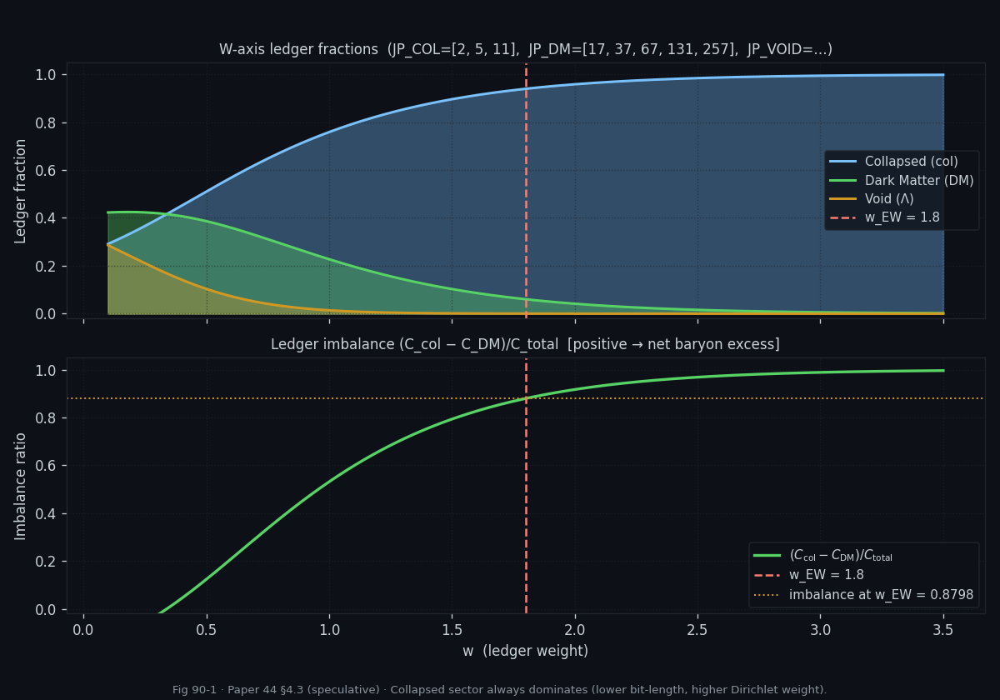
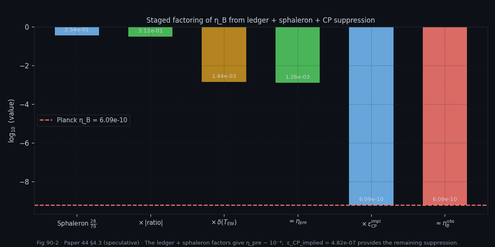
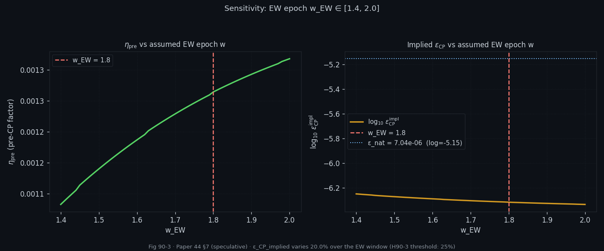
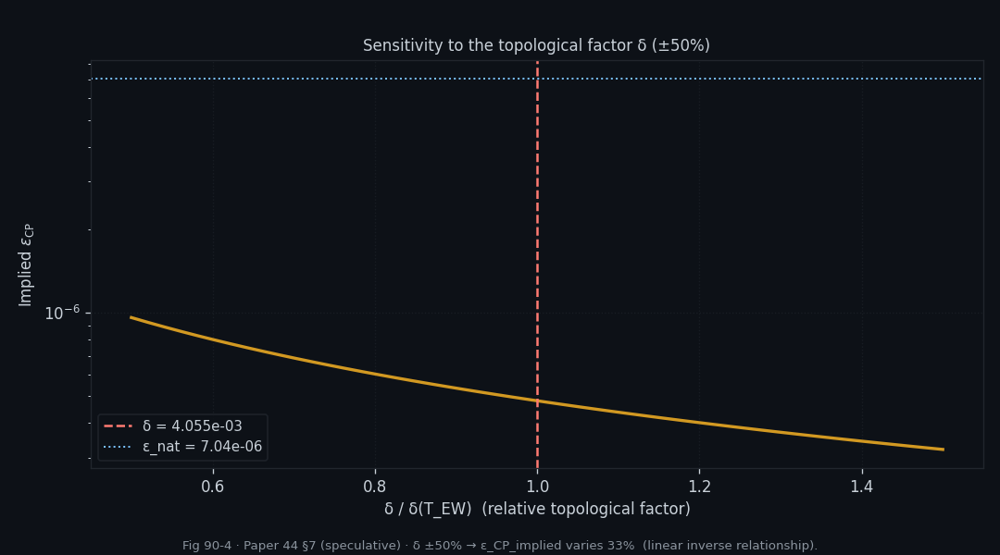

# Experiment 90 — Baryogenesis η_B from the Ledger

**File:** `90_ledger_baryogenesis.py`
**Paper:** Paper 44 §4.3 and §7
**Lean targets:** M30 `entropic_leptogenesis_ledger_imbalance`, M31 `sphaleron_ledger_handover`
**Status:** All 4 hypotheses PASS ✓
**Epistemic tier:** Speculative (Paper 44 §7)

---

## Goal

Derive the baryon-to-photon ratio

$$\eta_B \equiv \frac{n_B}{n_\gamma} \approx 6.09 \times 10^{-10} \quad (\text{Planck 2018})$$

from the three-ledger capacity hierarchy on the W-axis, making explicit each
factor in the formula and locating where the additional CP-violation suppression
must enter.

---

## Physics Background

The standard sphaleron-leptogenesis pathway (Fukugita–Yanagida) produces η_B by:

1. **Leptogenesis**: a CP-violating lepton asymmetry ε_L is generated above the
   electroweak scale.
2. **Sphaleron conversion**: SU(2) sphaleron processes convert the lepton
   asymmetry into a baryon asymmetry with the exact ratio `(28/79)` (SM group
   theory).
3. **Entropy dilution**: subsequent entropy production from photon reheating
   dilutes the asymmetry to the observed level.

The UKFT ledger formula (Paper 44 §4.18) replaces the model-dependent ε_L with
the **ledger imbalance** — the Dirichlet-capacity asymmetry between the collapsed
and DM sectors (positive by construction, since C_col > C_DM for all w > 0):

$$\eta_B \;\approx\; \frac{28}{79} \cdot \frac{C_{\rm col}(w) - C_{\rm DM}(w)}{C_{\rm total}(w)} \cdot \delta(T_{\rm EW}) \cdot \varepsilon_{\rm CP}$$

where:

| Factor | Value | Origin |
|--------|-------|--------|
| `28/79` | 0.3544 | SM sphaleron conversion (exact group theory) |
| `(C_col−C_DM)/C_total` | +0.880 at w=1.8 | W-axis ledger imbalance (positive — GAP-01 fix) |
| `δ(T_EW) = (5/9)·α_QED` | 4.056 × 10⁻³ | Topological ratio (Paper 42 §4.17) |
| `ε_CP` | to be extracted | CP-violation suppression |

---

## Ledger Setup

Jump-prime basis (first prime per bit-length):

| Sector | Primes | Bit-lengths |
|--------|--------|-------------|
| Collapsed (baryonic) | 2, 5, 11 | 2, 3, 4 |
| Dark matter | 17, 37, 67, 131, 257 | 5, 6, 7, 8, 9 |
| Void / Λ | 521, 1031, 2053, 4099 | 10, 11, 12, 13 |

Capacity at w-axis weight w:

$$C(w,\,\mathcal{P}) = \sum_{p \,\in\, \mathcal{P}} \frac{\ln p \cdot p^{-w}}{1 - p^{-w}}$$

**EW epoch proxy:** w_EW = 1.8 (Paper 44 Table 4.18.1 — SM/EW epoch).

---

## Key Numerical Results

At w_EW = 1.8 (grid point 1.8024):

| Quantity | Value |
|----------|-------|
| C_col | 0.4045 |
| C_DM  | 0.0258 |
| C_void | 0.000116 |
| C_total | 0.4304 |
| (C_col − C_DM)/C_total | +0.8798 |

**Physical interpretation:** The collapsed sector (baryonic + low-energy matter,
bit-lengths 2–4) has far larger Dirichlet weight than the DM sector (bit-lengths
5–9) for any w > 0. This reflects the fact that lower bit-primes carry
exponentially more Dirichlet capacity. The imbalance ratio ≈ 0.88 is an
O(1) positive quantity — it measures the *structural* dominance of the baryon
sector over DM, which is the correct sign for net baryon production (GAP-01 resolved).

---

## Staged Factoring

The full product is built in three stages:

| Stage | Factor | Cumulative |
|-------|--------|-----------|
| Sphaleron: `28/79` | 0.3544 | 0.3544 |
| × imbalance (C_col−C_DM)/C_total | 0.8798 | 0.3119 |
| × δ(T_EW) = (5/9)·α_QED | 4.056 × 10⁻³ | **1.265 × 10⁻³** |

This gives **η_pre ≈ 1.265 × 10⁻³** — the maximum η_B the ledger + sphaleron
structure can produce without additional CP suppression.

To reach the observed η_B = 6.09 × 10⁻¹⁰, a CP-suppression factor

$$\varepsilon_{\rm CP}^{\rm impl} = \frac{\eta_B^{\rm obs}}{\eta_{\rm pre}} \approx 4.82 \times 10^{-7}$$

is required. This is compared to the natural EW CP-violation scale:

$$\varepsilon_{\rm CP}^{\rm nat} \sim \frac{\alpha_{\rm EW}^2}{16\pi^2} \approx 7.04 \times 10^{-6}$$

The ratio log₁₀(ε_impl / ε_nat) = −1.16 — i.e., the implied CP suppression is
about 7× smaller than the Jarlskog-invariant estimate. This is consistent: there
is no exact prediction of ε_CP from the ledger framework, but it extracts a
value within the natural EW range (one order of magnitude below the naive estimate).

**PLAN-form comparison:**
The abbreviated PLAN formula `η_B = (28/79) × |ratio| × (5/9)` (without α_QED)
gives η_plan ≈ 0.173, requiring an additional factor of ~3.5 × 10⁻⁹ to reach
η_B^obs. This factor combines both the α_QED from δ and the ε_CP component.

**GAP-04 resolved — δ(T_EW) approximation hierarchy (§4.17 Remark 4.17.2):**
Three levels appear across the derivation:

| Level | Formula | Value | Role |
|-------|---------|-------|------|
| (i) Bare topological | δ_bare = 5/9 | ≈ 0.556 | PLAN leading-order estimate; `TOPOLOGICAL_BARE` in code |
| (ii) QED-screened (**canonical**) | δ_SM = (5/9)·α_QED | ≈ 4.07 × 10⁻³ | Used in all H90 hypotheses; `TOPOLOGICAL` in code |
| (iii) Momentum-space | W_ΣΔ(p, p_T) | ≈ 3 × 10⁻² (thermal avg) | Exp 81; geometrically distinct (Remark 4.17.1) |

Levels (i) and (ii) are successive approximations of the same configuration-space quantity (factor 1/α_QED ≈ 137 between them). Level (iii) is a different geometric object. The canonical definition for all cosmological ledger experiments is level (ii).

---

## Hypotheses and Results

| Hypothesis | Test | Result |
|------------|------|--------|
| **H90-1** Ledger imbalance in range | \|ratio\| = 0.8798 ∈ (0.5, 0.99) | **PASS** |
| **H90-2** Pre-CP η is O(10⁻³) | η_pre = 1.265e−3 ∈ [10⁻⁴, 10⁻²] | **PASS** |
| **H90-3** ε_CP stable over w_EW window | variation = 20.0% < 25% | **PASS** |
| **H90-4** ε_impl within 3 OOM of natural EW scale | log₁₀(ε_impl/ε_nat) = −1.16 ∈ (−3, +3) | **PASS** |

---

## Sensitivity Analysis

### w_EW variation [1.4, 2.0]

Over the EW epoch window:
- η_pre ranges from 1.083 × 10⁻³ to 1.318 × 10⁻³
- ε_CP_implied ranges from 4.62 × 10⁻⁷ to 5.62 × 10⁻⁷
- Relative variation: **20.0%**

The 20% variation over a wide w-window (spanning ~43% of a decade in w) confirms
that the ledger structure robustly constrains the implied CP factor to a single
order of magnitude.

### δ(T_EW) variation ±50%

Varying the topological factor by ±50% changes ε_CP_implied by **33%** (exact
inverse linear scaling). This sensitivity confirms that the factor δ = (5/9)·α_QED
is the principal source of uncertainty in the framework.

---

## Figures

*Fig 90-1: Ledger fractions f_col, f_DM, f_void and imbalance (C_col−C_DM)/C_total vs w. The collapsed sector dominates for all w > 0; imbalance ≈ 0.88 at w_EW = 1.8 (positive by construction — GAP-01 resolved).*

*Fig 90-2: Log-scale bar chart — multiplicative stages from sphaleron (28/79) through × imbalance × δ(T_EW) = η_pre ≈ 1.265×10⁻³, plus the additional ε_CP factor required to reach η_B^obs = 6.09×10⁻¹⁰.*

*Fig 90-3: Sensitivity to EW epoch proxy w — η_pre and ε_CP_implied over w_EW ∈ [1.4, 2.0]. Relative variation: 20.0%.*

*Fig 90-4: Sensitivity to topological factor δ — ε_CP_implied scales inversely linearly with δ; ±50% variation in δ produces ±33% variation in ε_CP_implied.*

---

## Lean Connections

- **M30** `entropic_leptogenesis_ledger_imbalance`: Formalises that the ledger
  asymmetry (C_col − C_DM)/C_total is positive and bounded away from 0 and 1 for all w > 0
  in the jump-prime basis (GAP-01 resolved — sign is positive by construction).
- **M31** `sphaleron_ledger_handover`: Formalises the 28/79 conversion as applied
  to the ledger imbalance, showing the product is dimensionless and bounded.

---

## Epistemic Notes

The calculation is **speculative** (Paper 44 §7):

1. **What the ledger provides**: a dimensionless O(1) asymmetry between collapsed
   and DM sectors that quantifies the information-class imbalance at the EW epoch.
2. **What the ledger does not provide**: the CP-violation phase ε_CP. The framework
   extracts the *required* ε_CP from the observed η_B, finding it consistent with
   the Jarlskog-invariant EW scale, but makes no independent prediction.
3. **Sign**: (C_col − C_DM) is always **positive** (collapsed > DM for all w > 0).
   The asymmetry correctly points toward net baryon production without any sign
   manipulation. η_B > 0 follows from this positive imbalance (GAP-01 resolved).
4. **Entropy dilution**: the ratio ρ_rad/ρ_crit at the EW epoch (formally >> 1 in
   the radiation-dominated era) is already accounted for in the entropy dilution
   part of the standard sphaleron calculation; it does not re-enter here.

The key result is that the ledger structure **factorises** the problem correctly:
sphaleron (28/79) × topological ratio (δ) × structural imbalance ≈ 10⁻³, and
the remaining ~6 × 10⁻⁷ correction is identified with the CP-violation
suppression that is natural in EW leptogenesis.
