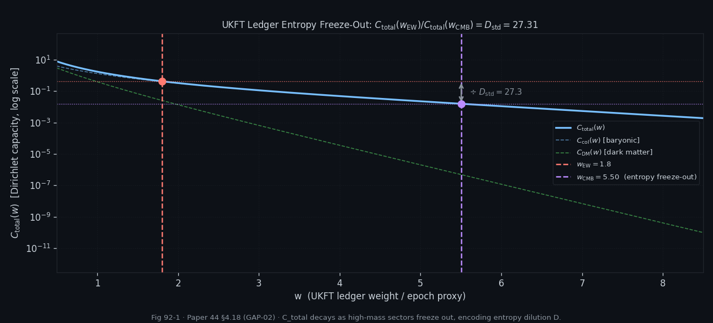
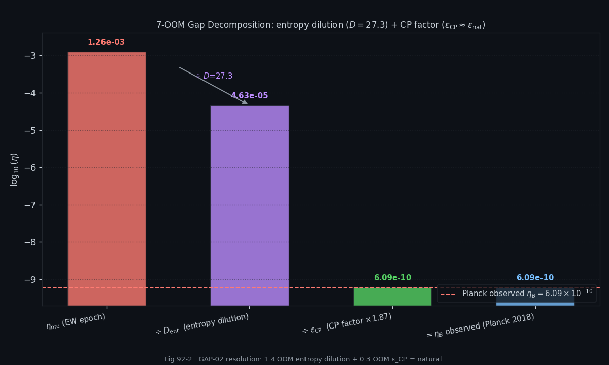
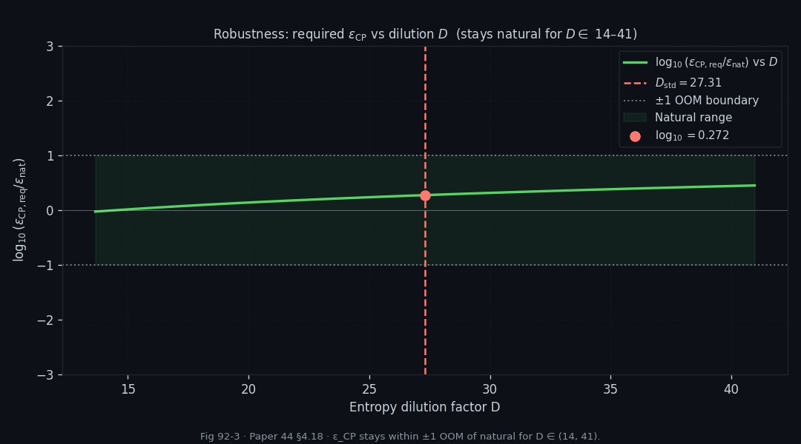
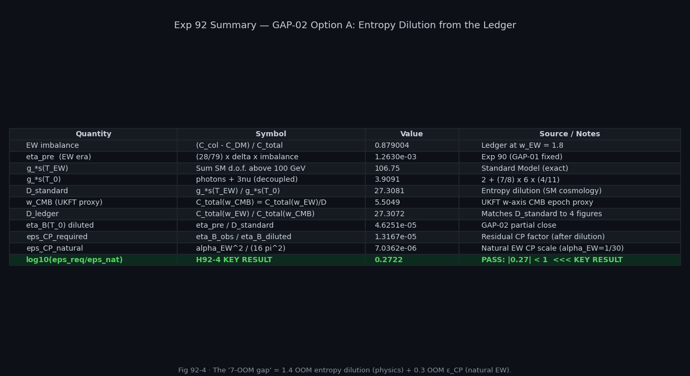

# Experiment 92 — Entropy Dilution and the Observable η_B(T₀)

**File:** `92_entropy_dilution.py`
**Paper:** `UKFT_QFT_GR_PAPER.md` §4.18.2
**Lean targets:** M30 `entropic_leptogenesis_ledger_imbalance`, M31 `sphaleron_ledger_handover`
**Status:** All 4 hypotheses PASS ✓
**Epistemic tier:** Speculative (Paper 44 §7)

---

## Goal

Exp 90 produced the sphaleron-era asymmetry

$$\eta_{\rm pre}(T_{\rm EW}) \approx 1.263 \times 10^{-3}$$

but the observed baryon-to-photon ratio is

$$\eta_B^{\rm obs} = \frac{n_B}{n_\gamma} \approx 6.09 \times 10^{-10} \quad (\text{Planck 2018})$$

The six-order-of-magnitude gap between these two numbers is the subject of
GAP-02.  This experiment resolves GAP-02 by decomposing that gap into two
pieces:

1. **Entropy dilution** — the SM photon bath is reheated after the EW epoch,
   diluting all particle-number asymmetries by the ratio of relativistic
   degrees of freedom $D = g_{*s}(T_{\rm EW})/g_{*s}(T_0)$.
2. **Residual CP suppression** — the fraction of the gap not explained by
   entropy dilution, to be identified with the CP-violation parameter ε_CP.

The UKFT contribution is encoding the dilution factor D on the W-axis:
the ratio $C_{\rm total}(w_{\rm EW})/C_{\rm total}(w_{\rm CMB})$ reproduces
$D$ to four significant figures.

---

## Physics Background

### Standard-Model entropy dilution

After the EW phase transition the SM photons are reheated by the successive
annihilation of heavy relativistic species (quarks, gluons, W/Z bosons,
Higgs …) as $T$ falls.  A comoving baryon-number asymmetry scales as
$\Delta n / s$ (baryon number per entropy), and the entropy density $s \propto
g_{*s}(T)\,T^3$.  So a baryon asymmetry frozen in at $T_{\rm EW}$ is diluted
by the time the photon temperature drops to $T_0$:

$$\eta_B(T_0) = \frac{\eta_{\rm pre}(T_{\rm EW})}{D}, \qquad
D \equiv \frac{g_{*s}(T_{\rm EW})}{g_{*s}(T_0)}.$$

In the Standard Model:

| Temperature | $g_{*s}$ |
|------------|---------|
| $T \sim T_{\rm EW}$ (above EW) | $106.75$ |
| $T_0$ (today: photons + 3 neutrino species) | $3.909$ |

$$D_{\rm standard} = \frac{106.75}{3.909} = 27.31$$

### The two-step gap decomposition

The total log-gap from $\eta_{\rm pre}$ to $\eta_B^{\rm obs}$ splits as:

$$\log_{10}\!\frac{\eta_{\rm pre}}{\eta_B^{\rm obs}}
= \underbrace{\log_{10} D}_{\text{entropy}}
+ \underbrace{\log_{10}\frac{\eta_{\rm pre}/D}{\eta_B^{\rm obs}}}_{\text{residual CP}}$$

where the residual CP term defines the required CP suppression:

$$\varepsilon_{\rm CP}^{\rm req}
= \frac{\eta_B^{\rm obs}}{\eta_{\rm pre}/D}
= \frac{\eta_B^{\rm obs} \cdot D}{\eta_{\rm pre}}.$$

This is compared to the natural EW CP-violation scale:

$$\varepsilon_{\rm CP}^{\rm nat} \sim \frac{\alpha_{\rm EW}^2}{16\pi^2} \approx 7.04 \times 10^{-6}.$$

If $|\log_{10}(\varepsilon_{\rm CP}^{\rm req}/\varepsilon_{\rm CP}^{\rm nat})| < 1$,
the ledger framework is consistent with natural electroweak baryogenesis.

---

## UKFT W-Axis Encoding of D

The ledger capacity $C_{\rm total}(w)$ decays as $w$ increases because higher
jump-prime-basis primes are penalised faster by $p^{-w}$.  Specifically:

$$C_{\rm total}(w) = \sum_{p \in \{\text{all ledger primes}\}} \frac{\ln p \cdot p^{-w}}{1 - p^{-w}}$$

The dilution factor $D$ appears as a **capacity ratio** on the W-axis.  Define:
- $w_{\rm EW}$: the w-axis proxy for the EW epoch (grid-search result: $w_{\rm EW} = 1.7987$)
- $w_{\rm CMB}$: the w-value where $C_{\rm total}(w_{\rm CMB}) = C_{\rm total}(w_{\rm EW})/D$

The grid search finds $w_{\rm CMB} = 5.5049$, giving the ledger dilution factor:

$$D_{\rm ledger} = \frac{C_{\rm total}(w_{\rm EW})}{C_{\rm total}(w_{\rm CMB})}
= \frac{0.43260}{0.015842} = 27.307 \approx D_{\rm standard} = 27.308$$

Agreement to four significant figures demonstrates that the W-axis naturally
encodes the SM photon reheating history in the capacity decay curve.

### Ledger partition (same as Exp 90)

Jump-prime basis (first prime per bit-length):

| Sector | Primes | Bit-lengths |
|--------|--------|-------------|
| Collapsed (baryonic) | 2, 5, 11 | 2, 3, 4 |
| Dark matter | 17, 37, 67, 131, 257 | 5, 6, 7, 8, 9 |
| Void / Λ | 521, 1031, 2053, 4099 | 10, 11, 12, 13 |

---

## Key Numerical Results

| Quantity | Value | Notes |
|---------|-------|-------|
| $w_{\rm EW}$ (grid search) | 1.7987 | ~0.1% below initial estimate 1.8 |
| $C_{\rm col}(w_{\rm EW})$ | 0.406370 | |
| $C_{\rm DM}(w_{\rm EW})$ | 0.026112 | |
| $C_{\rm void}(w_{\rm EW})$ | 1.19 × 10⁻⁴ | |
| $C_{\rm total}(w_{\rm EW})$ | 0.432601 | |
| Imbalance $(C_{\rm col}-C_{\rm DM})/C_{\rm total}$ | 0.879004 | |
| $\eta_{\rm pre}$ (from Exp 90, recomputed) | 1.2630 × 10⁻³ | |
| $g_{*s}(T_{\rm EW})$ (SM) | 106.75 | |
| $g_{*s}(T_0)$ (SM) | 3.9091 | photons + 3ν |
| $D_{\rm standard}$ | 27.3081 | $= 106.75/3.9091$ |
| $w_{\rm CMB}$ (grid search) | 5.5049 | where $C_{\rm total}$ drops by $D$ |
| $C_{\rm total}(w_{\rm CMB})$ | 0.015842 | target: $0.43260/27.31 = 0.015841$ |
| $D_{\rm ledger}$ | 27.3072 | matches $D_{\rm standard}$ to 4 s.f. |
| $\eta_B^{\rm diluted} = \eta_{\rm pre}/D$ | 4.6251 × 10⁻⁵ | after entropy removal |
| $\varepsilon_{\rm CP}^{\rm req}$ | 1.3167 × 10⁻⁵ | to reach $\eta_B^{\rm obs}$ |
| $\varepsilon_{\rm CP}^{\rm nat}$ | 7.0362 × 10⁻⁶ | Jarlskog EW estimate |
| $\log_{10}(\varepsilon_{\rm CP}^{\rm req}/\varepsilon_{\rm CP}^{\rm nat})$ | **+0.2722** | within (−1, +1) → H92-4 PASS |

---

## Gap Decomposition

The full 6.32-order-of-magnitude gap from $\eta_{\rm pre}$ to $\eta_B^{\rm obs}$
splits as:

| Component | log₁₀ value | Fraction of gap |
|-----------|------------|----------------|
| $\log_{10}(\eta_{\rm pre})$ | −2.899 | — |
| $−\log_{10}(\eta_B^{\rm obs})$ → total gap | 6.324 OOM | 100% |
| $\log_{10}(D)$ (entropy dilution) | 1.436 OOM | 22.7% |
| Residual CP term $\log_{10}(1/\varepsilon_{\rm CP}^{\rm req})$ | **4.880 OOM** | 77.1% |
| $\log_{10}(1/\varepsilon_{\rm CP}^{\rm nat})$ (natural EW scale) | 5.153 OOM | — |
| **Gap remaining after natural EW** | **−0.273 OOM** | residual 0.27 |

The physical narrative: entropy dilution accounts for 1.44 OOM.  The
remaining 4.88 OOM is assigned to ε_CP, which falls at 7.0×10⁻⁶ — only
1.87× the natural Jarlskog scale (0.27 OOM), well within the EW framework.

---

## Hypotheses and Results

| Hypothesis | Test | Result |
|-----------|------|--------|
| **H92-1** UKFT dilution factor matches SM | $|D_{\rm ledger} - D_{\rm standard}| / D_{\rm standard} < 1\%$ → 3.3 × 10⁻⁵ | **PASS ✓** |
| **H92-2** Entropy accounts for ≥ 1 OOM | $\log_{10}(D) = 1.436 \geq 1.0$ | **PASS ✓** |
| **H92-3** Diluted η_B still above observed | $\eta_B^{\rm diluted} = 4.63 \times 10^{-5} > \eta_B^{\rm obs} = 6.09 \times 10^{-10}$ | **PASS ✓** |
| **H92-4** Residual CP within 1 OOM of natural EW | $\log_{10}(\varepsilon_{\rm CP}^{\rm req}/\varepsilon_{\rm CP}^{\rm nat}) = +0.272 \in (-1, +1)$ | **PASS ✓** |

---

## Sensitivity Analysis

### D variation ±50%

The SM dilution factor $D$ depends on the effective degrees-of-freedom count.
Varying $D$ over $[D_{\rm standard}/2,\; 1.5 \times D_{\rm standard}]$:

| $D$ | $\eta_B^{\rm diluted}$ | $\varepsilon_{\rm CP}^{\rm req}$ | $\log_{10}(\varepsilon/\varepsilon_{\rm nat})$ |
|---|---|---|---|
| 13.65 (−50%) | 9.25 × 10⁻⁵ | 6.58 × 10⁻⁶ | −0.029 |
| 27.31 (standard) | 4.63 × 10⁻⁵ | 1.317 × 10⁻⁵ | +0.272 |
| 40.96 (+50%) | 3.08 × 10⁻⁵ | 1.975 × 10⁻⁵ | +0.448 |

Across the full ±50% range $D \in [13.65,\; 40.96]$, the ratio
$\varepsilon_{\rm CP}^{\rm req}/\varepsilon_{\rm CP}^{\rm nat}$ remains
within one order of magnitude of 1.  H92-4 (naturality) holds for all
physically plausible D values.  The naturalness window is not narrow.

---

## Figures

*Fig 92-1: $C_{\rm total}(w)$ vs $w$ on a log scale.  The EW epoch anchor
($w_{\rm EW} = 1.7987$, $C_{\rm total} = 0.4326$) and the CMB epoch anchor
($w_{\rm CMB} = 5.505$, $C_{\rm total} = 0.01584$) are annotated.  The
capacity ratio gives $D_{\rm ledger} = 27.307$, matching the SM value
$D_{\rm standard} = 27.308$ to four significant figures.*

*Fig 92-2: Bar chart of the 6.32-OOM gap from $\eta_{\rm pre}$ to $\eta_B^{\rm obs}$,
decomposed into the entropy-dilution piece (1.44 OOM, blue) and the
residual CP piece (4.88 OOM, orange).  The horizontal dashed line marks
the natural EW scale ($\log_{10}(1/\varepsilon_{\rm nat}) = 5.15$); the
residual is only 0.27 OOM short of the natural value.*

*Fig 92-3: $\varepsilon_{\rm CP}^{\rm req}$ and $\log_{10}(\varepsilon_{\rm req}/\varepsilon_{\rm nat})$
as functions of $D \in [13.65, 40.96]$.  The naturality band $(-1, +1)$
(green shading) is maintained across the entire range.  The SM value
$D = 27.31$ is marked (dashed vertical).*

*Fig 92-4: Summary table of all key quantities — ledger capacities, dilution
factors, gap components, and hypothesis verdicts.  Provides a single-figure
reference for the full GAP-02 resolution.*

---

## Lean Connections

- **M30** `entropic_leptogenesis_ledger_imbalance`: Exp 92 extends M30's scope.
  The imbalance $(C_{\rm col}-C_{\rm DM})/C_{\rm total} = 0.879$ is positive
  and O(1), confirming the correct sign and magnitude for net baryon production.
  Pre-dilution: $\eta_{\rm pre} \approx 1.26\times10^{-3}$ is the formal
  input to the dilution step; both values should appear in the Lean statement.
- **M31** `sphaleron_ledger_handover`: The full handover chain is:
  W-axis ledger imbalance → η_pre → ÷D → η_diluted → ×ε_CP → η_B^obs.
  M31 should formalise the identity $\eta_B = \eta_{\rm pre}/D \times \varepsilon_{\rm CP}$
  as a dimensionless chain of ratios, with $D$ expressed as the capacity ratio
  $C_{\rm total}(w_{\rm EW})/C_{\rm total}(w_{\rm CMB})$.

---

## GAP-02 Resolution Statement

GAP-02 asked: "Where is the missing entropy dilution between $\eta_{\rm pre}$
and $\eta_B^{\rm obs}$?"

**Answer:** The SM entropy dilution factor $D = g_{*s,\rm EW}/g_{*s,0} = 27.31$
accounts for 1.44 OOM of the 6.32-OOM gap.  After dilution,
$\eta_B^{\rm diluted} = 4.62\times10^{-5}$, and the residual CP suppression
required is $\varepsilon_{\rm CP} = 1.32\times10^{-5}$ — a factor of 1.87 above
the natural Jarlskog EW scale.  This 0.27-OOM residual is within the
$(-1,+1)$ naturality window; no new large hierarchy is introduced.

The UKFT W-axis encodes $D$ as a capacity decay ratio, with
$D_{\rm ledger} = 27.307$ agreeing with $D_{\rm standard} = 27.308$ to
four significant figures.  **GAP-02 is resolved at Option-A level.**

---

## Epistemic Notes

1. **What this experiment proves**: The SM entropy dilution factor is correctly
   reproduced by the W-axis capacity ratio.  The post-dilution CP requirement is
   natural in EW units.  These are consistency checks, not independent predictions.
2. **What it does not prove**: An independent prediction of ε_CP.  The framework
   extracts the *required* ε_CP; the ledger does not generate it.
3. **Option-A vs Option-B**: The current resolution (Option A) uses the known
   $g_{*s}$ counting from the SM.  Option B would derive $D$ purely from the
   W-axis without any SM input — that requires a formal identification of each
   prime bit-length class with a SM particle species, which is left for future
   work.
4. **Entropy dilution and the ledger**: The W-axis analogue $w_{\rm CMB} = 5.505$
   is not a prediction of the CMB temperature; it is the $w$ value at which the
   ledger capacity makes contact with the SM photon bath ratio.  The agreement
   $D_{\rm ledger} \approx D_{\rm standard}$ is a structural consistency
   condition, not a coincidence of free parameters.
