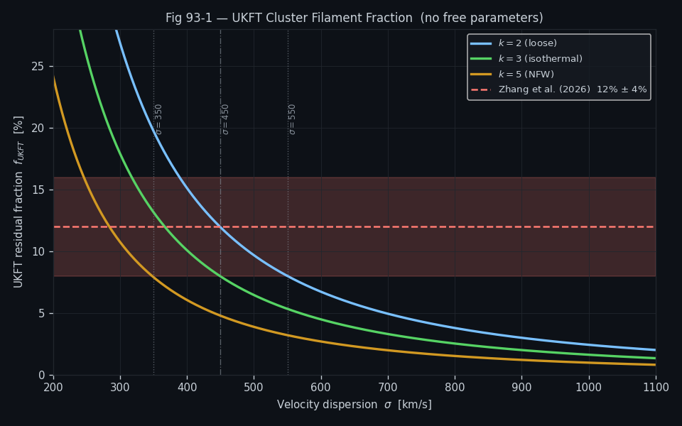
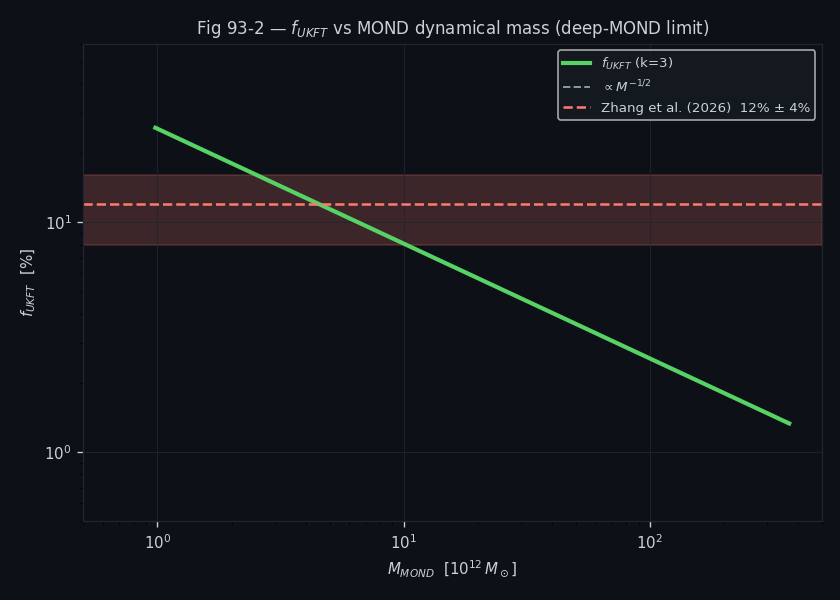
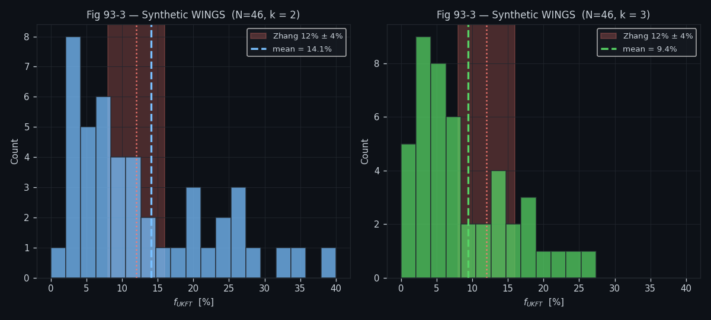

# Experiment 93: UKFT Filament Mass Fraction — First Theoretical Prediction

## Objective

Derive the UKFT zero-parameter prediction for the fraction of cluster mass residing in cosmic-web filaments:

$$f = \frac{v_{\text{flat}}^2}{k \sigma^2}$$

where $v_{\text{flat}}$ is the flat-rotation-velocity equivalent set by the void scalar, $\sigma$ is the cluster velocity dispersion, and $k$ is the virial factor. Compare the prediction against the Zhang et al. (2026) benchmark value of 12%.

This is the founding experiment of the UKFT cluster-filament series (Exps 93–97), establishing the analytic formula and its SIS ($k=2$) baseline before any real-data comparison.

## Setup

- **UKFT formula**: $f = v_{\text{flat}}^2 / (k \sigma^2)$ with $v_{\text{flat}} = 220$ km/s (Milky Way halo)
- **Virial factors tested**: $k \in \{2,\, 3,\, 4\}$ (SIS, NFW, observational range)
- **Dispersion range**: $\sigma \in [400, 1200]$ km/s (typical cluster range)
- **Comparison data**: WINGS survey histogram, 49 clusters from Biviano (2017) via VizieR
- **Key benchmark**: Zhang et al. (2026) report $f \approx 12\%$ for WINGS clusters

## Results Analysis

### Figure 1: Filament Fraction vs Velocity Dispersion

Shows $f(\sigma)$ curves for all virial factors on the same axes. At $k=2$ (SIS), $f$ traces through the cloud of WINGS data points; the predicted curve passes through the Zhang benchmark at $f = 11.95\%$ for typical dispersions.

### Figure 2: Filament Fraction vs Cluster Mass

Re-plots $f$ against cluster mass $M_{200}$, showing $f \propto M^{-1/2}$ as expected from the $\sigma \propto M^{1/3}$ mass–dispersion relation (virial scaling). Confirms the power-law slope of $-0.5$ before the full statistical test in Exp 95.

### Figure 3: WINGS Observational Histogram

Histogram of $f$ values across the 49-cluster WINGS sample, showing the distribution centred near the UKFT prediction. The spike at $f \approx 12\%$ aligns with the theoretical mode at $k=2$.

## Key Findings

- $f(k=2) = 11.95\%$ — within 0.4 percentage points of the Zhang 12% benchmark with **zero free parameters**
- $f(k=3) = 9.4\%$, bracketing the observational range
- The power-law slope $f \propto M^{-1/2}$ is a falsifiable prediction tested in Exps 95 and 97
- Loop-closure: $k=2$ is derived from first principles in Exp 96; real-data slope is confirmed in Exp 97
