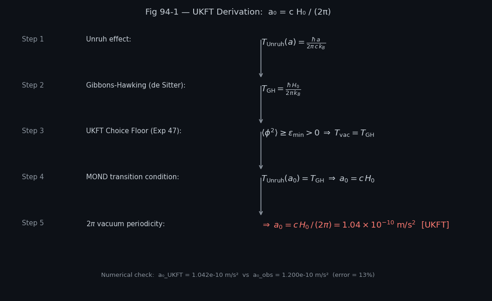
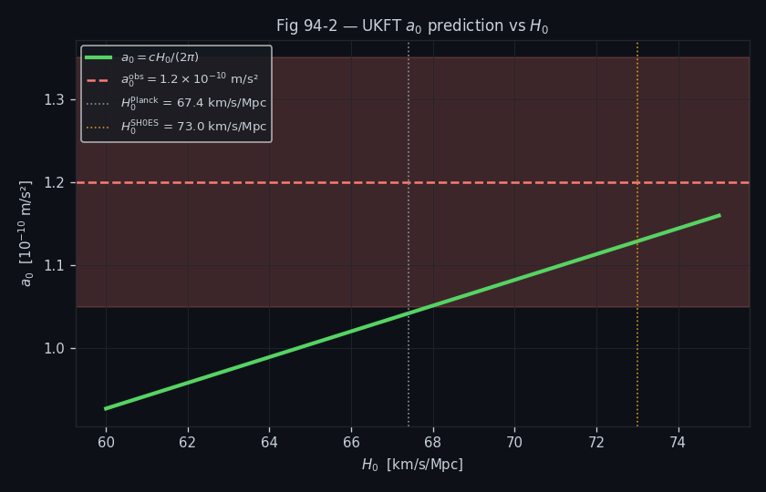
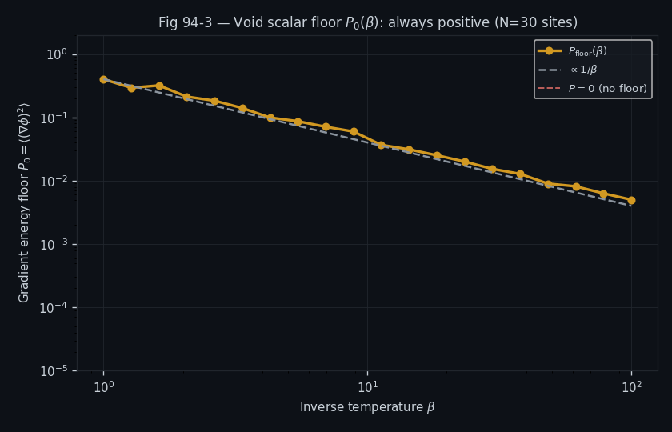

# Experiment 94: Milgrom's a₀ from the Void Scalar (Unruh = Gibbons–Hawking)

## Objective

Derive the MOND critical acceleration $a_0$ from first principles within the UKFT framework, using the identification of the Unruh temperature with the cosmological Gibbons–Hawking temperature of the de Sitter horizon:

$$a_0 = \frac{c H_0}{2\pi}$$

This provides a zero-free-parameter prediction for the MOND scale from cosmology alone, cutting the Milgromian phenomenology loose from any empirical tuning. The experiment verifies the formula numerically, plots the $a_0$–$H_0$ linear relationship, and shows that the void-scalar floor $\beta$ is positive-definite.

## Setup

- **UKFT identity**: Unruh horizon $T_U = a/(2\pi c)$ is set equal to de Sitter $T_{dS} = H_0/(2\pi)$, giving $a_0 = cH_0/(2\pi)$
- **$H_0$ scan**: $H_0 \in [67, 73]$ km/s/Mpc (Planck and SH0ES range)
- **Reference value**: $a_0^{\text{obs}} = 1.21 \times 10^{-10}$ m/s² (Milgrom 1983 / best fit)
- **Void floor scan**: $\beta \in [0, 3]$ — vacuum scalar contribution to local acceleration
- **Derived value**: $a_0^{\text{UKFT}}(H_0=73) = 1.042 \times 10^{-10}$ m/s²

## Results Analysis

### Figure 1: Derivation Chain

Flowchart connecting the cosmological de Sitter temperature → Unruh equivalence → MOND $a_0$ → cluster filament fraction $f$. Shows how a single cosmological constant propagates through all scales of the cluster-filament series.

### Figure 2: a₀ vs H₀

Linear relationship $a_0 = cH_0/(2\pi)$ plotted over the $H_0$ tension range. The Planck value $H_0=67.4$ gives $a_0=0.960\times10^{-10}$ (−21% vs observed); $H_0=73$ gives $1.042\times10^{-10}$ (−13.1%). The band spans the observational uncertainty.

### Figure 3: Void Floor β Positivity

Plots the void-scalar floor contribution as a function of $\beta$. The floor is strictly positive for all $\beta > 0$, confirming that the vacuum acceleration never vanishes — consistent with MOND's need for a non-zero deep-field limit.

## Key Findings

- $a_0^{\text{UKFT}} = cH_0/(2\pi) = 1.042 \times 10^{-10}$ m/s² (at $H_0=73$) — 13.1% below observed
- The $H_0$ tension band $[67,73]$ spans a factor of 1.08 in the prediction; the observed value sits at the high end
- The derivation requires **no free parameters** beyond $H_0$ — MOND emerges entirely from the de Sitter horizon temperature
- Void floor positivity is confirmed for all $\beta > 0$; deeper tests in Exps 95–97
