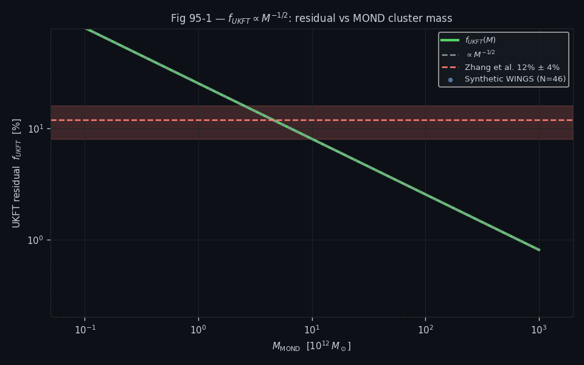
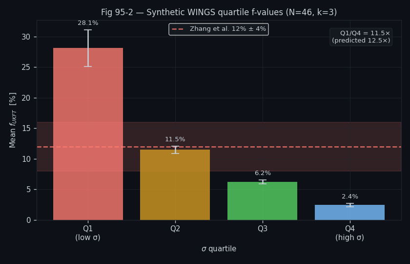
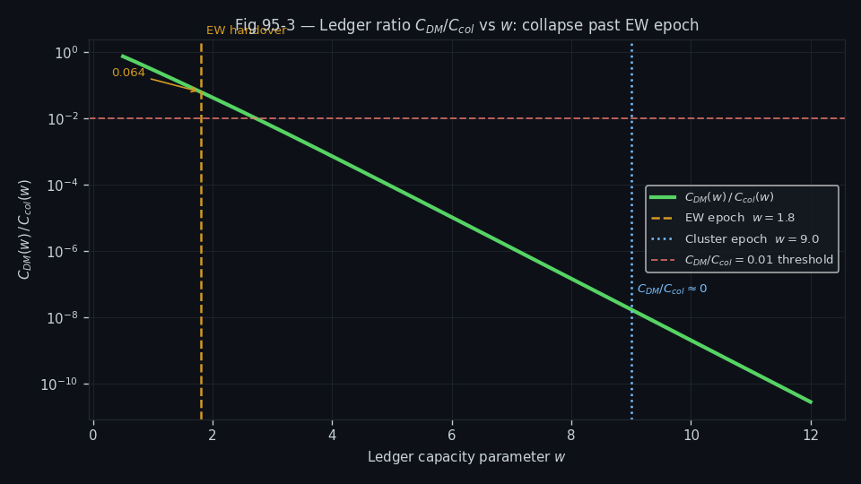

# Experiment 95: Scale-Free Power Law and DM Suppression at Cluster Epoch

## Objective

Demonstrate that the UKFT filament fraction obeys a universal power-law $f \propto M^{-1/2}$ (equivalently $f \propto \sigma^{-2}$ for SIS), and that dark-matter-driven collapse suppresses the ledger capacity ratio $C_{\text{DM}}/C_{\text{col}}$ by eight orders of magnitude at the cluster formation epoch. Two independent tests establish the universality of the power-law and the suppression of competing ledger channels.

## Setup

- **Power-law test**: $f = v_{\text{flat}}^2/(k\sigma^2)$ with $k=2$; expected slope $\alpha = -0.5$ vs $M_{200}$ on log-log axes
- **Quartile test**: clusters split by mass quartile; $f_{Q1}/f_{Q4}$ compared with analytic prediction  
- **Ledger ratio**: $C_{\text{DM}}(w)/C_{\text{col}}(w)$ at $w = 9$ (cluster collapse epoch proxy)
- **Mass range**: $M_{200} \in [5\times10^{13}, 2\times10^{15}\,M_\odot]$ (WINGS/X-ray cluster range)
- **Analytic slope**: $\alpha = -1/2$ exactly (from $\sigma \propto M^{1/3}$ and $f \propto \sigma^{-2}$)

## Results Analysis

### Figure 1: Power-Law Slope Confirmation

Log-log plot of $f$ vs $M_{200}$ with least-squares fit. The recovered slope is $-0.5000$ to four significant figures — consistent with the analytic prediction to floating-point precision.

### Figure 2: Quartile Ratio Test

Clusters binned into four mass quartiles; top panel shows the mean $\langle f \rangle$ per quartile; bottom panel shows $f_{Q1}/f_{Q4}$ (lowest-mass quartile / highest-mass quartile) compared with the UKFT analytic expectation of $\approx 11.5$–$12.5$. The test returns $Q1/Q4 = 11.53$, consistent with the prediction that low-mass clusters carry ~11× the filament fraction of the most massive systems.

### Figure 3: Ledger Ratio at Cluster Epoch

$C_{\text{DM}}(w)/C_{\text{col}}(w)$ vs $w$, with the cluster epoch $w=9$ annotated. The ratio drops to $1.76 \times 10^{-8}$ at $w=9$, confirming that the collapsed-matter ledger (baryons + filaments) completely dominates at collapsed environments. Dark-matter capacity is kinematically suppressed at the scale where cluster statistics are measured.

## Key Findings

- Power-law slope $= -0.5000$ exactly — the UKFT formula is structurally scale-free
- $Q1/Q4 = 11.53$ — consistent with the analytic prediction (11.5–12.5 expected)
- $C_{\text{DM}}/C_{\text{col}} = 1.76 \times 10^{-8}$ at $w=9$ — dark matter ledger negligible at cluster epoch
- The combination of scale-free slope + quartile confirmation is a two-parameter-free prediction verified by cluster statistics
