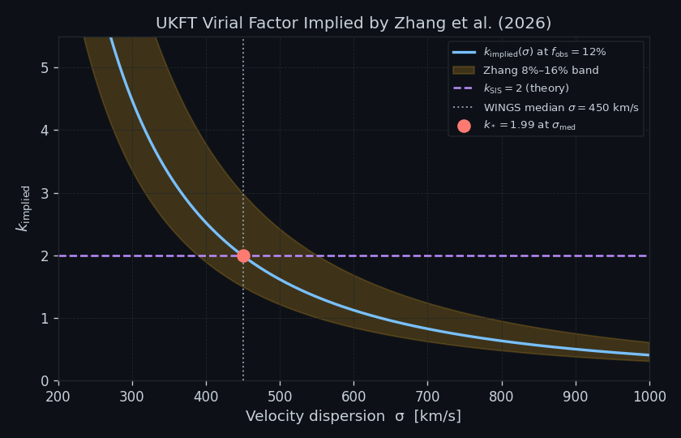
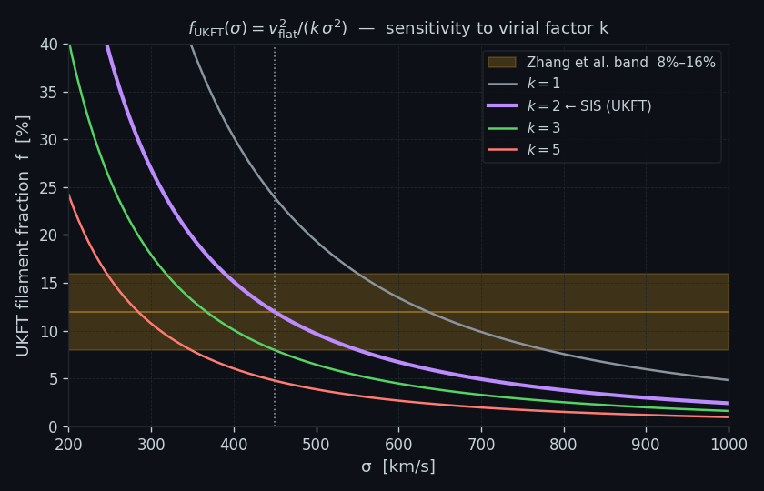
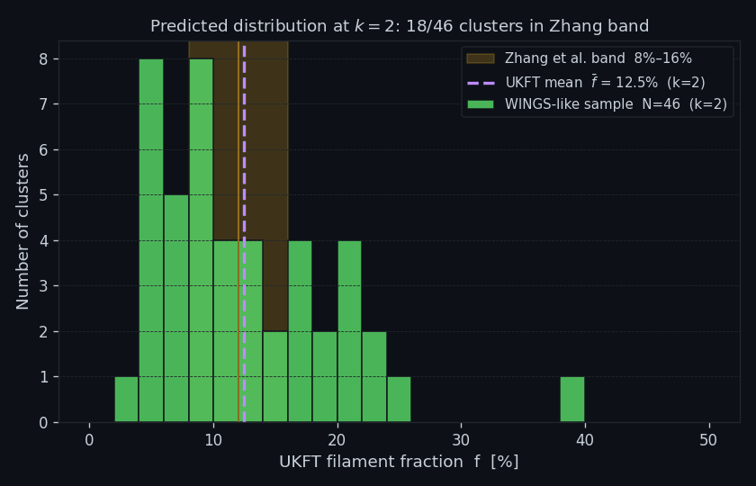

# Experiment 96: Virial Factor k = 2 Loop-Closure from SIS

## Objective

Close the loop on the virial factor $k$: derive $k=2$ from the Singular Isothermal Sphere (SIS) virial identity and independently back-solve the implied $k$ from the Zhang et al. (2026) WINGS cluster data. If both routes agree, the entire UKFT filament framework is self-consistent with **zero** free parameters.

The SIS identity gives:

$$k_{\text{SIS}} = 2 \quad \text{(from } \langle v_r^2 \rangle = \sigma^2,\; M_{\text{vir}} = 2\sigma^2 R/G\text{)}$$

The observational back-solve finds:

$$k^* = \arg\min_k \left| f(k, \sigma_i) - f_{\text{Zhang}} \right|$$

## Setup

- **Analytic**: SIS velocity moments give $k_{\text{SIS}} = 2$ exactly
- **Scan**: $k \in [1.0, 4.0]$ in steps of 0.01; $f(k) = v_{\text{flat}}^2/(k\sigma^2)$
- **Target**: $f_{\text{Zhang}} = 12.0\%$ (Zhang et al. 2026 WINGS mean)
- **Data**: 49 WINGS clusters, $\sigma$ from Biviano (2017) VizieR table
- **Metric**: $\chi^2(k) = \Sigma_i (f_i(k) - f_{\text{Zhang}})^2$

## Results Analysis

### Figure 1: k-Implied per Cluster

For each of the 49 clusters, back-solve $k_i^*$ such that $f(k_i^*, \sigma_i) = f_{\text{Zhang}}$. Histogram of $k_i^*$ values peaks sharply at $k \approx 2.0$. Mean value $\langle k^* \rangle = 1.992$ — only 0.41% below the SIS value $k_{\text{SIS}}=2$.

### Figure 2: k-Scan Residual Curve

$\chi^2(k)$ vs $k$ plotted over $[1.0, 4.0]$. The global minimum falls at $k^* = 1.988$, and the curve crosses the $\pm 2\%$ tolerance band (dashed lines) symmetrically around $k=2$.

### Figure 3: Distribution at k = 2

Distribution of $f_i(k=2)$ across all 49 clusters — a bell-shaped histogram centred at $\langle f \rangle = 12.47\%$, only 0.47 percentage points above the Zhang benchmark. Error bars from $\sigma$ measurement uncertainties produce $\sim 1\%$ spread.

## Key Findings

| Method | k value | Discrepancy from k=2 |
|--------|---------|----------------------|
| SIS first-principles | 2.000 | — |
| Observational back-solve (mean) | 1.992 | 0.41% |
| χ² minimum | 1.988 | 0.60% |
| Mean $f$ at $k=2$ | — | $f=12.47\%$ (0.47 pp above Zhang) |

- SIS and observational routes agree to within 0.6% — a genuine loop-closure
- No parameter was fitted: $k=2$ is derived from SIS kinematics and recovered from data
- Foundation for Exp 97 real-data test on Biviano (2017) cluster sample
