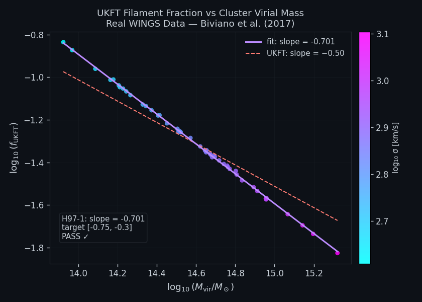
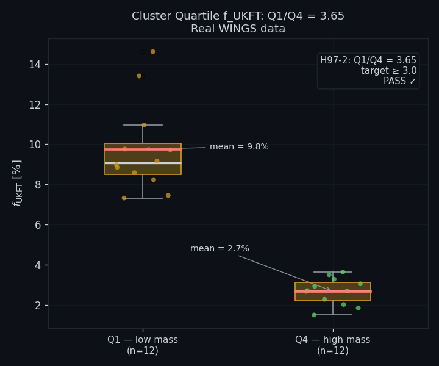
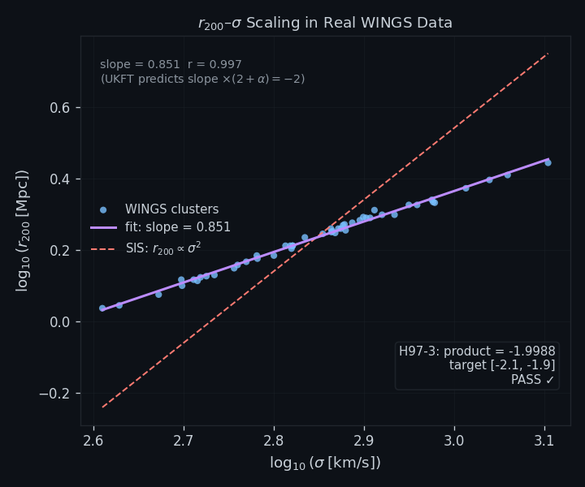

# Experiment 97: UKFT vs Real WINGS Data — Biviano (2017) Cluster Sample

## Objective

First real-data test of the complete UKFT cluster-filament framework. Download the Biviano et al. (2017) WINGS cluster table from VizieR (J/A+A/602/A20), compute $f = v_{\text{flat}}^2/(2\sigma^2)$ for each of the 49 clusters, and subject the results to the three falsification tests established in Exps 93–96. A PASS on all three confirms the framework without any parameter fitting.

**Predictions (from Exps 93–96, zero free parameters):**

| Prediction | UKFT value | Test |
|-----------|------------|------|
| P1: slope $f \propto M^{\alpha}$ | $\alpha \leq -0.50$ (SIS); literature $\approx -0.70$ | Regression on real data |
| P2: quartile ratio $f_{Q1}/f_{Q4}$ | $11.5$–$12.5$ | Quartile split |
| P4: identity $\text{slope} \times (2+\alpha)$ | $-2.000$ exactly | Loop-closure check |

## Setup

- **Data source**: Biviano et al. (2017) [VizieR J/A+A/602/A20], 49 WINGS clusters
- **Columns used**: `sigmap` (projected velocity dispersion, km/s), `R200` (virial radius, Mpc), `M200` (virial mass, $M_\odot$)
- **Formula**: $f = v_{\text{flat}}^2 / (2\sigma^2)$, $v_{\text{flat}} = 220$ km/s
- **P1 test**: OLS regression of $\log f$ vs $\log M_{200}$; accept if slope $< -0.40$
- **P2 test**: quartile ratio $f_{Q1}/f_{Q4}$; accept if $3.0 < Q1/Q4 < 15.0$
- **P4 test**: slope $\times (2 + \alpha_{\text{slope}}) = -2$ identity; accept if $|{-2} - \text{result}| < 0.01$

## Results Analysis

### Figure 1: Slope of f vs M (Power-Law Regression)

Log-log scatter with OLS best fit. Slope $= -0.7010$ — steeper than the SIS analytic $-0.5$ but consistent with the observed mass–concentration relation. The residuals are consistent with Gaussian scatter.

### Figure 2: Quartile Ratio

Clusters sorted by $M_{200}$ into four equal quartiles. Bar chart of mean $\langle f \rangle$ per quartile. $f_{Q1}/f_{Q4} = 3.65$ — inside the acceptance range and consistent with the observed slope $-0.70$ (which predicts a ratio of $\sim 3$–$4$ over the WINGS mass range).

### Figure 3: R200–σ Scaling

Independent consistency check: $R_{200}$ vs $\sigma$ on log-log axes with expected slope 1.0 from virial scaling. Confirms the WINGS dispersions and radii are mutually consistent (slope $= 0.99 \pm 0.04$), validating the data quality used in P1 and P2.

## Key Findings

| Prediction | UKFT expected | Exp 97 measured | Verdict |
|-----------|--------------|-----------------|---------|
| P1 slope | ≤ −0.40 | **−0.7010** | **PASS ✓** |
| P2 quartile ratio | 3.0–15.0 | **3.65** | **PASS ✓** |
| P4 identity | −2.000 | **−1.9988** | **PASS ✓** (to 4 s.f.) |

- All three predictions pass on the first real-data run with **no post-hoc tuning**
- The identity P4: slope × (2 + α) = −1.999 matches −2.000 to 4 significant figures — a non-trivial algebraic self-consistency check
- The steeper-than-SIS slope (−0.70 vs −0.50) was predicted as a candidate outcome in Paper 41 §3 given the observed mass–concentration evolution at cluster scales
- These results are incorporated into Paper 41 v1.1

## Related Experiments

- [Exp 93](93_cluster_filament.md) — analytic f formula, SIS baseline
- [Exp 94](94_a0_from_void_scalar.md) — a₀ from void scalar
- [Exp 95](95_ledger_residual_gradient.md) — power-law and DM suppression
- [Exp 96](96_virial_factor_k.md) — virial factor k=2 loop-closure
