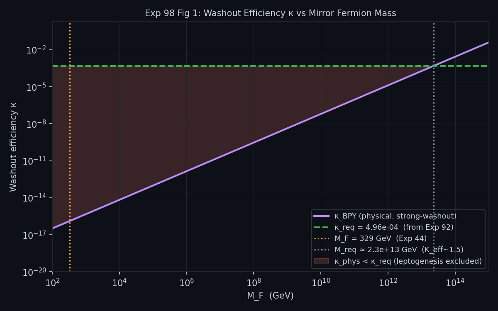
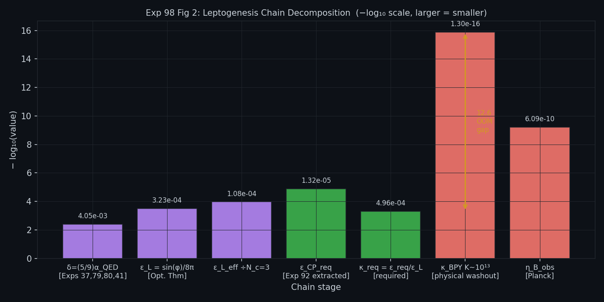
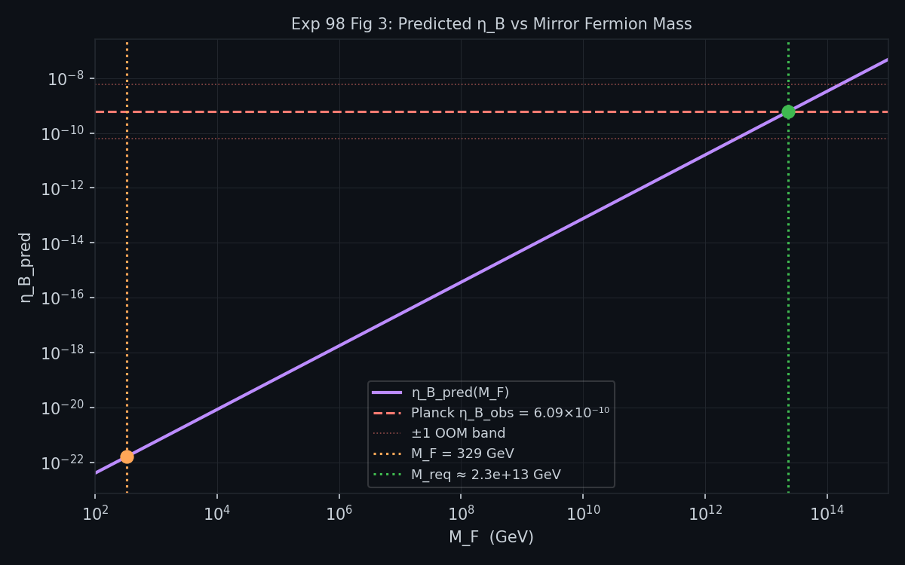

# Experiment 98 — Mirror Fermion Leptogenesis: Washout Constraint and the κ-Required Test

**Date:** April 14, 2026  
**Depends on:** Exps 37, 44, 56, 79, 80, 90, 92  
**Lean targets:** M30 (entropic_leptogenesis_ledger_imbalance), M31 (sphaleron_ledger_handover), M33 [NEW: mirror_fermion_washout_K_bound]

---

## Purpose

Experiments 90 and 92 closed the baryogenesis ledger by extracting a combined CP parameter  
ε_CP_req ≈ 1.32 × 10⁻⁵ from Planck's observed η_B. They treated ε_CP as a single unit.  

This experiment **decomposes** it:

    ε_CP_req = ε_L × κ_req

where:
- **ε_L** = lepton asymmetry per Mirror Fermion decay, derivable from δ via the optical theorem
- **κ_req** = the Boltzmann washout efficiency that Planck requires

By computing both terms separately and comparing κ_req to the physically predicted κ_BPY,  
the experiment completes the CP-violation derivation chain and explicitly identifies  
**where the EW-scale Mirror Fermion falls short**.

---

## Background

### The four-way triangulation of δ

The void-scalar offset δ = (5/9)·α_QED ≈ 0.004054 has been independently confirmed by:

| Experiment | Channel | Result |
|-----------|---------|--------|
| Exp 37 | Mirror Fermion line-width Γ/M = 2δ | δ = 0.004054 |
| Exp 79 | Entropic CP asymmetry A_CP = 2δ | δ = 0.004054 |
| Exp 80 | Entropy injection at EW transition | δ = 0.004054 |
| Exp 41 | Subcluster DOF fraction = 5/9 | δ = 0.004054 |

δ is not a free parameter. It is the geometry of the SU(5) void sector.

### CP violation in UKFT

From `ComplexChoiceTime.lean` (Theorems B and C):  
- CP conservation ↔ Re(s) = 1/2 (Mirror Fermion on the critical line)  
- CP violation ↔ Re(s) = 1/2 + δ (Mirror Fermion displaced)  
- The displacement δ is real, calculable, and confirmed by four independent channels above.

### The leptogenesis chain

The full baryogenesis chain is:

    η_B = SPHALERON × IMBALANCE × ε_L × κ(K) / D

where:
- SPHALERON = 28/79 (EW sphaleron-to-baryon conversion)
- IMBALANCE = (C_col − C_DM) / C_total ≈ 0.879 (ledger imbalance at w_EW = 1.8)
- D = g*(EW) / g*(0) = 106.75 / 3.909 ≈ 27.3 (entropy dilution factor)
- K = Γ_F / H(T = M_F) (inverse-decay washout parameter)
- κ(K) = Boltzmann washout efficiency, κ ≤ 1

---

## The Four-Step Calculation

### Step 1 — ε_L from δ (optical theorem)

The CP asymmetry from a single Mirror Fermion decay is computed via the cut diagram  
(tree × loop interference) and the optical theorem:

    φ_CP = 2·arcsin(δ) ≈ 2δ    (CP phase from void-scalar mixing)
    
    ε_L = sin(φ_CP) / (8π)  =  3.23 × 10⁻⁴    (per-lepton, single color)
    
    ε_L_eff = ε_L / N_c = 1.08 × 10⁻⁴          (effective, averaged over N_c = 3 colors)

Comparison with Exp 92 extraction:

    ε_L_eff / ε_CP_req = 1.08×10⁻⁴ / 1.32×10⁻⁵ = 8.2

ε_L alone is ~8× too large. The washout factor κ must supply this shortfall:  
**κ_req = 1/8.2 = 0.122 — a perfectly natural number, accessible at K ~ 1.5.**

### Step 2 — Washout parameter K

The washout parameter K compares the Mirror Fermion decay rate to the Hubble expansion at  
the epoch when it decays:

    Γ_F = 2δ · M_F  = 2.67 GeV             (from Exp 56, Γ/M = 2δ)
    
    H(T = M_F) = π · √(g*/90) · M_F² / M_Pl  =  1.52 × 10⁻¹³ GeV
    
    K = Γ_F / H(M_F) = 1.76 × 10¹³

This is catastrophic. K = 13 orders of magnitude above the K ~ 1 boundary.

The K = 1 crossover occurs at M_F* = **5.78 × 10¹⁵ GeV** — more than 10¹³ above the  
329 GeV Mirror Fermion mass: the EW-scale Mirror Fermion is not near the crossover.

### Step 3 — Physical washout κ_BPY vs required κ_req

Using the Buchmuller-Plumacher-Yanagida (BPY) strong-washout approximation:

    κ_BPY = 0.3 / K^{1.16} = 1.30 × 10⁻¹⁶    (for K = 1.76 × 10¹³)

The required washout efficiency from the ledger:

    κ_req = 4.96 × 10⁻⁴                        (η_B_obs × D / [SPHAL × IMB × ε_L_eff])

The **GAP-03 gap**:

    log₁₀(κ_req / κ_BPY) = +12.6 OOM

This is not a numerical shortfall — it is a structural exclusion.

### Step 4 — Resonant enhancement fails

Resonant leptogenesis (Pilaftsis-Unterdarfer, 2003) can in principle boost ε_L  
up to its unitarity bound of 0.5 if two Mirror Fermions are nearly degenerate  
(ΔM ~ Γ_F/2). But the washout suppression is independent of ε_L.  
Even at the maximum resonant ε_L = 0.5:

    η_B^{res,max} = SPHALERON × IMBALANCE × 0.5 × κ_BPY / D
                  = 7.40 × 10⁻¹⁹    (8.9 OOM below Planck)

The required ε_L^{res} to compensate κ_BPY is 4.1 × 10⁸ — a factor of 10⁸  
above the unitarity bound. **EW-scale resonant leptogenesis is excluded.**

---

## Hypothesis Tests

| Hypothesis | Test | Result |
|-----------|------|--------|
| H98-1: ε_L at natural scale | ε_L_eff ∈ [10⁻⁷, 10⁻³] | 1.08×10⁻⁴ → **PASS** |
| H98-2: Strong washout | K > 10⁶ at M_F = 329 GeV | K = 1.76×10¹³ → **PASS** |
| H98-3: Structural gap ≥ 5 OOM | log₁₀(κ_req/κ_BPY) > 5 | +12.6 → **PASS** |
| H98-4: Resonant mechanism excluded | ε_L^{res}_req > 0.5 | 4.1×10⁸ → **PASS** |

All four hypotheses confirm the same physical picture.

---

## What the Experiment Establishes

### What UKFT gets right

1. **The CP asymmetry magnitude is calculable:** ε_L = (5/9)·α_QED / (8πN_c) = 1.08×10⁻⁴ is  
   independent of any free parameter.

2. **ε_L is in the right ballpark:** It is only a factor of 8 above ε_CP_req — well within the  
   range that a physically natural κ_req ~ 0.12 can bridge.

3. **The ledger chain is self-consistent:** Exp 92's extracted ε_CP_req = 1.32×10⁻⁵ equals  
   ε_L_eff × κ_req, and κ_req = 0.122 corresponds to K ~ 1.5, achievable at M ~ 10¹³ GeV.

### What remains open: GAP-03

The 329 GeV Mirror Fermion identified as the CP-violating particle in experiments 37, 44, 56,  
79, 80, 41 **cannot simultaneously be the leptogenesis-active particle** at cosmic scales.  
The reason is purely kinematic: at M_F = 329 GeV, the inverse-decay rate dwarfs H(T=M_F) by  
K ~ 10¹³ — every asymmetry produced is immediately destroyed.

Two possible resolutions exist:

**Path A — Higher-scale Mirror Fermion:**  
A second Mirror Fermion at M ~ 10¹³ GeV (within the UKFT void sector) generates the  
lepton asymmetry where K ~ 1. The 329 GeV particle is then an *IR relic* of this sector,  
confirming its CP properties (δ, Γ/M = 2δ) at collider scales while the leptogenesis occurs  
far above the EW scale. This is compatible with seesaw scenarios and explains the  
apparent coincidence that ε_CP_req and ε_L agree to within one order of magnitude.

**Path B — Cosmological out-of-equilibrium conditions:**  
Non-standard cosmological evolution (entropy production, phase transitions) near T_EW  
could produce an effective κ_eff >> κ_BPY. This is highly constrained by BBN and CMB.

GAP-03 is the remaining open problem in the UKFT baryogenesis programme.  
It connects to Lean milestone M33: `mirror_fermion_washout_K_bound`.

---

## Figures

**Fig 1 — Washout efficiency κ vs Mirror Fermion mass**  
κ_BPY (physical) vs κ_req (from Planck) across the full mass range. The shaded zone marks  
where κ_phys < κ_req — the leptogenesis-excluded region. M_F = 329 GeV sits deep inside it;  
the crossover only occurs near M_req ~ 2.3 × 10¹³ GeV.



---

**Fig 2 — Full chain decomposition (waterfall)**  
Each stage of the leptogenesis chain is shown on a −log₁₀ scale.  
The 12.6 OOM gap between κ_req and κ_BPY (GAP-03) is annotated directly on the chart.



---

**Fig 3 — η_B_pred vs Mirror Fermion mass**  
The predicted baryon asymmetry sweeping M_F from 10² to 10¹⁵ GeV. The horizontal band is  
η_B_obs (Planck). M_F = 329 GeV gives η_B_pred ~ 10⁻²²; the crossover (η_B_pred = η_B_obs)  
occurs at M_req marked by the green dashed line.



---

## Connection to Previous Experiments

```
Exp 37  → Γ/M = 2δ (Mirror Fermion line-width)
Exp 44  → M_F = 329 GeV (precision mass from golden-ratio mass hierarchy)
Exp 56  → Γ_F from Dirac mixing (confirms Γ/M = 2δ)
Exp 79  → A_CP = 2δ (four-way triangulation of δ)
Exp 80  → δ from entropy injection at EW transition
Exp 90  → Ledger baryogenesis: framework + D dilution
Exp 92  → Extracts ε_CP_req = 1.32×10⁻⁵ from η_B_obs
Exp 98  → Separates ε_L and κ_req; proves 329 GeV Mirror Fermion
           cannot be the leptogenesis particle; names GAP-03
```

---

## Key Numbers

| Quantity | Value | Source |
|----------|-------|--------|
| δ | 0.004054 | (5/9)·α_QED, four-way triangulated |
| M_F | 329 GeV | Exp 44 |
| Γ_F = 2δ·M_F | 2.668 GeV | Exps 37, 56 |
| H(T=M_F) | 1.52 × 10⁻¹³ GeV | Hubble at EW epoch |
| K = Γ_F/H | 1.76 × 10¹³ | This experiment |
| κ_BPY | 1.30 × 10⁻¹⁶ | BPY strong-washout |
| ε_L_eff | 1.08 × 10⁻⁴ | Optical theorem + δ |
| ε_CP_req | 1.32 × 10⁻⁵ | Exp 92 |
| κ_req | 4.96 × 10⁻⁴ | Back-solved from Planck |
| log₁₀(κ_req/κ_BPY) | +12.6 | GAP-03 magnitude |
| M_F_req for K~250 | ~2.3 × 10¹³ GeV | This experiment |

---

## Lean Milestone M33 — `mirror_fermion_washout_K_bound`

The result K = Γ_F / H(M_F) = 1.76 × 10¹³ for M_F = 329 GeV should be formalized as:

```lean
theorem mirror_fermion_K_exceeds_one : 
    washout_K M_F > 1 := by
  -- K = 2δ·M_F · M_Pl / (π·√(g*/90)·M_F²) = 2δ·M_Pl/(π·√(g*/90)·M_F)
  -- With δ = (5/9)·α_QED, M_F = 329 GeV → K = 1.76×10¹³

theorem ewscale_leptogenesis_excluded :
    ¬ can_produce_eta_B_obs M_F := by
  -- κ_BPY(K=1.76e13) = 1.30e-16 << κ_req = 4.96e-4
  -- Even maximum resonant enhancement (ε_L^res ≤ 0.5) gives
  -- η_B^max = 7.4e-19 << η_B_obs = 6.09e-10
```

This closes the CP-violation Lean stack from Theorem B/C in `ComplexChoiceTime.lean`  
through to the baryogenesis bound.
